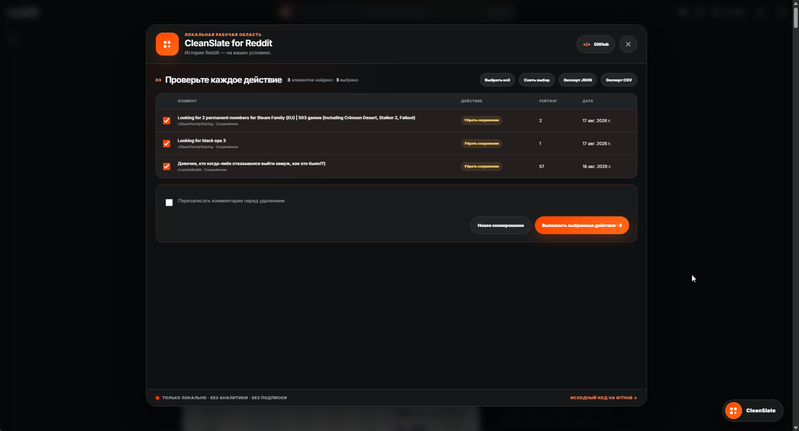
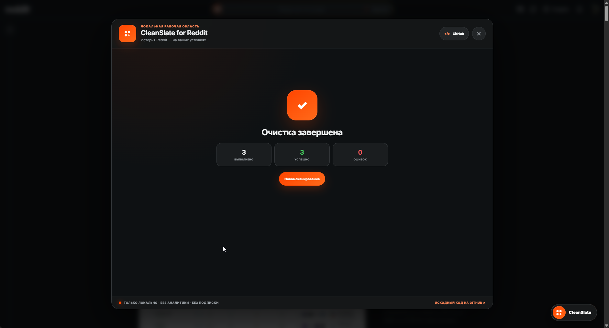

**CleanSlate for Reddit** is a local browser extension for safely and deliberately cleaning your own Reddit history without a subscription, an external server, or third-party data sharing.
<!--more-->

## 📌 About the project

**CleanSlate** can delete your posts and comments, remove saved items, clear upvotes and downvotes, and optionally hide processed posts. It uses the Reddit session already open in the browser and runs entirely on the client — with no Client ID, separate OAuth flow, or external backend.

The main goal was to provide a **transparent and predictable cleanup tool**: scan the history first, review every proposed action, and start the queue only after explicit confirmation.

---

## ✨ What was done

### Interface & UX

- Implemented a compact launcher that opens the workspace directly over Reddit
- Designed a step-by-step flow for scope selection, filters, review, and execution
- Added clear active-session, progress, paused, error, and completion states
- Isolated the interface from Reddit styles with **Shadow DOM**
- Added complete English and Russian localization

### Scanning & filtering

- Scanning for the user's posts, comments, saved items, upvotes, and downvotes
- Full cursor pagination for up to 2,000 items in each section
- Filters for text, subreddits, score, date range, and NSFW content
- Result deduplication before the action queue is created
- Preview export in JSON or CSV format

### Safe execution

- Review of every matched item with the option to deselect it
- An additional `DELETE` confirmation before posts or comments are removed
- Optional comment rewriting before deletion
- Pause, resume, stop, and retry-failed-actions controls
- Automatic Reddit rate-limit handling with a countdown after a `429` response
- Backoff retries for temporary `503` errors
- Controlled request intervals and scheduled breaks during long queues

### Privacy

- Data is processed locally and retained only in the tab's memory
- The existing browser cookie session is used
- Requests are sent only to Reddit domains
- No analytics, ads, telemetry, licensing, or payments
- The manifest requests access only to `https://*.reddit.com/*`

---

## 🖼️ Extension interface





---

## 🎨 Design system



- **Visual style:** dark surfaces, a high-contrast orange accent, and a subtle glow for primary actions
- **Components:** scope cards, filters, checkboxes, queue progress, and status indicators
- **Isolation:** interface styling remains independent of Reddit's current visual design

---

## 🛠️ Technical implementation

The extension is built with **WXT**, **React 19**, and **TypeScript 6**. A content script mounts the application on Reddit pages, while Shadow DOM prevents conflicts with the site's styles. A separate popup provides project status and guides the user to the main tab.

The session client retrieves the current user and `modhash`, scans Reddit JSON listings with cursor pagination, and performs confirmed actions through Reddit's native API endpoints. The action queue is separated from the UI and controls request intervals, pauses, retries, and rate limiting. Critical filtering, session, and queue behavior is covered by **Vitest** tests.

The project builds for Chromium and Firefox, uses **Manifest V3**, and is distributed under the **MIT** license.

---

## 🌐 Summary

- A complete local-first tool for managing Reddit history
- A clear review flow with explicit confirmation for destructive actions
- Resilient processing of large queues within Reddit's rate limits
- Minimal permissions and no external infrastructure
- Open-source code and a bilingual interface
