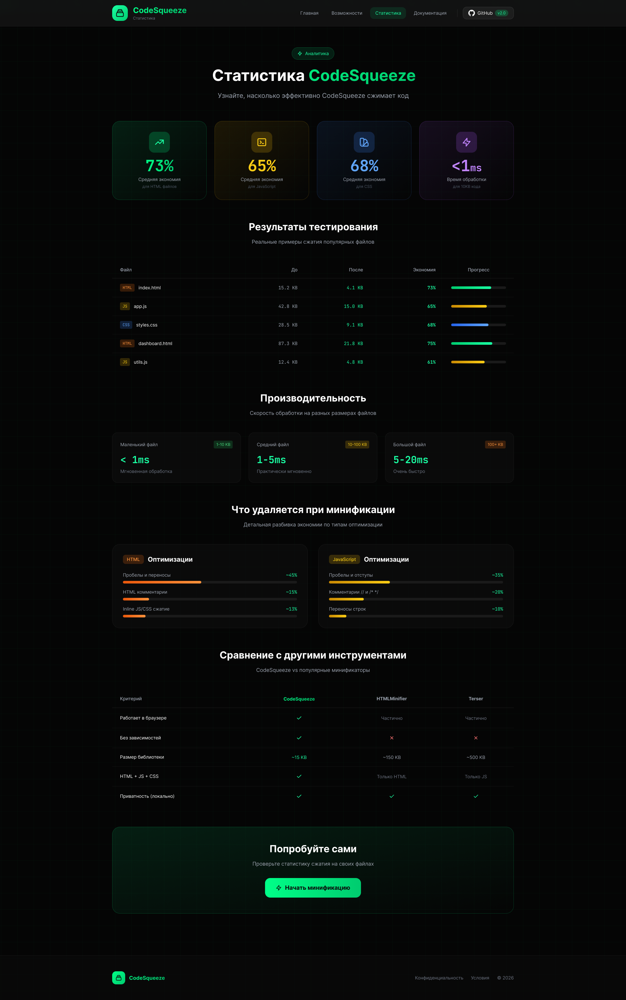

**CodeSqueeze** is a modern web tool for minifying HTML, CSS, and JavaScript, focused on speed, privacy, and a comfortable in-browser workflow.
<!--more-->

## 📌 About the project

**CodeSqueeze** is a standalone product developed from the initial idea to the final implementation.
The interface, UX logic, and visual system were designed in **Figma**, after which the tool was fully implemented on the frontend with no backend involved.

The main goal of the project was to create a **fast and intuitive tool** that doesn’t distract the user and provides clear, transparent feedback when working with code.

---

## ✨ What was done

### Interface & UX

* Designed the complete user flow in **Figma**: from screen structure to an interactive prototype
* Implemented a dark theme with an accent brand color
* Responsive, mobile-first interface
* Added subtle visual accents and micro-animations to improve perception

### Functionality

* Dual-pane editor for source and processed code
* HTML, CSS, and JavaScript minification with result control
* Reverse formatting (Beautify) for improved readability
* Detailed statistics: size before and after, compression percentage, processing time
* Operation history with state persistence in the browser
* Keyboard shortcuts to speed up workflow
* Notification system for clear user feedback

### Technical approach

* Pure **Vanilla JavaScript** without frameworks
* Modular code structure for easier maintenance and scalability
* **Tailwind CSS** for building the design system
* Fully client-side data processing — code is never sent to a server
* Offline support after the first load

### Additional sections

* Features — overview of capabilities
* Stats — extended statistics
* Documentation — usage guide
* Privacy & Terms — legal pages

---

## 🖼️ Project interface

### Main page

### Features

### Statistics

### Documentation

### Privacy & Terms

---

## 📱 Mobile version



---

## 🎨 Design system



* **Typography:** Inter for the interface, JetBrains Mono for working with code
* **Visual techniques:** soft shadows, glow accents, progress indicators, subtle animations

---

## 🌐 Summary

* A full-featured product implemented without a backend
* Well-thought-out UI/UX with a focus on usability and speed
* Secure code processing directly in the browser
* Flexible architecture ready for future growth