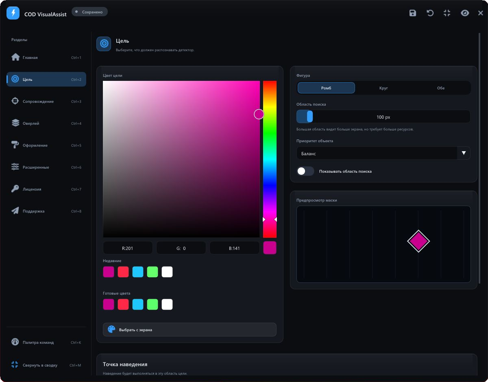
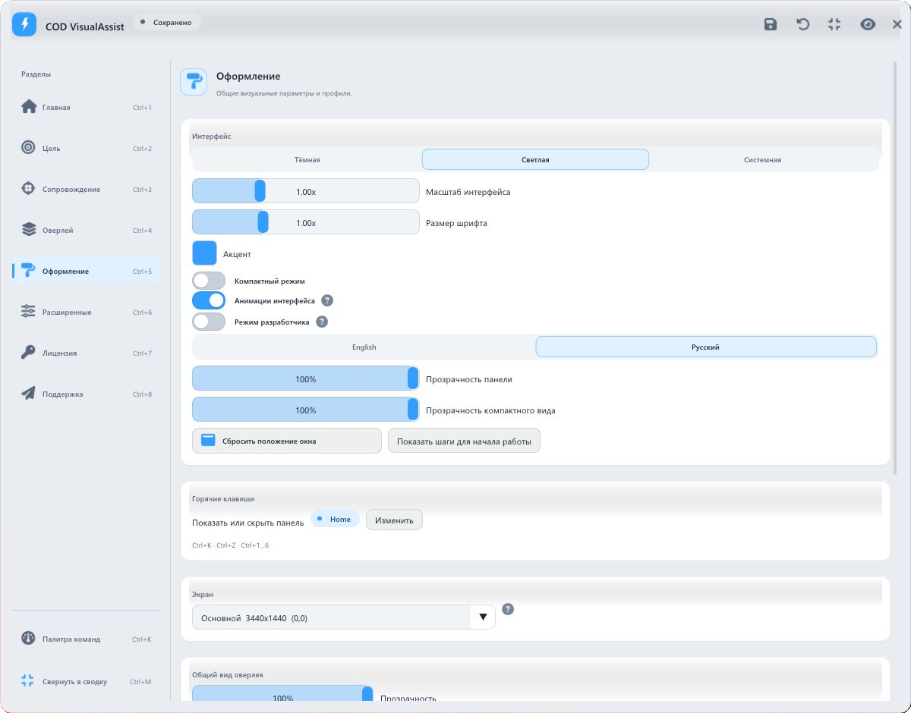

**COD VisualAssist** is a desktop application for modern Call of Duty games, built to assist with aiming at opponents. It detects on-screen game markers, tracks targets and controls visual guidance through a transparent overlay.
<!--more-->

## From a screen marker to an action

COD VisualAssist combines computer vision, object tracking and aiming assistance for modern Call of Duty games. It identifies markers by their colour and shape in captured images, maintains target identity across frames and passes the result to the aiming system and transparent overlay.

The compact control panel sits on top of a dedicated capture and processing pipeline. Users start with a marker colour and a preset, then refine behaviour, appearance and keyboard shortcuts.

> Screen images are the detector's data source. The project does not read the game process's memory.

## 01 / Detect

The first configuration screen answers a simple question: what should the application recognise? A large colour picker sits alongside colour presets, recent selections and an on-screen eyedropper. Shape, search area, object priority and a mask preview share the adjacent column.

Detection supports **diamonds, circles or both shapes**. The detector searches across marker sizes, while selection priorities include a balanced approach, distance to the crosshair, confidence and marker size. A separate silhouette control sets the aiming point.





## 02 / Track

Tracking is designed around continuity: a briefly missing marker should not cause an arbitrary switch to a different object. A multi-target tracker assigns stable identifiers, associates observations across frames and predicts motion during short occlusions.

The interface offers **automatic, soft, balanced, precise and custom modes**. These coordinate search, prediction and recovery. Automatic aiming and aim-on-key-hold are enabled separately. Auto-fire supports holding the button, repeated clicks and a single activation.





### One target lifecycle

1. **Acquiring.** The application gathers confirmation for a new object.
2. **Locked.** A confirmed target receives tracking priority.
3. **Coasting.** Its position is briefly predicted; auto-fire is not permitted.
4. **Lost.** After the target is definitively lost, selection begins again.

This shared model informs aiming, visual guidance and telemetry, keeping their responses to state changes consistent.

## 03 / Display

The overlay is configured as a coherent visual system. Object boxes, target lines, labels, the search area and an independent crosshair have dedicated controls. Options include line and box styles, thickness, colour, opacity and glow.

**Minimal, clean, neon, tactical and soft presets** provide coordinated starting points. The built-in preview shows how a style responds to different target states and can also display live detector data.





Boxes display the objects known to the tracker: the active target uses the primary colour, other objects use a neutral colour, and temporarily occluded tracks appear subdued. The line and lock indicator refer to the active target.

## An interface that adapts

Graphite surfaces, fine borders, a blue accent and Segoe UI typography define the application. Persistent sidebar navigation preserves context, while cards group related settings. The light theme follows the same grid and hierarchy.

Users can adjust the accent, interface and font scale, density, opacity and language. Font scaling rebuilds the font atlas. A command palette, keyboard shortcuts, undo and redo shorten common tasks; a compact summary retains the essential indicators.





### Settings worth keeping

Complete configurations can be saved as named profiles. The application supports autosave, change history and profile comparisons. The primary INI file is written through a temporary file and atomic replacement; a backup helps recover a damaged configuration.

## Technical implementation

| Layer | Implementation |
| --- | --- |
| Capture | DXGI Desktop Duplication through DirectX 11, with a fallback capture method. Monitor selection and coordinate handling. |
| Detection | OpenCvSharp: colour filtering, shape analysis, multi-scale search and local recovery. |
| Tracking | Multiple targets, observation association, stable IDs, target locking and motion prediction. |
| Rendering | ImGui.NET and ClickableTransparentOverlay; a shared visual renderer for the overlay and its preview. |
| Configuration | INI files, profiles, autosave and backup recovery; configuration snapshots for processing components. |

### Avoiding unnecessary frame processing

The pipeline uses candidate regions, frame-change checks and adaptive detection rates. Performance modes balance accuracy and latency. Frame, processing-time and tracking-state data can be inspected, while a built-in simulator lets users check behaviour in a controlled scene.

Recognition quality depends on the marker's visibility, geometry and colour stability. Search-area and detector controls are therefore presented alongside visual feedback.

## A cohesive desktop product

COD VisualAssist connects detection settings, tracking behaviour and visual output into one workflow for modern Call of Duty games. Presets simplify the first setup, while detailed controls, profiles and previews give users control over each subsequent step.




