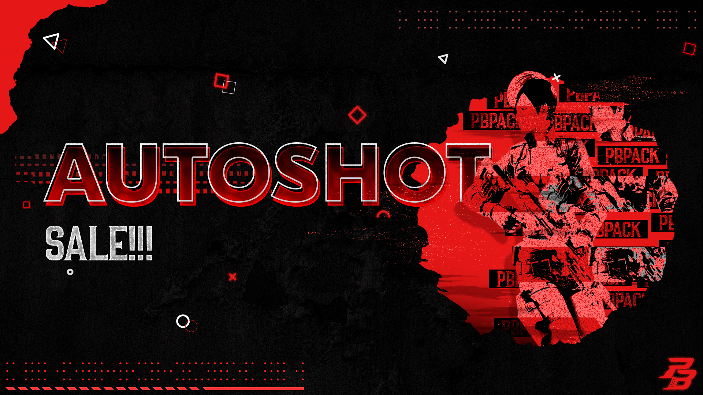

Developed visual identity for PBPack's social media brand, including YouTube and Telegram.
<!--more-->

## 📌 About PBPack Project
**Project Objective:**  
Creating a unified visual style for PBPack brand, focused on YouTube and Telegram platforms. The main goal is a harmonious and vivid representation of the brand in these channels.

**Key stages of development:**  
- ✔️ Creating an identity for YouTube (header, avatar, video cover templates)  
- ✔️ Development of custom interface for Telegram (channel and bot design)  
- ✔️ Design of animated logo for use on all platforms

---

### Result of work

---

## 🚀 Key elements

### 🌀 Animated logo  
  
> *Animation of the logo with smooth transition of colors and shape transformation, creating a dynamic perception of the brand.*

---

## 📱 Presentation and adaptation

### YouTube

### Telegram  

**Implementation features:**  
- Unified style applied on all platforms  
- Adaptive templates for regular publications in YouTube and Telegram

---

## 🎨 Cover creation process

  
> *From developing a composition to choosing a color palette and typography.*

---

## 🔧 Basic brand elements

---

## 📌 Ready-made solutions

---

## 🔗 Realized projects

- [🎥 YouTube channel](https://www.youtube.com/@pbpack/videos)  
- [📨 Telegram channel](https://t.me/PBPackOne)