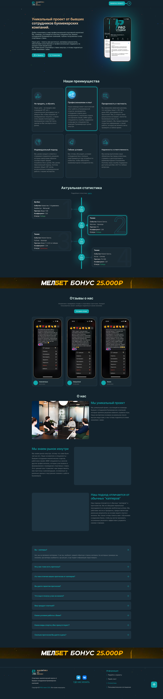

Landing Page development for a sports analytics project, including Google Sheets integration and unique visual style.
<!--more-->
## 📌 Description of the work done
Within the framework of the project implementation, an adaptive web site was created, emphasizing the team's professionalism, transparency and customer focus. Main stages of work:

1. **Design and structure:**
   - A unique visual style corresponding to the project logo was developed.
   - Figma layouts were prepared, taking into account adaptation for desktop and mobile devices.
   - Orange color was used as the main accent, harmonizing with the corporate palette.

2. **Functional integration:** 
    - Integration with Google Sheets has been set up to automatically update the statistics block, which displays the latest bets with details.

3. **Content and interaction:**
   - Added “Go to Project” and “Statistics” buttons providing navigation to the Telegram channel and statistics page.
   - Created FAQ section with drop-down answers to popular questions.
   - Created “About Us” block with text emphasizing the uniqueness of the approach and professionalism of the team.

4. **Elements of interaction:**
   - The project logo and the slogan “Analytics from the pros” were added to the header.
   - A banner for the affiliate program with a place for a promo code was prepared.

5. **Footer:**
   - Developed footer with links to the main sections (project, price list, statistics and user agreement).
   - Added social media icons with hyperlinks to Telegram and VKontakte.

**Key Stages of Development:**  
- ✔️ Development of corporate identity with orange accent color
- ✔️ Integration with Google Sheets for automatic download of statistics
- ✔️ Creation of interactive blocks (FAQ, reviews, etc.)
- ✔️ Adaptation for mobile devices

---

### Result of work





---

## 🚀 Demo of the desktop version
  
> *This video demonstrates the entire live functionality of the landing page, including updating bid statistics via Google Sheets and visualizing statuses.*

---

## 📱 Adaptive design

### Desktop version

### Mobile version





---

## 🔧 Creation process
1. **Research and planning:**
	- Reference analysis and definition of key requirements.
	- Creation of page structure and content.

2. **Design:**
   - Development of layouts in Figma.
   - Making edits and approving the design.

3. **Development:**
   - HTML/CSS layout.
   - JavaScript integration for interactive elements.
   - Customization of integration with Google Sheets.

4. **Testing and finalization:**
   - Testing for cross-browser compatibility.
   - Testing on different devices.
   - Bug fixes and performance optimization.

---

## 🎨 Color palette and fonts

### Color palette



### Fonts

- **Titles:** Inter Bold
- **Basic text:** Inter Regular
- **Accents:** Inter Medium

---

## 🌐 Final results

- Fully adaptive and functional landing page.
- Integration with Google Sheets for dynamic display of statistics.
- Interactive elements.