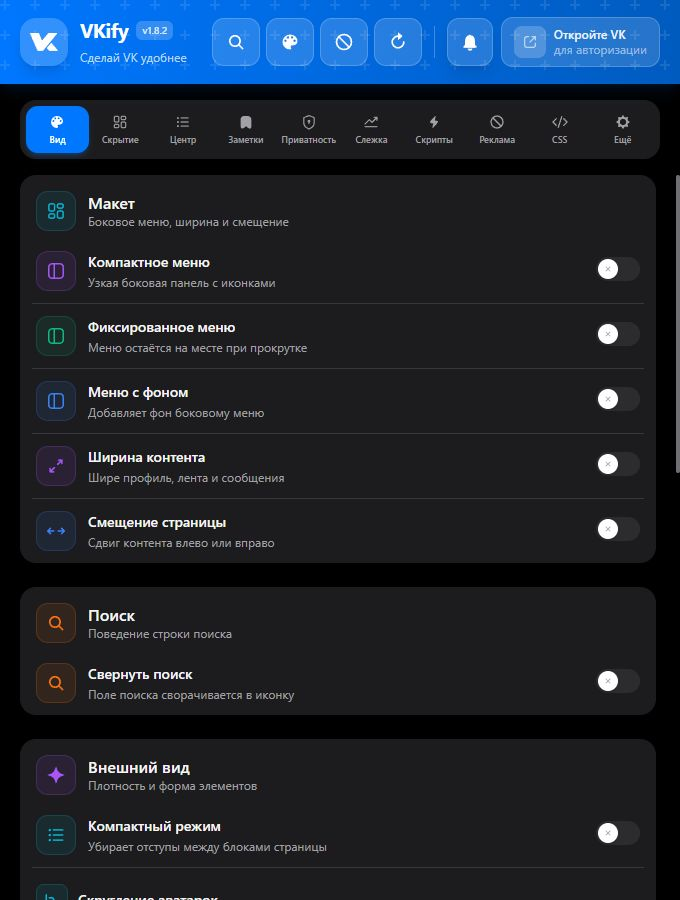
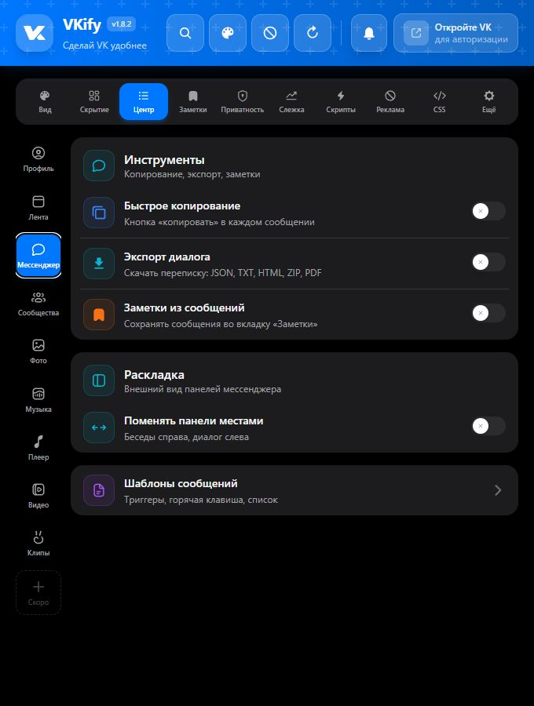
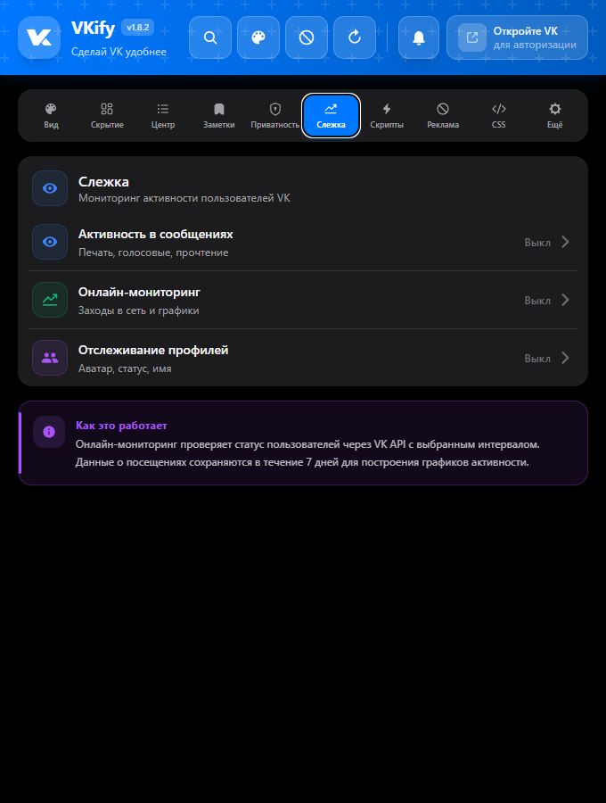
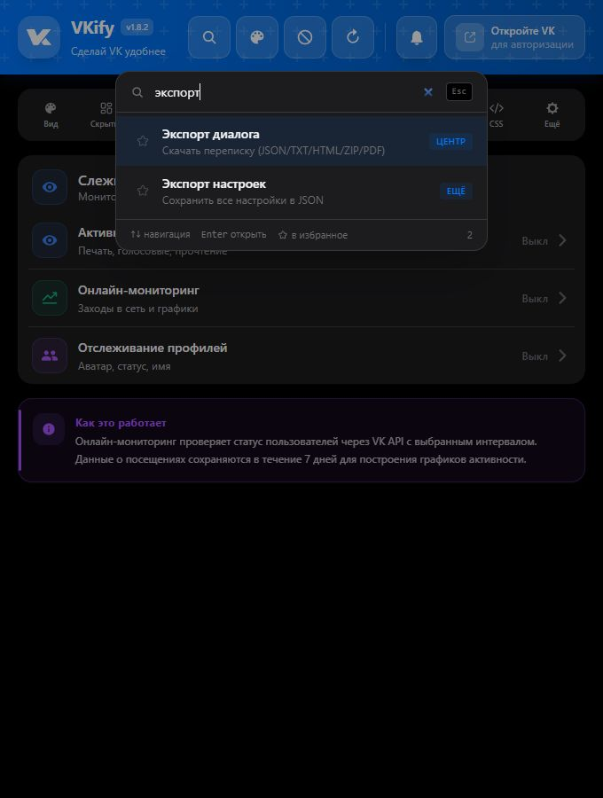
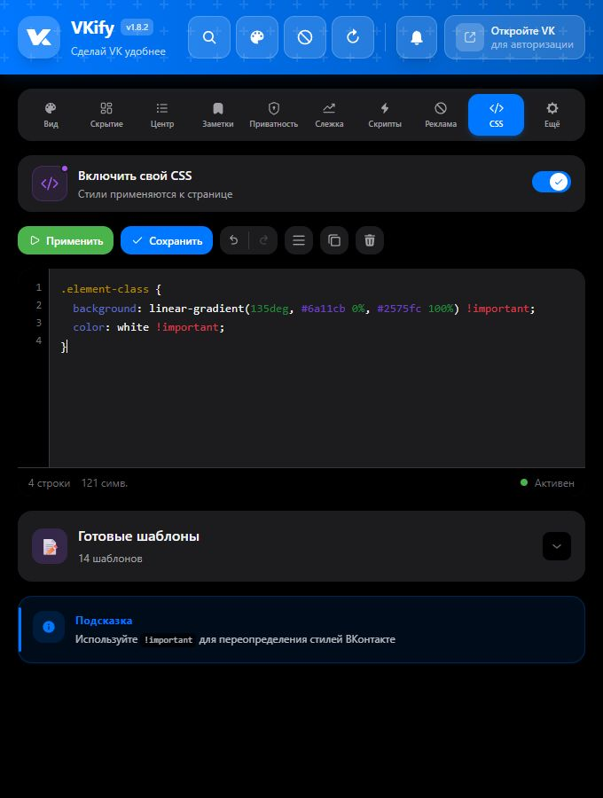
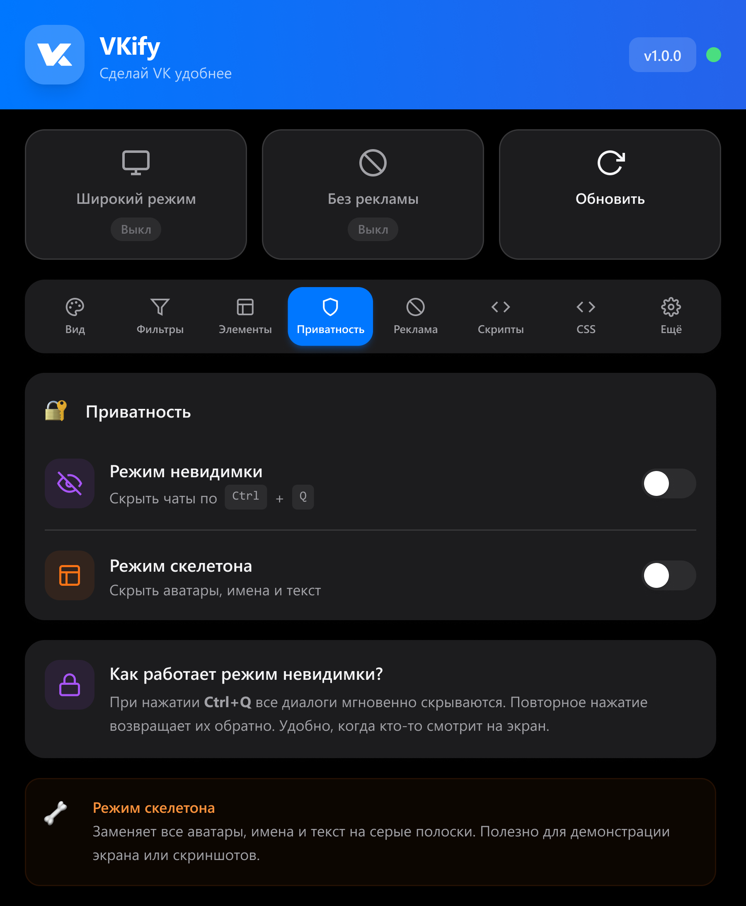
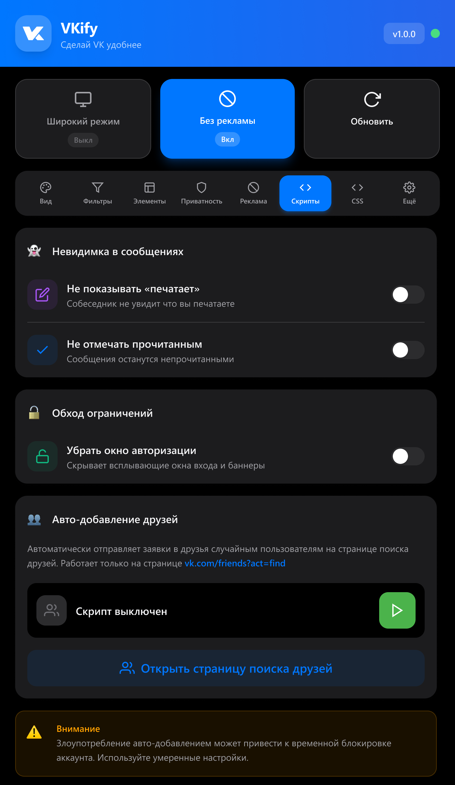
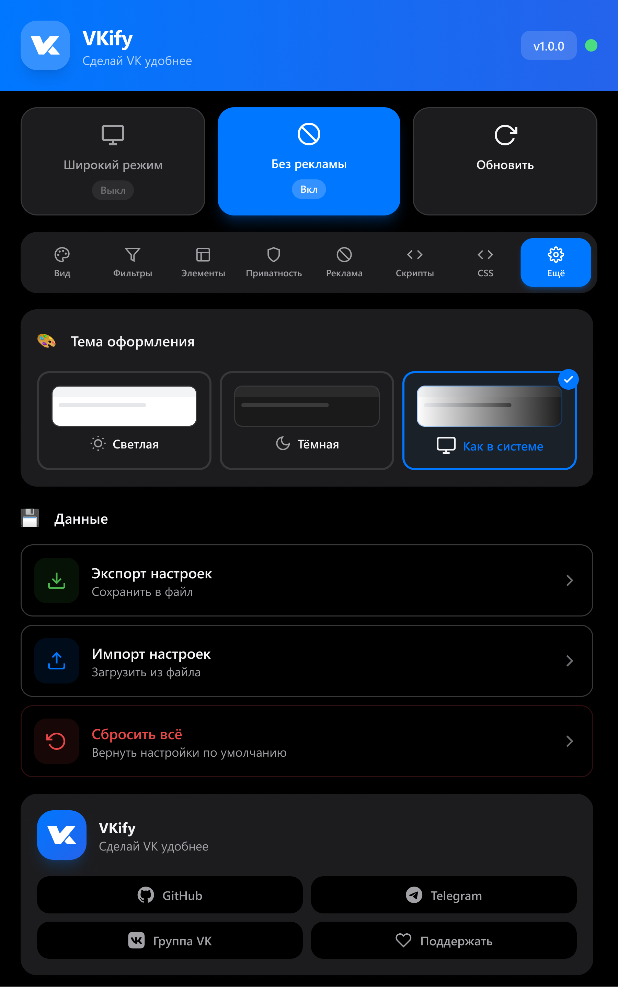

VKify brings VK appearance controls, a cleaner feed, privacy tools, conversation export, media downloads, and automation together in one extension for Chrome, Firefox, and Opera.
<!--more-->

## 📌 About the Project

**VKify** is a cross-browser Manifest V3 extension that adds tools missing from the standard `vk.ru` and `vkvideo.ru` experience. Settings are available in a **10-section** popup and on the embedded `vk.ru/vkify_settings` page; `Ctrl/Cmd + K` opens feature search.

Changes apply instantly without a page reload and stay synchronized across open tabs. The project is developed from a single codebase and is currently released as version **1.8.2**.

| Platform | Support |
|---|---|
| **Chrome and Chromium** | Chrome 109+, available through the Chrome Web Store |
| **Firefox** | Firefox 115+, separate build published on Firefox Add-ons |
| **Opera** | Dedicated Chromium build from the same codebase |
| **Languages** | Complete Russian and English localization, switchable without reloading |

---

## ✨ Features

### 🎨 Appearance and navigation

- **72 built-in themes** in 11 categories, with automatic light/dark switching
- A custom accent color and automatic palette extraction from the selected background
- More than **60 fonts** with size, weight, style, and line-height controls
- Image, video, or HTML-animation backgrounds with blur, dimming, and opacity settings
- Appearance profiles and built-in Minimalism, Privacy, and Performance presets
- Wide and compact layouts, content width and horizontal offset controls, and column swapping
- A minimal fixed sidebar with individual menu-item and counter controls
- Visual filters, avatar shapes, corner-radius controls, and smart conflict warnings

### 🛡️ Clean feed and privacy

- UI and feed ad blocking at both the DOM and API levels
- Tracker and analytics blocking with an inspectable activity log
- Precise hiding of stories, recommendations, comments, promo blocks, mini-chat, and other VK elements
- Invisible mode and blocking for typing and read indicators
- Hotkey-based hiding of selected conversations and page blur when the window loses focus
- Message encryption using **COFFEE** and **VKify E2E v2**, built on AES-256-GCM with PBKDF2

### 📦 Center: messages and media

- Conversation export to JSON, TXT, HTML, and ZIP, plus full or selected-message PDF export
- Message templates with variables, conversation-linked notes, and quick copy
- Quality-selectable video and clip downloads, story downloads, single photos, and complete albums as ZIP
- Track and album downloads in the original format or MP3 with bitrate selection, ID3 tags, cover art, and lyrics
- Batch operations and an on-page download center with progress, cancellation, and background work
- Audio-player hotkeys, playback resume, and a 10-band equalizer

### 📈 Activity tracking and automation

- LongPoll-based message activity tracking: typing, media, reads, edits, and deletions
- Online monitoring with history, weekly charts, and browser notifications
- Tracking avatar, status, and friend-count changes for selected profiles
- Automatic friend requests with limits and randomized delays
- A `ru ↔ en` keyboard-layout switcher on a hotkey
- Direct external links that bypass `away.php`

### ⚙️ Tools and settings

- A CSS editor with highlighting, formatting, live preview, and ready-made snippets
- Settings export/import and versioned storage migrations
- Appearance profiles and themes that can be shared through a link
- A diagnostics report and performance dashboard with a Feature Explorer
- First-run onboarding and search across every setting
- Instant synchronization between the popup, embedded settings page, and VK tabs

---

## 🖼️ Extension Interface

### Current version 1.8.2





### Earlier iterations

These screens show the foundation from which the current interface structure evolved.





---

## 🧩 Architecture

Every user-facing capability is a declarative `FeatureDefinition`: metadata, category, initialization phase, dependencies, conflicts, and behavior plugins. `FeatureManager` owns the feature lifecycle, while the central registry allows new features to be added without modifying the core.

The project is split into six cooperating parts:

1. **Popup** — the 10-tab React interface backed by a shared Zustand store.
2. **Embed** — the same settings UI mounted directly inside a VK page.
3. **Content scripts** — apply styles and behavior to the VK interface.
4. **Injected scripts** — run in the page context for LongPoll, network filters, and APIs unavailable to an isolated content script.
5. **Background** — VK API access, notifications, scheduled jobs, and download coordination.
6. **Site bridge** — safely transfers settings and shared themes from the VKify website to the extension.

State is stored in `chrome.storage.local`, validated against a shared schema, and upgraded through versioned migrations. Settings reactively synchronize across every extension context.

### Cross-browser builds

A shared `manifest/base.json` is combined with Chrome, Firefox, and Opera overrides. Chrome and Opera use a service worker and an offscreen document for PDF generation; Firefox uses a modular background page and an isolated utility tab. A small API-normalization layer preserves a promise-based interface in every browser.

Vite/Rollup produces ESM bundles for the popup and background and standalone IIFE bundles for content and injected scripts. Heavy audio and PDF dependencies stay outside the critical path and load only when required.

### Security

- CSP restricts executable code to extension-owned resources
- A per-session nonce protects the channel between content and injected scripts
- Imported settings, URLs, CSS, and themes go through centralized validation
- Runtime messages verify their sender, while network operations have limits and timeouts
- Production builds are automatically scanned for references to remotely hosted executable code
- The project has no custom backend: settings, profiles, and logs stay local, while external requests go directly to the services required by specific features

---

## 🛠️ Tech Stack

| Layer | Technologies |
|---|---|
| **Interface** | React 18, TypeScript 5, Tailwind CSS 3, i18next |
| **State** | Zustand 5, Chrome Storage, versioned migrations |
| **Build** | Vite 5, Rollup, PostCSS, custom build and verification scripts |
| **Extension** | Manifest V3, WebExtension APIs, content scripts, injected scripts |
| **Media** | hls.js, lamejs, html2canvas, jsPDF, Web Audio API |
| **Quality** | Vitest, happy-dom, Playwright, ESLint, TypeScript type checking |

---

## 🔧 Key Engineering Challenges

### Instant updates without a visual flash

Critical appearance settings are mirrored before React initializes and applied during the earliest page-loading phase. Everything else flows through the feature registry and updates without reloading the tab.

### Page-context access without weakening isolation

LongPoll and network interception need access to page-owned objects, so they live in the injected layer. Communication with the content script uses a validated, nonce-protected, strictly typed message channel.

### Heavy exports without freezing VK

PDF generation runs outside the active VK tab: in an offscreen document on Chromium or an isolated background tab on Firefox. Data is streamed, the operation can be cancelled, and resources are released after completion.

### Resilience to VK interface changes

DOM selectors are centralized, features are isolated from one another, and dynamic areas are observed selectively. This makes maintenance more predictable when `vk.ru` changes its markup.

---

## 📊 Project Metrics

- **1.8.2** — current repository version
- **3** target browsers from a single codebase
- **10** interface sections
- **72** built-in themes in 11 categories
- **60+** available fonts
- **2** fully localized languages
- **5** conversation export options: JSON, TXT, HTML, ZIP, and PDF

---

## 🚀 Result

VKify has grown from a collection of visual tweaks into an independent VK tool platform, with a declarative feature system, cross-browser builds, localization, a media pipeline, message export, and automated quality checks.

- [Install from the Chrome Web Store](https://chromewebstore.google.com/detail/vkify/lofggenkgbpdmmplnbgfplnpfjhgljla)
- [Install from Firefox Add-ons](https://addons.mozilla.org/en-US/firefox/addon/vkify/)
- [Open the VKify website](https://vkify.ru/)
- [Browse the source code](https://github.com/VKify/vkify-extension)
