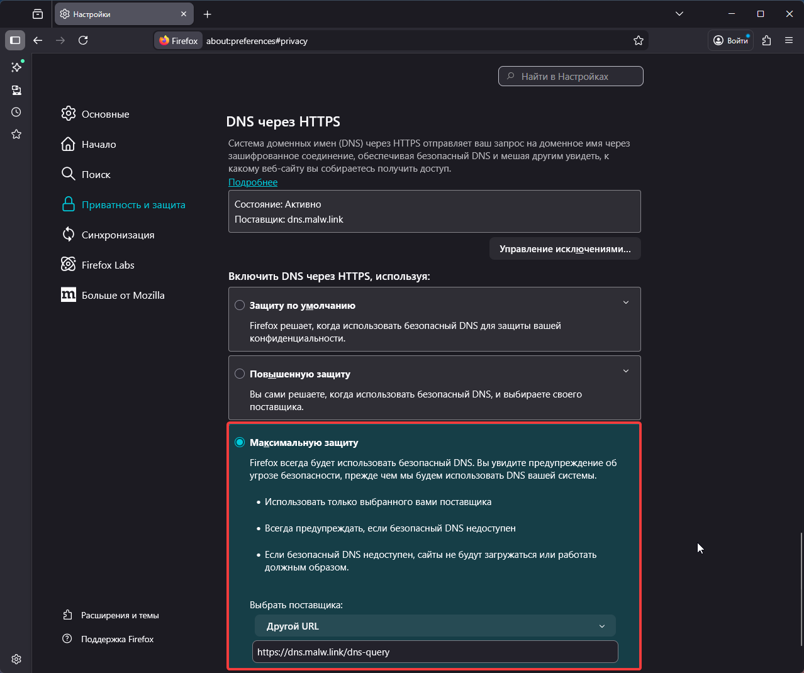
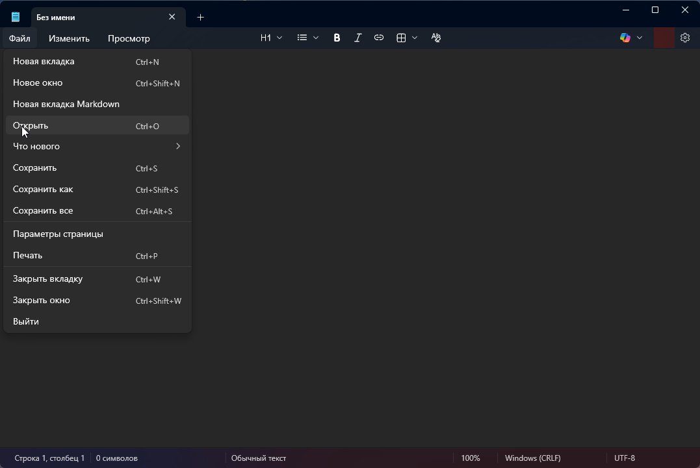

Proper DNS configuration for stable access to AI services – via DNS, hosts file, or AdGuard.

<!--more-->

## Introduction

> Many AI services employ **geographic access restrictions**, determining the user's region by IP address. OpenAI, Anthropic, Google, and other companies restrict access from certain regions at their server level.

There are several technical approaches for correctly configuring network parameters to establish a connection with AI services. This article discusses methods based on proper domain name resolution and selecting permissible connection points.


Access to ChatGPT, Claude, and Gemini can be configured using:

1. Alternative DNS servers;
2. The local `hosts` file;
3. DNS filtering via AdGuard DNS;
4. Ready-made DNS solutions with pre-configured rules.

These methods work by correctly resolving domain names and selecting IP addresses of servers that accept connections. It uses only standard DNS operation without tunneling or bypassing network restrictions.

---

## ⚠️ Important: Security and Trust Issues

All described methods imply trust in the sources of IP addresses:

**Third-party DNS servers** see all your DNS queries (which sites you visit).

**IP addresses from hosts lists** redirect your traffic through third-party intermediate servers.

**Proxy nodes** can technically:
- See unencrypted traffic (if the site uses HTTP).
- Log your requests.
- Potentially intercept data.

**Recommendations:**
1. Use only trusted sources (Xbox DNS, Malw.link, Comss.one).
2. For critical data, consider alternative solutions.
3. Never enter passwords or payment details via unverified proxies.
4. Regularly check the relevance of IP addresses from official sources.
5. Use these methods at your own risk, understanding the technical specifics of DNS operation.

---

## How Geographic Access Restrictions Work

To understand why DNS methods work, it's important to understand the mechanism of user region verification.

### What Happens During Connection

When you open an AI service website, a chain of actions occurs:

1. **DNS Resolution**  
   The system requests the IP address of the domain (e.g., `chatgpt.com`).
2. **Connecting to the Server**  
   The browser connects to the obtained IP.
3. **Verification by the Service**  
   The server analyzes the user's IP address and decides whether to allow access or not.

If the IP is identified as belonging to a restricted region, the service may:
- Not load.
- Show an unavailability message.
- Block registration or login.

### The Role of DNS in the Connection Process

Many AI services use:
- Different IP addresses for different regions.
- CDNs and load balancers.
- Separate frontend nodes with different geo-check logic.

If DNS returns an **alternative permissible IP address**, then:
- The connection is established directly.
- The geo-restriction may determine a different region.
- The service becomes accessible.

It's important to understand:  
👉 **When using third-party DNS, your ISP does not participate in name resolution.**  
👉 **Traffic is not encrypted or tunneled** (this is not a VPN).  
👉 Only **which IP address the domain name resolves to** changes.

This is precisely why:
- The `hosts` file.
- Third-party DNS.
- AdGuard DNS with `dnsrewrite`.

allow for proper connection configuration.

---

## Method 1. Alternative DNS Server

### How it Works

The simplest method is to replace your ISP's DNS server with a public server that returns current IP addresses without regional filtering. Suitable options: **Xbox DNS** or **Malw.link DNS**. These servers provide standard DNS responses.

An additional plus: you can use encrypted protocols like DNS over HTTPS (DoH) or DNS over TLS (DoT), which encrypt DNS queries. Your ISP cannot spoof DNS responses or see which domains you request. However, the IP addresses of the servers you connect to and the HTTPS connection itself remain visible to your ISP.

---

### Available DNS Servers

**Xbox DNS**
- IP: `176.99.11.77`, `80.78.247.254`
- DoH: `https://xbox-dns.ru/dns-query`

**Malw.link**
- IP: `84.21.189.133`, `193.23.209.189`
- DoH: `https://dns.malw.link/dns-query`

> 📎 More details: [xbox-dns.ru](https://xbox-dns.ru/) and [info.dns.malw.link](https://info.dns.malw.link/)

---

### Browser Configuration

Modern browsers can use their own DNS independent of system settings.

#### Chrome, Edge, Brave


1. Open browser **Settings**.
2. Go to **Privacy & Security** → **Security**.
3. Find **Use secure DNS**.
4. Select **Choose another provider** and enter one of the addresses:
   - `https://xbox-dns.ru/dns-query`
   - `https://dns.malw.link/dns-query`

#### Firefox


1. **Settings** → **Privacy & Security**.
2. Scroll to the **DNS over HTTPS** section.
3. Enable **DNS over HTTPS (Max Protection)**.
4. Select provider **Custom URL**.
4. In the **URL** field, enter one of the addresses:
   - `https://xbox-dns.ru/dns-query`
   - `https://dns.malw.link/dns-query`

---

### Operating System Configuration

Configuration at the system level ensures DNS works for all applications, not just the browser.

#### Windows 11

  
    
  
  
    
  


1. **Settings** → **Network & internet**.
2. Select **Wi-Fi** or **Ethernet** (depending on connection).
3. Click on your connection.
4. Find **DNS server assignment** → **Edit**.
5. Select **Manual** and enable **IPv4**.
6. Enter addresses:

**Xbox DNS**

- Preferred DNS: `176.99.11.77`
- Alternate DNS: `80.78.247.254`

**Malw.link DNS**

- Preferred DNS: `84.21.189.133`
- Alternate DNS: `193.23.209.189`

7. Save changes.

#### macOS

1. **System Preferences** → **Network**.
2. Select active connection → **Details** (or **Advanced**).
3. Go to the **DNS** tab.
4. Remove existing entries and add new ones:
   - `176.99.11.77` and `80.78.247.254` (Xbox DNS), or
   - `84.21.189.133` and `193.23.209.189` (Malw.link)
5. Click **OK** → **Apply**.

#### Linux (Ubuntu/Debian with NetworkManager)

1. **Settings** → **Network**.
2. Click ⚙️ next to your connection.
3. **IPv4** tab → **DNS** section.
4. Turn off **Automatic DNS**.
5. Enter addresses separated by commas:
   - `176.99.11.77, 80.78.247.254` or
   - `84.21.189.133, 193.23.209.189`
6. Apply changes and reconnect.

---

### Pros and Cons

| Pros ✅ | Cons ❌ |
|----------|-----------|
| Quick setup – 2 minutes | DNS traffic goes through a third party. |
| Works immediately for all sites. | No granular control. |
| No additional software required. | May affect access to corporate resources. |
| DoH encrypts DNS queries. | Dependency on DNS server availability. |

### Verdict

Excellent solution for a quick start. Requires no technical knowledge, set up in a couple of minutes. Suitable as a basic measure or for users who need a simple method without unnecessary complexity.


  
    
  
  
    
  
  
    
  
  
    
  


---

## Method 2. Hosts File

⚠️ **Important Limitation:** The hosts method does not guarantee stable work with large CDN services (Google, OpenAI, Anthropic). It may stop working without warning and requires regular IP address updates.

### How it Works

The `hosts` file is a text file in your operating system that acts as a local address book for domains. You can specify, for example: "When I open chatgpt.com, use IP address 45.155.204.190."

The operating system checks this file **before any DNS queries**, allowing full control over where the device connects—your ISP is not involved in the DNS resolution process.

The record format is very simple:

```
IP-address    domain
```

For example:

```
45.155.204.190    chatgpt.com
```

### Where to Find the Hosts File

The file location depends on the operating system:

| Operating System | File Path |
|------------------|-----------|
| Windows | `C:\Windows\System32\drivers\etc\hosts`|
| macOS | `/etc/hosts`|
| Linux | `/etc/hosts`|

### How to Edit Hosts in Windows


**Important:** you need administrator rights to edit, otherwise the system won't allow saving changes.

**The Correct Way:**

1. Press Win + S, type "Notepad".
2. Right-click → "Run as administrator".
3. In Notepad: File → Open.
4. In the path field, paste: `C:\Windows\System32\drivers\etc\`.

  
    
  
  
    
  
  
    
  
  
    
  

5. In the "File type" dropdown, select **"All Files"** (otherwise hosts won't appear).
6. Open the file.
7. Scroll to the very end.
8. Add the necessary entries (each on a new line).

  
    
  
  
    
  

9. Save (Ctrl + S).

**Critical Points:**

- **Use only Notepad or Notepad++.** No Word, WordPad, or other text editors—they add invisible formatting characters that will break the file.
- There must be a space or tab between the IP and domain.
- Don't check "Always open files of this type in this program" — hosts should remain unassociated with programs.
- If Windows complains about saving, check your antivirus — some block changes to hosts as potentially dangerous.

### How to Edit Hosts in macOS/Linux

```bash
sudo nano /etc/hosts
```

Enter the administrator password, add entries, save (Ctrl + O, Enter, Ctrl + X).

### Example Entries for AI Services

> ℹ️ **About Duplicate IP Addresses:** You'll notice that one IP (`45.155.204.190`) is used for many different services (OpenAI, Google, Anthropic). This is the address of a special proxy server that:
> - Accepts connections regardless of client geography.
> - Forwards requests to the services' real servers.
> - Allows establishing a connection to AI services.

Here is a basic set for main services:

```
# Google AI Services
45.155.204.190 gemini.google.com
45.155.204.190 aistudio.google.com
45.155.204.190 generativelanguage.googleapis.com
45.155.204.190 aitestkitchen.withgoogle.com
45.155.204.190 aisandbox-pa.googleapis.com
45.155.204.190 webchannel-alkalimakersuite-pa.clients6.google.com
45.155.204.190 alkalimakersuite-pa.clients6.google.com
45.155.204.190 assistant-s3-pa.googleapis.com
45.155.204.190 proactivebackend-pa.googleapis.com
45.155.204.190 robinfrontend-pa.googleapis.com
45.155.204.190 o.pki.goog
45.155.204.190 labs.google
45.155.204.190 notebooklm.google.com
45.155.204.190 jules.google.com
45.155.204.190 stitch.withgoogle.com

# OpenAI
45.155.204.190 chatgpt.com
45.155.204.190 ab.chatgpt.com
45.155.204.190 auth.openai.com
45.155.204.190 auth0.openai.com
45.155.204.190 platform.openai.com
45.155.204.190 cdn.oaistatic.com
45.155.204.190 files.oaiusercontent.com
45.155.204.190 cdn.auth0.com
45.155.204.190 tcr9i.chat.openai.com
45.155.204.190 webrtc.chatgpt.com
45.155.204.190 android.chat.openai.com
45.155.204.190 api.openai.com
45.155.204.190 operator.chatgpt.com
45.155.204.190 sora.chatgpt.com
45.155.204.190 sora.com
45.155.204.190 videos.openai.com
45.155.204.190 ios.chat.openai.com

# Microsoft
45.155.204.190 copilot.microsoft.com
45.155.204.190 sydney.bing.com
45.155.204.190 edgeservices.bing.com
45.155.204.190 rewards.bing.com

# GitHub Copilot
144.31.14.104 api.github.com
144.31.14.104 api.individual.githubcopilot.com
144.31.14.104 proxy.individual.githubcopilot.com

# Grok
45.155.204.190 grok.com
45.155.204.190 accounts.x.ai
45.155.204.190 assets.grok.com

# Claude
45.155.204.190 claude.ai
45.155.204.190 console.anthropic.com
45.155.204.190 api.anthropic.com
```

Lines starting with `#` are comments. The system ignores them; they are for human convenience.

### Where to Get Current IP Addresses

Service IP addresses change periodically. Manually searching for them via nslookup or dig is inconvenient. It's easier to use ready-made up-to-date lists.

**Recommended:** [info.dns.malw.link/hosts](https://info.dns.malw.link/hosts)

There are ready-made configurations for different services. Just copy the needed lines into your hosts file. If there are comments with `#` in the list, you can leave or remove them—as you prefer.

### Pros and Cons

**Pros ✅** | **Cons ❌**
--- | ---
**Maximum Control** — only you decide what and where is resolved. | **IP addresses can change** — you'll need to monitor and update manually.
**Complete Privacy** — no external DNS servers are involved. | **Inconvenient with large lists of sites** (100+ domains) — difficult to edit.
**High Speed** — system doesn't make network DNS queries. | **No synchronization between devices** — each needs to be configured separately.
**Independence from external services.** | **Requires minimal technical skills** for setup.
**Suitable for paranoids :)** |

**Verdict:** Perfect for those who want complete control and are willing to spend 10 minutes on initial setup. For advanced users and privacy paranoids.

---

## Method 3. AdGuard DNS

This is the optimal balance between convenience and control. It combines the simplicity of third-party DNS with the flexibility of the hosts file while simplifying the IP address update process.

### How it Works

AdGuard DNS is not just a public DNS like Google or Cloudflare. It can work with DNS response rewriting rules via a special `dnsrewrite` syntax. Essentially, you create your rules in the cloud, and AdGuard DNS applies them to your device.

**Important:** The IP addresses of AI service servers can change, and AdGuard DNS **does not update them automatically**. The advantage is that you can update all IP addresses **in one place** (in the AdGuard web interface), and the changes immediately apply to all your devices—no need to edit the `hosts` file on each device separately.

Rule syntax:

```
||domain^$dnsrewrite=IP-address
```

Let's break it down with an example:

```
||chatgpt.com^$dnsrewrite=45.155.204.190
```

**What's what:**
- `||` — means "this domain and all its subdomains".
- `chatgpt.com` — target domain.
- `^` — end-of-hostname marker.
- `$dnsrewrite=` — "rewrite DNS response" command.
- `45.155.204.190` — the IP address to be returned instead of the standard one.

When your device asks "where is chatgpt.com?", the query goes to AdGuard DNS. It sees the rule, returns the IP you specified, and the standard DNS resolution is replaced with an alternative one.

### Setting Up AdGuard DNS

**Step 1: Registration**

1. Go to [adguard-dns.io/ru/](https://adguard-dns.io/ru/).
2. Register (email + password, or via Google/Apple/GitHub).
3. The free tier gives 300,000 DNS queries per month—more than enough for personal use.


**Step 2: Creating a Device**

1. In your account, click "Add device".
2. Choose device type (computer, smartphone, router).
3. Copy the DNS server address.

You'll get a personal address like:

- **DNS-over-HTTPS**: `https://d.adguard-dns.com/dns-query/your_id`
- **DNS-over-TLS**: `tls://your_id.d.adguard-dns.com`
- **Regular DNS**: simple IP addresses (less secure, but simpler).


  
    
  
  
    
  
  
    
  


**Step 3: Applying DNS**

Use the instructions from Method 1 (alternative DNS), but instead of Xbox DNS or Malw.link, specify the address from AdGuard.

### Adding Rewriting Rules

Now for the interesting part—adding rules for AI services.

1. Go to "Custom rules".

2. Click "Editor".

3. Paste the rules into the field.

> ℹ️ **About Duplicate IP Addresses:** You'll notice that one IP (`45.155.204.190`) is used for many different services (OpenAI, Google, Anthropic). This is the address of a special proxy server that:
> - Accepts connections regardless of client geography.
> - Forwards requests to the services' real servers.
> - Allows establishing a connection to AI services.

**Basic set for ChatGPT, Claude, Grok, and Gemini:**

```
||gemini.google.com^$dnsrewrite=45.155.204.190
||aistudio.google.com^$dnsrewrite=45.155.204.190
||generativelanguage.googleapis.com^$dnsrewrite=45.155.204.190
||aitestkitchen.withgoogle.com^$dnsrewrite=45.155.204.190
||aisandbox-pa.googleapis.com^$dnsrewrite=45.155.204.190
||webchannel-alkalimakersuite-pa.clients6.google.com^$dnsrewrite=45.155.204.190
||alkalimakersuite-pa.clients6.google.com^$dnsrewrite=45.155.204.190
||assistant-s3-pa.googleapis.com^$dnsrewrite=45.155.204.190
||proactivebackend-pa.googleapis.com^$dnsrewrite=45.155.204.190
||robinfrontend-pa.googleapis.com^$dnsrewrite=45.155.204.190
||o.pki.goog^$dnsrewrite=45.155.204.190
||labs.google^$dnsrewrite=45.155.204.190
||notebooklm.google.com^$dnsrewrite=45.155.204.190
||jules.google.com^$dnsrewrite=45.155.204.190
||stitch.withgoogle.com^$dnsrewrite=45.155.204.190
||chatgpt.com^$dnsrewrite=45.155.204.190
||ab.chatgpt.com^$dnsrewrite=45.155.204.190
||auth.openai.com^$dnsrewrite=45.155.204.190
||auth0.openai.com^$dnsrewrite=45.155.204.190
||platform.openai.com^$dnsrewrite=45.155.204.190
||cdn.oaistatic.com^$dnsrewrite=45.155.204.190
||files.oaiusercontent.com^$dnsrewrite=45.155.204.190
||cdn.auth0.com^$dnsrewrite=45.155.204.190
||tcr9i.chat.openai.com^$dnsrewrite=45.155.204.190
||webrtc.chatgpt.com^$dnsrewrite=45.155.204.190
||android.chat.openai.com^$dnsrewrite=45.155.204.190
||api.openai.com^$dnsrewrite=45.155.204.190
||operator.chatgpt.com^$dnsrewrite=45.155.204.190
||sora.chatgpt.com^$dnsrewrite=45.155.204.190
||sora.com^$dnsrewrite=45.155.204.190
||videos.openai.com^$dnsrewrite=45.155.204.190
||ios.chat.openai.com^$dnsrewrite=45.155.204.190
||copilot.microsoft.com^$dnsrewrite=45.155.204.190
||sydney.bing.com^$dnsrewrite=45.155.204.190
||edgeservices.bing.com^$dnsrewrite=45.155.204.190
||rewards.bing.com^$dnsrewrite=45.155.204.190
||api.github.com^$dnsrewrite=144.31.14.104
||api.individual.githubcopilot.com^$dnsrewrite=144.31.14.104
||proxy.individual.githubcopilot.com^$dnsrewrite=144.31.14.104
||grok.com^$dnsrewrite=45.155.204.190
||accounts.x.ai^$dnsrewrite=45.155.204.190
||assets.grok.com^$dnsrewrite=45.155.204.190
||claude.ai^$dnsrewrite=45.155.204.190
||console.anthropic.com^$dnsrewrite=45.155.204.190
||api.anthropic.com^$dnsrewrite=45.155.204.190
```

4. Click "Save".


Changes apply within 1-2 minutes.

### How to Make a Rule List Yourself and Quickly:

**In VS Code or Notepad++:**
1. `Ctrl+H` (Find and Replace).
2. Enable **Regular expressions** (`.*`).
3. **Find:** `^(\d+\.\d+\.\d+\.\d+)\s+(\S+)`
4. **Replace with:** `||$2^$dnsrewrite=$1`
5. **Replace all**.
6. Done in 5 seconds! 🚀

> 💡 **Note:** Find and replace with regular expressions is available in VS Code, Notepad++, Sublime Text, and other advanced editors. It is not available in the standard Windows Notepad.

**List of current AI service domains:** still the same [info.dns.malw.link](https://info.dns.malw.link/).

### Important Nuances

**Hosts vs AdGuard DNS Priority**

If you previously entered domains in the local `hosts` file, AdGuard DNS won't work for those domains—the system won't query DNS at all.

**Solution:** Either clear the AI service entries from hosts, or use only one of the methods.

**Free Version Limits:**

- 300,000 DNS queries per month.
- Up to 100 custom filtering rules.
- Up to 5 connected devices.

More than enough for personal use.

### Pros and Cons

| Pros ✅ | Cons ❌ |
|----------|-----------|
| **Centralized management** — all rules in one place. | **Requires registration and trust** — AdGuard sees your DNS queries. |
| **Works on all devices** with the specified AdGuard DNS. | **Limits on the free tier.** |
| **No need to manually update IPs** — changes in the account apply automatically. | **Dependency on the service** — problems with AdGuard can disrupt internet access. |
| **Additional blocking** of ads and trackers via filters. | **More complex to set up** than simple DNS. |
| **Query encryption** via DoH/DoT. | |
| **Query statistics** — device activity is visible. | |

**Verdict:** Best option for those who want a balance between convenience and control. Recommended for users with medium technical knowledge.

---

## Method 4. Comss.one DNS – Ready-Made "Out of the Box" Solution

**Comss.one DNS** is a public DNS service with pre-configured access to AI services and built-in DNS filtering. Unlike hosts and AdGuard DNS, **nothing needs to be entered manually** here—all rules are already added on the server side.

The service solves several tasks at once:

* Correct name resolution for AI services.
* Blocking ads, trackers, phishing, and malicious sites.
* Protecting DNS queries using modern encryption protocols.

---

### What Comss.one DNS Offers

**Supported AI Services:**

* ChatGPT and Sora.
* Claude AI.
* Google Gemini.
* Microsoft Copilot.
* GitHub Copilot.
* xAI Grok.

**Additionally:**

* Blocking ads and counters (AdGuard DNS + AdAway filters).
* Protection against phishing and malicious domains.
* Correct operation of Windows updates, antiviruses, and insider builds.
* DDoS protection for servers.
* DNSSEC support.
> 📎 More details: [Comss.one DNS](https://www.comss.ru/page.php?id=7315)
---

### Comss.one DNS Server Addresses (Current)

#### 🔐 DNS-over-HTTPS (DoH)

**For Windows and Browsers:**

```
https://dns.comss.one/dns-query
```

**For MikroTik and Keenetic Routers:**

```
https://router.comss.one/dns-query
```

Server IP:

```
195.133.25.16
```

**For iPhone, iPad, and macOS:**

- Configuration profile: [dns.comss.one.mobileconfig](https://dl.comss.org/download/dns.comss.one.mobileconfig)

---

#### 🔐 DNS-over-TLS (DoT)

**For Android and Linux:**

```
dns.comss.one
```

or

```
tls://dns.comss.one
```

---

#### 🔐 DNS-over-QUIC (DoQ)

```
quic://dns.comss.one
```

---

#### 🌐 Regular DNS Servers (IPv4)

Use if the device doesn't support encryption:

```
83.220.169.155
212.109.195.93
```

---

### Configuration (Briefly)

Configuration is fully analogous to **Method 1**:

* In browser — via "Secure DNS".
* In system — via network settings.
* On router — via DNS or DoH/DoT section.

The only difference is the server address — Comss.one is used.

---

### Important Nuances

* If the system has entries in `hosts` for ChatGPT, Gemini, etc. — **Comss.one DNS will not be used** for those domains.
* Not recommended to use simultaneously:
  * Comss.one DNS.
  * AdGuard DNS.
  * Hosts.
* When using a router, DNS needs to be changed **on it**, not on each device.

---

### Pros and Cons

| Pros ✅ | Cons ❌ |
| :--- | :--- |
| **Works immediately** — no rules or manual IP entry. | **Complete trust in one provider** — you rely on the service's choices. |
| **Ready access to AI services** — already configured and working. | **No granular customization** — cannot flexibly configure blocking like in AdGuard DNS. |
| **Blocks ads and trackers** "out of the box". | **Dependency on Comss.one infrastructure** — access depends on this service's operation and availability. |
| **Supports DoH / DoT / DoQ** — modern and secure protocols. | **Not maximum privacy level** — DNS queries are processed by an external server (unlike the `hosts` file). |
| **Great for routers** — set up once for the entire network. |
| **Free** — no financial cost. |
| **Minimal technical knowledge** — easy to set up and use. |

---

### Verdict

**Comss.one DNS is the best "set it and forget it" option.**

If you need **the simplest and most stable way** to work with ChatGPT, Claude, and Gemini—this is the optimal choice. Especially good for:

* Beginners.
* Home routers.
* Families.
* Smartphones and smart devices.

For fine-tuning — AdGuard DNS.
For maximum autonomy — `hosts`.
But for most users, **Comss.one DNS is the optimal compromise** between convenience and functionality.

---

## Verifying Functionality

After configuring any of the methods, check that everything works:

### DNS Check

1. Open [https://dnsleaktest.com/](https://dnsleaktest.com/).
2. Click "Extended test".
3. Ensure the correct DNS servers are used:
   - Xbox DNS: `176.99.11.77` or `80.78.247.254`
   - Malw.link: `84.21.189.133` or `193.23.209.189`
   - AdGuard or Comss.one: corresponding IPs.

### Checking Access to AI Services

Try opening:
- [chatgpt.com](https://chatgpt.com)
- [claude.ai](https://claude.ai)
- [gemini.google.com](https://gemini.google.com)
- [grok.com](https://grok.com)

If a site doesn't open:
1. Clear DNS cache: `ipconfig /flushdns` (Windows) or `sudo dscacheutil -flushcache` (macOS).
2. Restart the browser.
3. Check that there are no conflicting entries in hosts.
4. Ensure IP addresses are current.

### If Nothing Helps

- Try another DNS server from the article.
- Check if your antivirus is blocking the connection.
- Temporarily disable VPN (if it was on).
- Update IP addresses from current lists.

---

## Frequently Asked Questions (FAQ)

**Q: Can I use multiple methods simultaneously?**

A: Not recommended. Hosts has priority over DNS, so AdGuard DNS or Comss.one won't work for domains entered in hosts.

---

**Q: Is it safe to use someone else's DNS servers?**

A: The DNS servers from the article (Xbox DNS, Malw.link, Comss.one) are public and verified. But they see your DNS queries. For maximum privacy, use hosts.

---

**Q: Why one IP for all services?**

A: `45.155.204.190` is the address of a proxy server that forwards requests to the real servers of OpenAI, Google, and other companies.

---

**Q: IP addresses stopped working. What to do?**

A: Update the list from [info.dns.malw.link/hosts](https://info.dns.malw.link/hosts). CDN IP addresses can change.

---

**Q: Will this work on mobile devices?**

A: Yes. For iOS/Android, configure DNS in system settings or use configuration profiles (for iOS) and Private DNS apps (for Android).

---

**Q: Can my ISP block these methods?**

A: Your ISP can block specific DNS servers or IP addresses. In that case, you'll need to find new working addresses or consider alternative solutions.

---

## Conclusion

Getting stable access to ChatGPT, Claude, and Gemini through proper DNS configuration is **quite possible** and often easier than it seems. In most cases, geographic restrictions are implemented by the services themselves via IP address verification, and DNS approaches allow resolving domain names to alternative connection points.

All four options solve the same problem but differ in convenience, control, and autonomy.

**My Recommendations:**

* **For beginners and those who want "set it and forget it":**
  **Comss.one DNS** — the simplest and most universal option. Ready access to AI services, ad and tracker blocking, DoH/DoT/DoQ support. No IP addresses, rules, or manual updates—just change DNS and use it.

* **For users with moderate experience who need balance:**
  **AdGuard DNS** — the optimal compromise between convenience and flexibility. Set up rewriting rules once, and they work on all devices. No need to edit hosts, yet you retain control over which domains resolve where.

* **For advanced users and privacy paranoids:**
  **The `hosts` file** — maximum autonomy. Everything is local, no third-party DNS services or query leaks. However, you'll need to monitor IP address relevance and update them manually.

* **For family and home use:**
  **Comss.one DNS on the router** — one setup for the entire network. Smartphones, laptops, TVs, game consoles, and smart devices get access to AI services without additional configuration.

In real life, DNS approaches are often **more stable and convenient** than alternative solutions: they don't slow down the connection, work transparently, and don't require constant maintenance.

---

## Useful Links

**DNS Services**
* **Comss.one DNS** — AI access & filtering [link](https://www.comss.ru/page.php?id=7315).
* **AdGuard DNS** — filtering rules (`dnsrewrite`) [link](https://adguard-dns.io/ru/).
* **Xbox DNS** — public DNS with DoH [link](https://xbox-dns.ru/).
* **Malw.link DNS** — public DNS and IP lists [link](https://info.dns.malw.link/).

**Ready IPs and Hosts Files**
* **Hosts and IP lists for AI services** [link](https://info.dns.malw.link/hosts).

**Connection Check**
* **DNS Leak Test** [link](https://dnsleaktest.com/).
* **Whoer** (IP, DNS, region) [link](https://whoer.net/).

**Documentation**
* **AdGuard DNS — Help** [link](https://adguard-dns.io/kb/).
* **Comss.ru — Guides** [link](https://www.comss.ru/).



### Legal Note

All links and technical examples are provided **for reference and educational purposes only**. The material is dedicated to issues of proper DNS resolution and network parameter configuration within the standard capabilities of operating systems and network equipment.

The described approaches are based on standard DNS operation mechanisms and do not involve using means to bypass technical restrictions or violate service terms of use.

The user is solely responsible for complying with applicable laws and service terms of use when applying the described configuration methods.