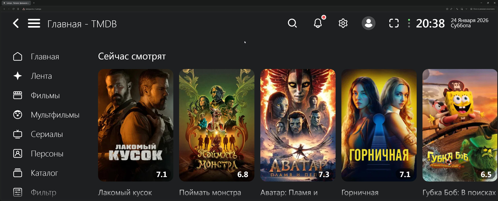
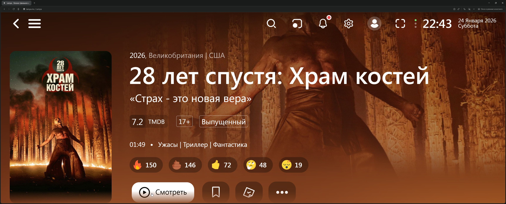

A complete guide to torrent streaming for those who value quality and their time

<!--more-->

## Introduction: Torrents Have Changed

Hey there! Today I want to share a technology that has literally transformed my approach to home theater.

Forget about waiting hours for a movie to download. Forget about cluttered hard drives and folders full of half-forgotten torrents. Modern technology allows you to watch torrents right now — just like a regular streaming service, but with a library that no studio can limit.

The **Lampa + TorrServer** combo turns the chaotic world of torrents into a convenient media center with beautiful covers, descriptions, and instant playback. Let's break down how it works and who it's for!

---

## What Is TorrServer and Why It's a Game Changer

### The Core Technology

TorrServer is a local server that converts torrent files into a video stream. Instead of downloading the entire file, it loads data sequentially and on demand — only the chunks that the player needs at any given moment.

### How It Works Technically (In Simple Terms)

1. You select a movie and press "Play"
2. TorrServer receives the magnet link or torrent file
3. Connects to peers (other users who have the file)
4. Starts downloading data from the beginning of the file, not in random chunks
5. Immediately delivers the stream to your player
6. Buffer is minimal — usually 30–60 seconds of video

Essentially, TorrServer acts as a translator between the chaotic torrent world and your familiar video player.

### Why This Isn't Just "Background Downloading"

A classic torrent client downloads file parts in random order — you might get the final scene first, then the middle. TorrServer uses prioritization: it literally "requests" exactly the fragments needed right now from the network. A smart preloading algorithm makes viewing smooth.

**By the way!** TorrServer can run not only locally but also on a home server or NAS — I'll cover this in more detail in the next article.

---

## Lampa: Your Personal Movie Catalog

### What It Is

Lampa is a media shell application that doesn't store any content itself. Its job is to provide a beautiful interface for searching, cataloging, and launching playback.

Imagine Netflix, but instead of a built-in library — connectable sources: online cinemas, torrent tracker parsers, your local files.

### What Lampa Can Do

| Feature | Description |
|---------|-------------|
| **Catalog with metadata** | Covers, descriptions, ratings, actors — all pulled automatically |
| **Collections and recommendations** | New releases, popular titles, personal lists |
| **Tracker search** | Finds torrents on various trackers via plugins |
| **TorrServer integration** | One button — and the movie plays |
| **Multi-platform** | Android TV, Smart TV, Apple TV, Xbox, smartphones, PC |

### Lampa Versions: Which to Choose

There are several Lampa variants:

- **Lampa (official)** — base version from developers, requires manual plugin installation
- **Lampa UNCENSORED** — modified version with pre-installed content sources

For the official version, plugins are added manually through settings. The UNCENSORED version works "out of the box" but requires changing the server address.

### Key Advantage

Lampa abstracts the complexity. Users see a movie cover, press "Watch," choose quality (1080p, 4K, with or without dubbing) — that's it. No magnet links, no copying between apps.

---

## How It Works: From Choosing a Movie to Playback

Let's break down the user journey step by step:

```
┌─────────────────────────────────────────────────────────────────┐
│  1. SEARCH                                                      │
│     User opens Lampa → enters movie title                       │
│                              ↓                                  │
│  2. SOURCE SELECTION                                            │
│     Lampa shows available options:                              │
│     • Online cinemas (if connected)                             │
│     • Torrent releases (via parsers)                            │
│                              ↓                                  │
│  3. PASSING TO TORRSERVER                                       │
│     User selects a torrent →                                    │
│     Lampa sends magnet link to TorrServer                       │
│                              ↓                                  │
│  4. STREAMING                                                   │
│     TorrServer connects to peers →                              │
│     creates video stream →                                      │
│     delivers to Lampa player                                    │
│                              ↓                                  │
│  5. VIEWING                                                     │
│     Movie plays after 10–30 seconds of buffering                │
└─────────────────────────────────────────────────────────────────┘
```

**Important:** TorrServer can run on the same device (e.g., Android TV) or on a separate server in your home network (NAS, Raspberry Pi, old PC). The second option is more convenient if you watch content on multiple devices.

---

## Advantages: Why This Is Convenient

### 1. Instant 4K Content Playback

A quality 4K HDR release weighs 40–80 GB. At 100 Mbps internet speed, downloading takes 1–2 hours. With TorrServer streaming — playback starts in 30 seconds.

### 2. Disk Space Savings

TorrServer only stores a small buffer (configurable, usually 1–4 GB max). After viewing — data is automatically deleted. No terabytes "for later."

### 3. Access to Rare Content

Streaming services are limited by licenses. On torrents you can find:

- Director's cuts
- Uncensored films
- Rare subtitles
- Content not released in your region
- Remux versions with maximum quality

### 4. Flexible Quality Selection

The same movie is available in different variants:

- 720p for slow internet
- 1080p for balance
- 4K HDR for maximum experience
- Different audio tracks (original, dubbing, voiceover)

### 5. User-Friendly Interface for the Whole Family

Lampa looks like a regular streaming service. No need to explain to parents what a magnet link is — they just choose a movie and watch.

---

## Internet and Device Requirements

### Internet Speed

| Content Quality | Minimum Speed | Recommended |
|-----------------|---------------|-------------|
| 720p | 10 Mbps | 20 Mbps |
| 1080p | 20 Mbps | 40 Mbps |
| 1080p Remux | 40 Mbps | 60 Mbps |
| 4K SDR | 40 Mbps | 60 Mbps |
| 4K HDR/Remux | 80 Mbps | 100+ Mbps |

**Note:** Actual requirements depend on torrent health. A popular movie with hundreds of seeders will work even on slow internet. A rare release with 2–3 peers may buffer even at 200 Mbps.

### Supported Devices

**Android TV / Google TV**
- Best option: native Lampa app + TorrServer
- Compatible: Xiaomi Mi Box, NVIDIA Shield, Ugoos, Sony, Philips, TCL TVs with Android TV
- [Download Lampa for Android TV](https://github.com/lampa-app/LAMPA/releases)

**Regular Smart TVs (Samsung Tizen, LG webOS)**
- Lampa works via browser or special apps
- TorrServer — on a separate device in the network
- Requires additional setup

**Apple TV (tvOS)**
- Can be installed using the **Luxo** app (available only in App Store on Apple TV) — just enter the address `lampa.mx` or an alternative
- More details in the Apple TV section below

**Xbox**
- Can be installed using **Media Station X** app
- [Download Media Station X from Microsoft Store](https://apps.microsoft.com/detail/9P4Z98MLJPLZ)
- Great option for those who already have a console

**PC (Windows, macOS, Linux)**
- TorrServer runs as a background service (we recommend TorrServe MatriX)
- Lampa opens in browser
- Playback — via built-in player or VLC/mpv

**Smartphones and Tablets**
- Android: Lampa app from APK
- iOS: via web version (with limitations)

### To Run TorrServer You'll Need

- **Minimum:** the viewing device itself (Android TV)
- **Optimal:** separate mini-PC, NAS, or Raspberry Pi 4
- **Resources:** 512 MB RAM, any processor, stable internet

---

## Apple TV (tvOS): A Special Case

### Is Lampa Supported on Apple TV?

Not directly through the App Store — no. Apple strictly controls what can be installed on tvOS. However, there's a convenient solution!

### Installation via Luxo

The simplest and working method for Apple TV:

1. Open **App Store** directly on Apple TV
2. Find and install the **Luxo** app
3. Open Luxo and find the address input field
4. Enter the address: `lampa.mx` or an alternative (e.g., `bylampa.online`)
5. Done! Lampa will load inside Luxo

**Pros:**
- No jailbreak required
- Official app from the App Store
- Works stably

**Cons:**
- TorrServer still needs to run on a separate device
- Dependent on Luxo's functionality

### Alternative Methods

**Via AirPlay / Screen Mirroring:**
- Open Lampa on iPhone/iPad or Mac
- Mirror your screen to Apple TV
- Watch content on the big screen

**Via Infuse + TorrServer:**
- TorrServer on a separate device (NAS, PC, Raspberry Pi)
- On Apple TV — the [Infuse](https://apps.apple.com/app/infuse-7/id1136220934) media player
- The player connects to TorrServer over the network
- Use Lampa on another device for navigation

### tvOS Limitations Compared to Other Platforms

| Aspect | Android TV | Smart TV | Apple TV |
|--------|-----------|----------|----------|
| Lampa installation | Easy (APK) | Medium (browser) | Via Luxo |
| Native app | Yes | Partially | Via wrapper |
| TorrServer on device | Yes | No | No |
| 4K HDR support | Yes | Depends on model | Yes |
| Control convenience | High | Medium | Good via Luxo |

### Who Apple TV Will Suit and Who It Won't

**Will suit:**
- Those who already have Apple TV and the Apple ecosystem
- Users willing to use Luxo
- Fans of AirPlay streaming from other Apple devices

**Won't suit:**
- Those who want to set everything up in 5 minutes without additional devices
- Users without a separate device for TorrServer

---

## Xbox: An Unexpected Option for Gamers

If you have an Xbox, you can turn it into a full-fledged media center!

### Installation via Media Station X

1. Find and install **[Media Station X](https://apps.microsoft.com/detail/9P4Z98MLJPLZ)** from the Microsoft Store
2. Open the app and go to settings
3. Add a source with the Lampa address (`lampa.mx` or `bylampa.online`)
4. Enjoy watching!

This is a great solution for those who already own a console and don't want to buy a separate TV box.

---

## Installing Lampa on Different Devices

### Android TV / Google TV — Native Installation

This is the best platform for Lampa. Full-featured app, convenient remote control, ability to install TorrServer directly on the device.

#### What You'll Need

- Device on Android TV 7.0+ (Xiaomi Mi Box, NVIDIA Shield, Ugoos, Sony/Philips/TCL TVs)
- Unknown sources installation enabled
- Lampa APK file

#### Step-by-Step Installation

**Step 1.** Allow installation from unknown sources

Go to: **Settings → Security & Restrictions → Unknown Sources**

Enable permission for the file manager or browser you'll use for installation.

**Step 2.** Download the Lampa APK file

Options:
- Via built-in browser: go to [GitHub Lampa](https://github.com/lampa-app/LAMPA/releases)
- Via **[Downloader](https://play.google.com/store/apps/details?id=com.esaba.downloader)** app from Google Play: enter the download URL
- Via **[Media Station X](https://play.google.com/store/apps/details?id=de.benzac.msx&hl=ru)** app from Google Play
- Transfer APK from computer to USB drive

**Step 3.** Install the application

Open the downloaded file via file manager and confirm installation.

**Step 4.** First launch and setup

On first launch, Lampa will ask to:
- Choose interface language
- Specify server address

**Step 5.** Add plugins (for official version)

Go to: **Settings → Extensions → Add Plugin**

Enter the plugin address:
```
https://skaztv.online/store.js
```

Press "Add" and **completely restart the application** (not just minimize!).

**Step 6.** Install TorrServer

For torrent streaming, install TorrServer as a separate application. APK is available on [the project's GitHub](https://github.com/YouROK/TorrServer/releases).

After installation, specify the TorrServer address in Lampa settings:
```
http://127.0.0.1:8090
```
(if TorrServer is running on the same device)

#### Alternative: Lampa UNCENSORED

If you don't want to manually add plugins:

1. Install standard Lampa
2. Go to **Settings → General → Server Address**
3. Replace the address with:
   - `bylampa.online` (short variant)
   - `https://bylampa.online/` (full address needed for Android TV)
   - `http://bylampa.online/` (for older devices)
4. Restart the application

**Note:** the address `http://lampa.mx` is the standard server without pre-installed plugins.

---

### Smart TV (Samsung Tizen, LG webOS)

On Samsung and LG TVs, there's no way to install APK directly.

#### Method 1: Built-in Browser

**For Samsung:**
1. Open the **Internet** app (browser)
2. Go to: `bylampa.online` or `lampa.mx`
3. Add the page to bookmarks

**For LG:**
1. Open **Web Browser**
2. Enter the Lampa address
3. Save to favorites

**Limitations:**
- Inconvenient cursor control
- Possible playback issues with some formats
- No background mode

#### Method 2: Apps from Official Stores

For Samsung (Tizen App Store) and LG (LG Content Store), there are Lampa versions available. They already have the "Parser" option — no additional plugins needed.

#### Important: TorrServer on a Separate Device

Smart TVs cannot run TorrServer locally. You'll need:
- A computer on the same network
- NAS (Synology, QNAP)
- Raspberry Pi
- Router with Entware support

In Lampa settings, specify the IP address of the device with TorrServer:
```
http://192.168.1.100:8090
```
(replace with your IP)

---

### PC (Windows / macOS / Linux) — Detailed Guide

On a computer, Lampa works through a browser, and TorrServer runs as a local server. For Windows, I recommend using **TorrServe MatriX** — a convenient version with a graphical interface.

#### Installing TorrServe MatriX (Windows)

**Step 1.** Download TorrServe MatriX

Go to [GitHub TorrServe MatriX](https://github.com/YouROK/TorrServer/releases) and download the `TorrServer-windows-amd64.exe` file for Windows.


**Step 2.** Launch TorrServer

Run the downloaded file. Windows may show a SmartScreen warning — click "More info" → "Run anyway."


**Step 3.** Verify the server is working

Open a browser and go to:
```
http://127.0.0.1:8090
```


**Step 4.** Open Lampa in browser

In a new tab, go to:
- [bylampa.online](https://bylampa.online/) — version with pre-installed plugins
- [lampa.mx](http://lampa.mx) — clean version



**Step 5.** Configure TorrServer connection

Go to **Settings** (gear icon) → **General** → **TorrServer**

Enter the address:
```
127.0.0.1:8090
```

> **💡 Important:** The address `127.0.0.1` only works if Lampa is opened on the same computer where TorrServer is running.
>
> If you want to connect from another device on your local network (e.g., from a TV or phone), you need to find the **local IPv4 address** of the computer with TorrServer:
>
> **Windows:** open Command Prompt (Win+R → `cmd`) and enter:
> ```
> ipconfig
> ```
> Find the **IPv4 Address** line (usually looks like `192.168.X.X`) and use it instead of `127.0.0.1`:
> ```
> 192.168.1.100:8090
> ```


**Step 6.** Install a parser (torrent source)

A parser is a plugin that searches for torrents for movies and TV shows. **Without an installed parser, Lampa cannot find releases** — when trying to open torrents, you'll see an empty list.

**6.1.** First, add the parser plugin:

Go to: **Settings → Extensions → Add Plugin**

Enter one of the addresses:

| Parser | Plugin Address |
|--------|----------------|
| Jackett (public) | `https://bylampa.github.io/jackett.js` |
| PubTorr | `https://lampame.github.io/main/pubtorr.js` |


Click **"Add"** and refresh the page.

**6.2.** Then activate the parser in settings:

Go to: **Settings → Parser**

Select the installed parser from the list.


**6.3.** Test the parser:

Open any movie and go to the **"Torrents"** section. If everything is configured correctly, you'll see a list of releases with quality, size, and seeder count.


> **💡 Tip:** If one parser doesn't work or shows few results — try installing a different one.

**Step 7.** Add plugin catalog (optional)

If you're using the clean lampa.mx version and want access to additional plugins, you can add a third-party catalog.

Go to: **Settings → Extensions → Add Plugin**

Enter:
```
https://skaztv.online/store.js
```


> **⚠️ Note:** This is an unofficial catalog of third-party plugins that includes pirated content sources. Use at your own discretion and be aware of legal aspects in your country.

**Step 8.** Done! Choose a movie and watch

Find a movie through search or catalog, click on it, select "Torrents" source, choose quality — playback will start in a few seconds.




#### Installation on macOS

1. Download `TorrServer-darwin-amd64` from [GitHub](https://github.com/YouROK/TorrServer/releases)
2. Open **System Preferences → Security & Privacy**
3. Allow running the downloaded file
4. Run via terminal or double-click
5. Open Lampa in browser and configure as described above

#### Installation on Linux

```bash
wget https://github.com/YouROK/TorrServer/releases/latest/download/TorrServer-linux-amd64
chmod +x TorrServer-linux-amd64
./TorrServer-linux-amd64
```

Then open Lampa in browser and configure connection to `http://127.0.0.1:8090`.

---

### Smartphones and Tablets

#### Android

1. Download APK from [GitHub Lampa](https://github.com/lampa-app/LAMPA/releases)
2. Allow installation from unknown sources
3. Install and configure as on Android TV

TorrServer can run directly on the phone (there's a mobile version), but it heavily drains battery. Better to use a server on another device.

#### iOS / iPadOS

No native app available. Options:
- **Web version in Safari:** open [bylampa.online](https://bylampa.online), add to home screen
- **AirPlay** to Apple TV or TV

---

## Useful Plugins for Lampa

Here's a list of verified plugins that will extend Lampa's capabilities. Add them via **Settings → Extensions → Add Plugin**.

### Torrent Plugins

| Plugin | Description | Address |
|--------|-------------|---------|
| **Adds "Parser" item** | For smart TVs from official stores | `http://cub.rip/plugin/etor` |
| **Parser switching** | Server selection for torrent search with status display | `https://bylampa.github.io/jackett.js` or `https://lampame.github.io/main/pubtorr.js` |
| **Tracks** | Audio track and subtitle selection in torrents | `http://cub.rip/plugin/tracks` |
| **Local TorrServer search** | Automatic TorrServer discovery in local network | `http://193.233.134.21/plugins/checker.js` |
| **Torrent download** | qBittorrent and Transmission connection | `https://lampame.github.io/main/torrentmanager/torrentmanager.js` |
| **Second Torrents button** | Additional button with parser selection | `https://github.freebie.tom.ru/torrents.js` |
| **Free Torrserver** | Free TorrServers online (if you don't have your own) | `https://bylampa.github.io/freetorr.js` |
| **Loading visualization** | Beautiful preloader before video starts | `https://plugin.rootu.top/ts-preload.js` |

### TV Plugins

| Plugin | Description | Address |
|--------|-------------|---------|
| **Diesel TV** | Free TV channels with program guide and archive | `https://andreyurl54.github.io/diesel5/diesel.js` |
| **Kulik TV** | IPTV channels (requires activation via Telegram bot @kuliktv_bot) | `http://cdn.kulik.uz/cors` |
| **IPTV** | IPTV viewing with your own playlists | `http://cub.rip/plugin/iptv` |
| **Hack TV** | Free channels (quality may vary) | `https://bylampa.github.io/tv.js` |

### 18+ Plugins

| Plugin | Description | Address |
|--------|-------------|---------|
| **Strawberry** | Content from Pornhub, Xvideos and others | `https://bwa.to/s` |
| **Strawberry (Bwa Cloud)** | Alternative version for older devices | `http://bwa-cloud.cfhttp.top/sisi.js` |

---

## Limitations and Risks: What You Should Know

### Technical Limitations

**Dependency on Seeders**
If a release is "dead" (no users sharing the file) — you won't be able to watch. This applies to rare and old content.

**Buffering When Seeking**
Jumping 30 minutes forward = new data request. You'll have to wait a few seconds.

**Format Compatibility**
Not all players correctly play HDR, Dolby Vision, multichannel audio. On cheap boxes, 4K may stutter.

**Plugin Instability**
Content sources may stop working, addresses change. Plugins need periodic updating.

---

## Who This Viewing Method Suits

### Ideally Suits:

**Quality Enthusiasts**
Those who won't settle for Netflix compression and want Remux versions.

**Users with Limited Storage**
If your TV box has 8 GB of memory — traditional downloading isn't an option.

**Home Media Server Owners**
TorrServer fits perfectly into an ecosystem with Plex, Jellyfin, NAS.

**Rare Content Viewers**
Art house cinema, old TV shows, foreign shows without localization.

**Android TV Users**
Maximum simple setup, everything works natively.

### May Not Suit:

**With Unstable Internet**
Frequent disconnections = constant buffering.

**For Background Viewing**
If content is just background, easier to turn on YouTube.

**Those Not Ready for Minimal Setup**
Initial configuration will require 20–30 minutes.

---

## Quick Installation Reference

| Platform | Difficulty | Recommendation |
|----------|------------|----------------|
| Android TV | ★☆☆☆☆ | Best choice — APK + TorrServer on device |
| Smart TV (Samsung/LG) | ★★★☆☆ | Browser or app from store + TorrServer separately |
| Apple TV | ★★☆☆☆ | Luxo (from App Store on Apple TV) + TorrServer on separate device |
| Xbox | ★★☆☆☆ | Media Station X + TorrServer separately |
| Windows/macOS/Linux | ★★☆☆☆ | Browser + TorrServe MatriX |
| Android smartphone | ★★☆☆☆ | APK, TorrServer better on server |
| iPhone/iPad | ★★★☆☆ | Web version only |

---

## Conclusion

The Lampa + TorrServer combo is truly a convenient tool for organizing a home theater. The technology has become more accessible: installation has been simplified, new plugins have appeared, buffering has improved.

For those who value freedom of choice and picture quality — this is one of the best options. And the ability to install on Xbox and Apple TV makes the system even more universal!

In the next article, I'll tell you more about running TorrServer on a remote server — this will open up even more possibilities for multi-room viewing.

---

## Useful Links

### Official Resources

| Resource | Link |
|----------|------|
| **Lampa (official site)** | [lampa.mx](https://lampa.mx) |
| **Lampa (GitHub, APK)** | [github.com/lampa-app/LAMPA/releases](https://github.com/lampa-app/LAMPA/releases) |
| **Lampa UNCENSORED** | [bylampa.online](https://bylampa.online) |
| **TorrServer (GitHub)** | [github.com/YouROK/TorrServer](https://github.com/YouROK/TorrServer) |
| **TorrServer (releases)** | [GitHub Releases](https://github.com/YouROK/TorrServer/releases) |

### Apps for Devices

| Platform | App | Link |
|----------|-----|------|
| **Apple TV** | Infuse | [App Store](https://apps.apple.com/app/infuse-7/id1136220934) |
| **Xbox** | Media Station X | [Microsoft Store](https://apps.microsoft.com/detail/9P4Z98MLJPLZ) |
| **Android TV** | Media Station X | [Google Play](https://play.google.com/store/apps/details?id=de.benzac.msx&hl=ru) |
| **Android TV** | Downloader | [Google Play](https://play.google.com/store/apps/details?id=com.esaba.downloader) |

### Plugin Store

| Name | Address |
|------|---------|
| **Main plugin store** | `https://skaztv.online/store.js` |
| **cub.rip (authorization)** | [cub.rip](https://cub.rip) |
| **cub.rip IPTV** | [cub.rip/iptv](https://cub.rip/iptv/) |



*Information current as of: January 2026. Plugin and server addresses may change — check for current data in thematic communities.*