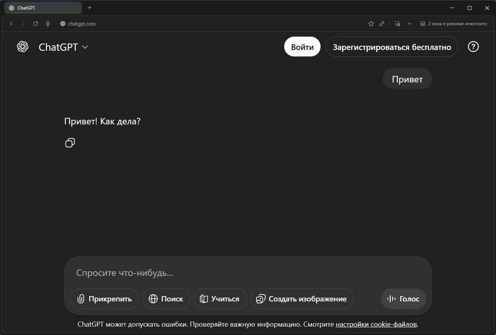

Unlock neural networks without VPN — through DNS, hosts, or AdGuard.

<!--more-->

## Introduction

> Many AI services are unavailable due to regional restrictions. VPN helps, but it's not the only and far from the most convenient way to bypass blocks. A constantly enabled VPN slows down your connection, drains battery on mobile devices, and sometimes conflicts with banking apps or corporate services.


There's an alternative: working with DNS. In this article, we'll cover **four working methods** to access ChatGPT, Claude, and Gemini without VPN:

1. Third-party DNS server
2. `hosts` file
3. DNS filtering through AdGuard DNS
4. Comss.one DNS — ready-made solution

This isn't magic or complex hacking techniques — just smart configuration of how your computer finds out where the sites you need are located. We'll explain how it works and how to set up each method.

---

## How Blocking Actually Works

To understand how to bypass blocks, you need to understand how they work. When you enter a website address in your browser, several steps occur:

1. **DNS query**: your system asks the DNS server: "What's the IP address of chatgpt.com?"
2. **Receiving response**: the DNS server returns an IP address, for example `95.182.120.241`
3. **Connection**: the browser connects to this IP address and loads the site

Most neural network blocks in Russia occur precisely **at the first stage** — at the DNS level. The provider uses its own DNS server, which either substitutes the correct IP address with a stub page or doesn't return a response at all. The result is the same: the site won't open.

The good news: if you get the correct IP address bypassing the provider's DNS, the service will work without any VPN. The traffic to the neural network itself is usually not blocked — only the information about where to connect is blocked.

### Name Resolution Priority

When the system tries to find out a site's IP address, it checks sources in strict sequence:

1. **`hosts` file** — a local file on your computer (highest priority)
2. **User DNS** — the server you specified in settings
3. **Provider's DNS** — the default server from your internet provider

This is important to understand because if you've written an address in `hosts`, then no DNS servers will be used for this domain.

---

## Method 1. Third-Party DNS Server

### How It Works

The simplest way is to replace the provider's DNS server with a public server that doesn't apply regional blocks. Suitable options: **Xbox DNS** or **Malw.link DNS**. These servers honestly return real IP addresses without substitutions.

An additional plus: you can use secure DNS over HTTPS (DoH) or DNS over TLS (DoT) protocols that encrypt DNS queries. The provider won't be able to not only substitute the response but even see which sites you're requesting.

---

### Available DNS Servers

**Xbox DNS**
- IP: `176.99.11.77`, `80.78.247.254`
- DoH: `https://xbox-dns.ru/dns-query`

**Malw.link**
- IP: `84.21.189.133`, `193.23.209.189`
- DoH: `https://dns.malw.link/dns-query`

> 📎 More details: [xbox-dns.ru](https://xbox-dns.ru/) and [info.dns.malw.link](https://info.dns.malw.link/)

---

### Browser Setup

Modern browsers can use their own DNS independently of system settings.

#### Chrome, Edge, Brave


1. Open browser **Settings**
2. Go to **Privacy and security** → **Security**
3. Find **Use secure DNS**
4. Select **Specify custom** and enter one of the addresses:
   - `https://xbox-dns.ru/dns-query`
   - `https://dns.malw.link/dns-query`

#### Firefox


1. **Settings** → **Privacy & Security**
2. Scroll to **DNS over HTTPS** section
3. Enable **DNS over HTTPS** to **Maximum Protection**
4. Select **Custom** provider
5. In the **Address** field enter one of the addresses:
   - `https://xbox-dns.ru/dns-query`
   - `https://dns.malw.link/dns-query`

---

### Operating System Setup

System-level configuration will ensure DNS works for all applications, not just the browser.

#### Windows 11

  
    
  
  
    
  


1. **Settings** → **Network & internet**
2. Select **Wi-Fi** or **Ethernet** (depending on connection)
3. Click on your connection
4. Find **DNS server assignment** → **Edit**
5. Select **Manual** and enable **IPv4**
6. Enter addresses:

| Parameter | Xbox DNS | Malw.link |
|----------|----------|-----------|
| Preferred | `176.99.11.77` | `84.21.189.133` |
| Alternate | `80.78.247.254` | `193.23.209.189` |

7. Save changes

#### macOS

1. **System Preferences** → **Network**
2. Select active connection → **Details** (or **Advanced**)
3. Go to **DNS** tab
4. Remove existing entries and add new ones:
   - `176.99.11.77` and `80.78.247.254` (Xbox DNS), or
   - `84.21.189.133` and `193.23.209.189` (Malw.link)
5. Click **OK** → **Apply**

#### Linux (Ubuntu/Debian with NetworkManager)

1. **Settings** → **Network**
2. Click ⚙️ next to your connection
3. **IPv4** tab → **DNS** section
4. Disable **Automatic DNS**
5. Enter addresses separated by commas:
   - `176.99.11.77, 80.78.247.254` or
   - `84.21.189.133, 193.23.209.189`
6. Apply changes and reconnect

---

### Pros and Cons

| Pros ✅ | Cons ❌ |
|----------|-----------|
| Quick setup — 2 minutes | DNS traffic goes through a third party |
| Works immediately for all sites | No granular control |
| Doesn't require additional software | May break access to corporate resources |
| DoH encrypts DNS queries | Will stop working if DNS is blocked |

### Verdict

Excellent solution for quick start. Doesn't require technical knowledge, configured in a couple of minutes. Suitable as a temporary measure or for users who need a simple method without extra complications.


  
    
  
  
    
  
  
    
  
  
    
  


---

## Method 2. Hosts File

### How It Works

The `hosts` file is a simple text file in your operating system that works as a local address book. In it, you can manually specify: "When I request chatgpt.com, connect to IP address 45.155.204.190".

The system checks this file **earlier** than it queries any DNS servers. This means complete control: the provider doesn't participate in the name resolution process for specified domains at all.

The entry format is very simple:

```
IP-address    domain
```

For example:

```
45.155.204.190    chatgpt.com
```

### Where to Find the Hosts File

The file location depends on the operating system:

| Operating System | File Path |
|----------------------|--------------|
| Windows | `\System32\drivers\etc\hosts`|
| macOS | `/etc/hosts`|
| Linux | `/etc/hosts`|

### How to Edit Hosts in Windows


**Important:** administrator rights are required for editing, otherwise the system won't allow saving changes.

**Correct method:**

1. Press Win + S, type "Notepad"
2. Right-click → "Run as administrator"
3. In Notepad: File → Open
4. In the path field paste: `C:\Windows\System32\drivers\etc\`

  
    
  
  
    
  
  
    
  
  
    
  

5. In the "File type" dropdown select **"All Files"** (otherwise hosts won't show)
6. Open the file
7. Scroll to the very end
8. Add required entries (each on a new line)

  
    
  
  
    
  

9. Save (Ctrl + S)

**Critically important points:**

- **Use only Notepad or Notepad++**. No Word, WordPad or other text editors — they add invisible formatting characters that will break the file.
- There must be a space or tab between IP and domain
- Don't check "Always open files of this type in this program" — hosts should remain without program association
- If Windows complains about saving, check your antivirus — some block hosts changes as potentially dangerous

### How to Edit Hosts in macOS/Linux

```bash
sudo nano /etc/hosts
```

Enter administrator password, add entries, save (Ctrl + O, Enter, Ctrl + X).

### Example Entries for Neural Networks

Here's a basic set for main services:

```
52.223.13.41 tracker.openbittorrent.com
185.31.40.18 test.dns.malw.link
130.255.77.28 ntc.party
45.155.204.190 controlplane.tailscale.com
45.95.233.23 game.clashroyaleapp.com
193.23.209.189 gamea.clashofclans.com
185.246.223.127 game.brawlstarsgame.com
108.61.167.26 game.squadbustersgame.com
45.95.233.23 game.mocogame.com
172.64.33.155 d.rutor.info
157.240.245.174 instagram.com
157.240.245.174 www.instagram.com
157.240.245.174 b.i.instagram.com
157.240.245.174 z-p42-chat-e2ee-ig.facebook.com
157.240.245.174 help.instagram.com
45.155.204.190 gemini.google.com
45.155.204.190 aistudio.google.com
45.155.204.190 generativelanguage.googleapis.com
45.155.204.190 aitestkitchen.withgoogle.com
45.155.204.190 aisandbox-pa.googleapis.com
45.155.204.190 webchannel-alkalimakersuite-pa.clients6.google.com
45.155.204.190 alkalimakersuite-pa.clients6.google.com
45.155.204.190 assistant-s3-pa.googleapis.com
45.155.204.190 proactivebackend-pa.googleapis.com
45.155.204.190 robinfrontend-pa.googleapis.com
45.155.204.190 o.pki.goog
45.155.204.190 labs.google
45.155.204.190 notebooklm.google.com
45.155.204.190 jules.google.com
45.155.204.190 stitch.withgoogle.com

# OpenAI
45.155.204.190 chatgpt.com
45.155.204.190 ab.chatgpt.com
45.155.204.190 auth.openai.com
45.155.204.190 auth0.openai.com
45.155.204.190 platform.openai.com
45.155.204.190 cdn.oaistatic.com
45.155.204.190 files.oaiusercontent.com
45.155.204.190 cdn.auth0.com
45.155.204.190 tcr9i.chat.openai.com
45.155.204.190 webrtc.chatgpt.com
45.155.204.190 android.chat.openai.com
45.155.204.190 api.openai.com
45.155.204.190 operator.chatgpt.com
45.155.204.190 sora.chatgpt.com
45.155.204.190 sora.com
45.155.204.190 videos.openai.com
45.155.204.190 ios.chat.openai.com

# Microsoft
45.155.204.190 copilot.microsoft.com
45.155.204.190 sydney.bing.com
45.155.204.190 edgeservices.bing.com
45.155.204.190 rewards.bing.com
45.155.204.190 xsts.auth.xboxlive.com
45.155.204.190 xgpuwebf2p.gssv-play-prod.xboxlive.com
45.155.204.190 xgpuweb.gssv-play-prod.xboxlive.com

# GitHub Copilot
144.31.14.104 api.github.com
144.31.14.104 api.individual.githubcopilot.com
144.31.14.104 proxy.individual.githubcopilot.com

# Grok
45.155.204.190 grok.com
45.155.204.190 accounts.x.ai
45.155.204.190 assets.grok.com

# Deezer
45.155.204.190 deezer.com
45.155.204.190 www.deezer.com
45.155.204.190 payment.deezer.com

# Claude
45.155.204.190 claude.ai
45.155.204.190 console.anthropic.com
45.155.204.190 api.anthropic.com
```

Lines starting with `#` are comments. The system ignores them; they're needed for human convenience.

### Where to Get Current IP Addresses

Service IP addresses change periodically. Finding them yourself through nslookup or dig is inconvenient. It's easier to use ready-made current lists.

**Recommended:** [info.dns.malw.link/hosts](https://info.dns.malw.link/hosts)

There are ready configs for different services. Just copy the needed lines to your hosts. If there are comments with `#` in the list, you can keep or remove them — whatever's more convenient.

### Pros and Cons

**Pros ✅**
- Maximum control — only you decide what gets resolved where
- Complete privacy — no external DNS servers involved
- Works faster than any DNS because the system doesn't make network requests at all
- Doesn't depend on external services
- Perfect for paranoids :)

**Cons ❌**
- IP addresses can change, you'll need to monitor and update manually
- With a large list of sites (100+ domains) editing becomes inconvenient
- Settings don't sync between devices — must configure separately on each computer/smartphone
- Requires minimal technical skills

**Verdict:** ideal for those who want full control and are ready to spend 10 minutes on initial setup. For advanced users and privacy paranoids.

---

## Method 3. AdGuard DNS

This is the optimal balance between convenience and control. Combines the simplicity of third-party DNS and the flexibility of hosts, while not requiring constant updates.

### How It Works

AdGuard DNS isn't just a public DNS like Google or Cloudflare. It can work with DNS response rewriting rules through special `dnsrewrite` syntax. Essentially, you create your rules in the cloud, and AdGuard DNS applies them for your device.

Rule syntax:

```
||domain^$dnsrewrite=IP-address
```

Let's break down an example:

```
||chatgpt.com^$dnsrewrite=45.155.204.190
```

**What's what:**
- `||` — means "this domain and all its subdomains"
- `chatgpt.com` — target domain
- `^` — end of hostname symbol
- `$dnsrewrite=` — command "rewrite DNS response"
- `45.155.204.190` — IP address that will be returned instead of what the provider would say

When your device asks "where's chatgpt.com?", the request goes to AdGuard DNS. It sees the rule, returns your specified IP, and the provider's block doesn't trigger at all — the request doesn't reach the provider's DNS.

### Setting Up AdGuard DNS

**Step 1: Registration**

1. Go to [adguard-dns.io/en/](https://adguard-dns.io/en/)
2. Register (email + password, or through Google/Apple/GitHub)
3. The free tier gives 300,000 DNS queries per month — more than enough for personal use


**Step 2: Creating a Device**

1. In the dashboard click "Add device"
2. Choose device type (computer, smartphone, router)
3. Copy the DNS server address

You'll get a personal address like:

- **DNS-over-HTTPS**: `https://d.adguard-dns.com/dns-query/your_id`
- **DNS-over-TLS**: `tls://your_id.d.adguard-dns.com`
- **Regular DNS**: just IP addresses (less secure but simpler)


  
    
  
  
    
  
  
    
  


**Step 3: Applying DNS**

Use instructions from Method 1 (third-party DNS), but instead of Xbox DNS or Malw.link specify the address from AdGuard.

### Adding Rewrite Rules

Now the interesting part — adding rules for neural networks.

1. Go to "Custom rules"

2. Click "Editor"

3. Paste rules in the field

**Basic set for ChatGPT, Claude, Grok and Gemini:**

```
||tracker.openbittorrent.com^$dnsrewrite=52.223.13.41
||test.dns.malw.link^$dnsrewrite=185.31.40.18
||ntc.party^$dnsrewrite=130.255.77.28
||controlplane.tailscale.com^$dnsrewrite=45.155.204.190
||game.clashroyaleapp.com^$dnsrewrite=45.95.233.23
||gamea.clashofclans.com^$dnsrewrite=193.23.209.189
||game.brawlstarsgame.com^$dnsrewrite=185.246.223.127
||game.squadbustersgame.com^$dnsrewrite=108.61.167.26
||game.mocogame.com^$dnsrewrite=45.95.233.23
||d.rutor.info^$dnsrewrite=172.64.33.155
||instagram.com^$dnsrewrite=157.240.245.174
||www.instagram.com^$dnsrewrite=157.240.245.174
||b.i.instagram.com^$dnsrewrite=157.240.245.174
||z-p42-chat-e2ee-ig.facebook.com^$dnsrewrite=157.240.245.174
||help.instagram.com^$dnsrewrite=157.240.245.174
||gemini.google.com^$dnsrewrite=45.155.204.190
||aistudio.google.com^$dnsrewrite=45.155.204.190
||generativelanguage.googleapis.com^$dnsrewrite=45.155.204.190
||aitestkitchen.withgoogle.com^$dnsrewrite=45.155.204.190
||aisandbox-pa.googleapis.com^$dnsrewrite=45.155.204.190
||webchannel-alkalimakersuite-pa.clients6.google.com^$dnsrewrite=45.155.204.190
||alkalimakersuite-pa.clients6.google.com^$dnsrewrite=45.155.204.190
||assistant-s3-pa.googleapis.com^$dnsrewrite=45.155.204.190
||proactivebackend-pa.googleapis.com^$dnsrewrite=45.155.204.190
||robinfrontend-pa.googleapis.com^$dnsrewrite=45.155.204.190
||o.pki.goog^$dnsrewrite=45.155.204.190
||labs.google^$dnsrewrite=45.155.204.190
||notebooklm.google.com^$dnsrewrite=45.155.204.190
||jules.google.com^$dnsrewrite=45.155.204.190
||stitch.withgoogle.com^$dnsrewrite=45.155.204.190
||chatgpt.com^$dnsrewrite=45.155.204.190
||ab.chatgpt.com^$dnsrewrite=45.155.204.190
||auth.openai.com^$dnsrewrite=45.155.204.190
||auth0.openai.com^$dnsrewrite=45.155.204.190
||platform.openai.com^$dnsrewrite=45.155.204.190
||cdn.oaistatic.com^$dnsrewrite=45.155.204.190
||files.oaiusercontent.com^$dnsrewrite=45.155.204.190
||cdn.auth0.com^$dnsrewrite=45.155.204.190
||tcr9i.chat.openai.com^$dnsrewrite=45.155.204.190
||webrtc.chatgpt.com^$dnsrewrite=45.155.204.190
||android.chat.openai.com^$dnsrewrite=45.155.204.190
||api.openai.com^$dnsrewrite=45.155.204.190
||operator.chatgpt.com^$dnsrewrite=45.155.204.190
||sora.chatgpt.com^$dnsrewrite=45.155.204.190
||sora.com^$dnsrewrite=45.155.204.190
||videos.openai.com^$dnsrewrite=45.155.204.190
||ios.chat.openai.com^$dnsrewrite=45.155.204.190
||copilot.microsoft.com^$dnsrewrite=45.155.204.190
||sydney.bing.com^$dnsrewrite=45.155.204.190
||edgeservices.bing.com^$dnsrewrite=45.155.204.190
||rewards.bing.com^$dnsrewrite=45.155.204.190
||xsts.auth.xboxlive.com^$dnsrewrite=45.155.204.190
||xgpuwebf2p.gssv-play-prod.xboxlive.com^$dnsrewrite=45.155.204.190
||xgpuweb.gssv-play-prod.xboxlive.com^$dnsrewrite=45.155.204.190
||api.github.com^$dnsrewrite=144.31.14.104
||api.individual.githubcopilot.com^$dnsrewrite=144.31.14.104
||proxy.individual.githubcopilot.com^$dnsrewrite=144.31.14.104
||grok.com^$dnsrewrite=45.155.204.190
||accounts.x.ai^$dnsrewrite=45.155.204.190
||assets.grok.com^$dnsrewrite=45.155.204.190
||deezer.com^$dnsrewrite=45.155.204.190
||www.deezer.com^$dnsrewrite=45.155.204.190
||payment.deezer.com^$dnsrewrite=45.155.204.190
||claude.ai^$dnsrewrite=45.155.204.190
||console.anthropic.com^$dnsrewrite=45.155.204.190
||api.anthropic.com^$dnsrewrite=45.155.204.190
```

4. Click "Save"


Changes apply within 1-2 minutes.

### How to Create a Rules List Quickly:

**In VS Code or Notepad++:**
1. `Ctrl+H` (Find and Replace)
2. Enable **Regular expressions** (`.*`)
3. **Find:** `^(\d+\.\d+\.\d+\.\d+)\s+(\S+)`
4. **Replace with:** `||$2^$dnsrewrite=$1`
5. **Replace all**
6. Done in 5 seconds! 🚀

**List of current neural network domains:** still the same [info.dns.malw.link](https://info.dns.malw.link/).

### Important Nuances

**Priority of hosts vs AdGuard DNS**

If you previously wrote domains in the local `hosts` file, AdGuard DNS won't work for those domains — the system won't query DNS at all.

**Solution:** either clear hosts of neural network entries, or use only one method.

**Free version limits:**

- 300,000 DNS queries per month
- Up to 100 custom filtering rules
- Up to 5 connected devices

For personal use this is more than enough.

### Pros and Cons

**Pros ✅**
- Centralized management — all rules in one place
- Works on all devices where AdGuard DNS is specified
- No need to manually update IPs — just change the rule in the dashboard
- Additional ad and tracker blocking (if filters enabled)
- DNS query encryption via DoH/DoT
- Query statistics — see where your device goes

**Cons ❌**
- Requires registration and trusting an external service (AdGuard sees your DNS queries)
- Limits on free tier
- Dependency on AdGuard service — if they have problems, internet may disappear
- Slightly more complex to set up than just changing DNS from the first option

**Verdict:** best option for those who want balance between convenience and control. Recommended for users with medium technical knowledge level.

---

## Method 4. Comss.one DNS — Ready-Made "Out of the Box" Solution

**Comss.one DNS** is a public DNS service with pre-configured access to AI services and built-in DNS filtering. Unlike hosts and AdGuard DNS, **nothing needs to be manually configured** — all rules are already added on the server side.

The service is oriented towards users from Russia and solves several tasks at once:

* bypassing DNS blocks of AI services;
* blocking ads, trackers, phishing and malicious sites;
* protecting DNS queries using modern encryption protocols.

---

### What Comss.one DNS Provides

**Supported AI services:**

* ChatGPT and Sora
* Claude AI
* Google Gemini
* Microsoft Copilot
* GitHub Copilot
* xAI Grok

**Additionally:**

* ad and tracker blocking (AdGuard DNS + AdAway filters);
* protection from phishing and malicious domains;
* correct operation of Windows updates, antiviruses and insider builds;
* server DDoS protection;
* DNSSEC support.
> 📎 More details: [Comss.one DNS](https://www.comss.ru/page.php?id=7315)
---

### Comss.one DNS Server Addresses (Current)

#### 🔐 DNS-over-HTTPS (DoH)

**For Windows and browsers:**

```
https://dns.comss.one/dns-query
```

**For MikroTik and Keenetic routers:**

```
https://router.comss.one/dns-query
```

Server IP:

```
195.133.25.16
```

**For iPhone, iPad and macOS:**

- configuration profile: [dns.comss.one.mobileconfig](https://dl.comss.org/download/dns.comss.one.mobileconfig)

---

#### 🔐 DNS-over-TLS (DoT)

**For Android and Linux:**

```
dns.comss.one
```

or

```
tls://dns.comss.one
```

---

#### 🔐 DNS-over-QUIC (DoQ)

```
quic://dns.comss.one
```

---

#### 🌐 Regular DNS Servers (IPv4)

Use if your device doesn't support encryption:

```
83.220.169.155
212.109.195.93
```

⚠️ Without encryption, the provider can **theoretically** interfere with DNS queries, so when possible it's better to use DoH / DoT / DoQ.

---

### Setup (Brief)

Setup is completely analogous to **Method 1**:

* in browser — through "Secure DNS";
* in system — through network settings;
* on router — through DNS or DoH/DoT section.

The only difference is the server address — Comss.one is used.

---

### Important Nuances

* If there are entries in `hosts` for ChatGPT, Gemini, etc. — **Comss.one DNS won't be used** for these domains.
* Not recommended to use simultaneously:

  * Comss.one DNS
  * AdGuard DNS
  * NextDNS
    for the same devices.
* When using a router, DNS needs to be changed **on it**, not on each device.

---

### Pros and Cons

**Pros ✅**

* Works immediately — without rules and IPs
* Ready access to AI services
* Ad and tracker blocking
* DoH / DoT / DoQ support
* Perfect for routers
* Free
* Minimal technical knowledge required

**Cons ❌**

* Complete trust in one DNS provider
* No granular customization like in AdGuard DNS
* Dependency on Comss.one infrastructure
* Not maximum privacy level (unlike hosts)

---

### Verdict

**Comss.one DNS is the best "set and forget" option.**

If you need **the simplest and most stable way** to use ChatGPT, Claude and Gemini without VPN — this is the optimal choice. Especially well suited for:

* beginners;
* home routers;
* families;
* smartphones and smart devices.

For fine-tuning — AdGuard DNS.
For maximum autonomy — `hosts`.
But for most users **Comss.one DNS is the optimal compromise** between convenience and functionality.

---

## Conclusion

Getting access to ChatGPT, Claude and Gemini without VPN is **quite realistic** and often simpler than it seems. In most cases, blocks are implemented at the DNS level, which is exactly why the methods described in the article work stably and without unnecessary side effects.

All four options solve one task, but differ in level of convenience, control and autonomy.

**My recommendations:**

* **For beginners and those who want "set and forget":**
  **Comss.one DNS** — the simplest and most universal option. Ready access to AI services, ad and tracker blocking, DoH / DoT / DoQ support. No IP addresses, rules and manual updates — just change DNS and use.

* **For users with medium experience who need balance:**
  **AdGuard DNS** — optimal compromise between convenience and flexibility. Set up rewrite rules once, and they work on all devices. No need to edit hosts, but control over which domains resolve where is maintained.

* **For advanced users and privacy paranoids:**
  **`hosts` file** — maximum autonomy. Everything local, without third-party DNS services and query leaks. But you'll need to monitor IP address relevance and update them manually.

* **For family and home use:**
  **Comss.one DNS on router** — one setup for the entire network. Smartphones, laptops, TVs, game consoles and smart devices get access to AI services without VPN and without individual configuration.

In real life, DNS approaches often turn out to be **more stable and convenient than VPN**: they don't slow down the connection, don't drain battery, don't conflict with banking apps, and work transparently for all applications.

The only serious downside — if the provider starts massively applying blocks by IP or DPI, DNS may stop helping. In this case, VPN will indeed remain the only option. But while the main mass of restrictions is implemented through DNS, all described methods remain working.

**Useful links:**

* [comss.ru](https://www.comss.ru/page.php?id=7315) — Comss.ru DNS and instructions
* [info.dns.malw.link](https://info.dns.malw.link/) — current IPs and ready configs for hosts
* [adguard-dns.io](https://adguard-dns.io/en/) — cloud AdGuard DNS
* [dnsleaktest.com](https://dnsleaktest.com/) — DNS check
* [whoer.net](https://whoer.net/) — comprehensive connection check