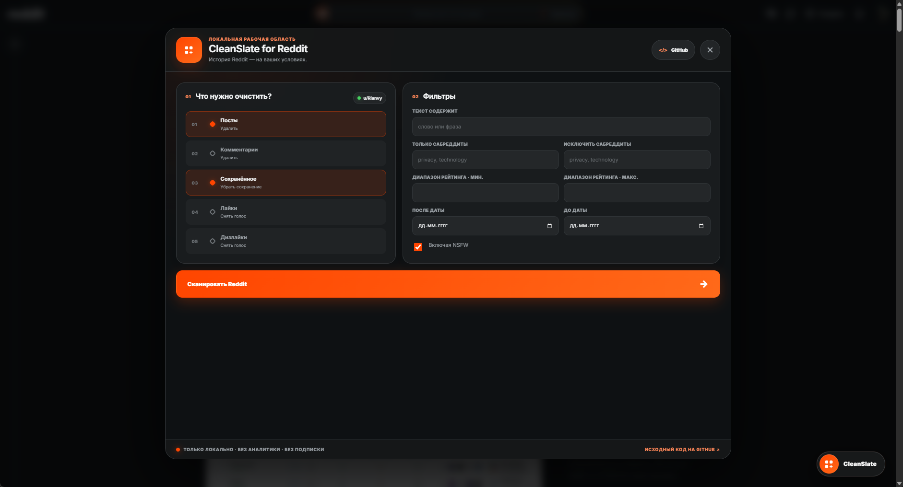
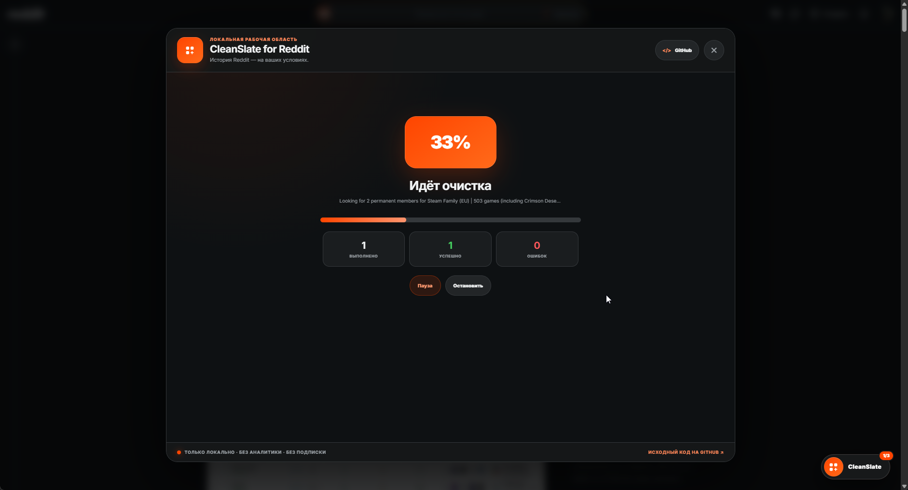

**CleanSlate for Reddit** — локальное браузерное расширение для безопасной и контролируемой очистки собственной истории Reddit без подписки, внешнего сервера и передачи данных третьим лицам.
<!--more-->

## 📌 О проекте

**CleanSlate** помогает удалить собственные посты и комментарии, очистить сохранённые публикации, снять лайки и дизлайки и при необходимости скрыть обработанные посты. Расширение использует уже открытую сессию Reddit и работает непосредственно в браузере — без Client ID, отдельной OAuth-формы или внешнего backend.

Ключевая цель проекта — дать пользователю **прозрачный и предсказуемый инструмент** для массовой очистки: сначала отсканировать историю, затем проверить каждое действие и только после явного подтверждения запустить очередь.

---

## ✨ Что было сделано

### Интерфейс и UX

- Реализован компактный launcher, который открывает рабочее окно поверх Reddit
- Спроектирован пошаговый сценарий: выбор разделов, настройка фильтров, предварительный просмотр и выполнение
- Добавлены состояния активной сессии, прогресса, паузы, ошибок и завершения
- Интерфейс изолирован от стилей Reddit через **Shadow DOM**
- Поддерживаются русский и английский языки

### Сканирование и фильтрация

- Сканирование собственных постов, комментариев, сохранённых публикаций, лайков и дизлайков
- Полная курсорная пагинация Reddit — до 2000 элементов в каждом разделе
- Фильтры по тексту, сабреддитам, рейтингу, диапазону дат и NSFW
- Дедупликация результатов перед формированием очереди
- Экспорт предварительного списка в JSON или CSV

### Безопасное выполнение

- Предварительный просмотр всех найденных элементов с возможностью снять выбор
- Дополнительное подтверждение словом `DELETE` перед удалением постов и комментариев
- Опциональная перезапись комментариев перед удалением
- Пауза, продолжение, остановка и повтор только неудачных действий
- Автоматическая обработка ограничений Reddit с обратным отсчётом при ответе `429`
- Повтор временных ошибок `503` с увеличивающейся задержкой
- Контролируемые интервалы между запросами и периодические паузы в длинных очередях

### Приватность

- Данные обрабатываются локально и хранятся только в памяти вкладки
- Используется существующая cookie-сессия браузера
- Запросы отправляются только на домены Reddit
- Нет аналитики, рекламы, телеметрии, лицензирования и платежей
- Manifest запрашивает только доступ к `https://*.reddit.com/*`

---

## 🖼️ Интерфейс расширения





---

## 🎨 Дизайн-система



- **Визуальный стиль:** тёмные поверхности, контрастный оранжевый акцент и мягкое свечение ключевых действий
- **Компоненты:** карточки разделов, фильтры, чекбоксы, прогресс очереди и статусные индикаторы
- **Изоляция:** стили интерфейса не зависят от текущей версии оформления Reddit

---

## 🛠️ Техническая реализация

Расширение построено на **WXT**, **React 19** и **TypeScript 6**. Content script внедряет приложение на страницы Reddit, а Shadow DOM защищает интерфейс от конфликтов со стилями сайта. Отдельный popup показывает состояние проекта и помогает перейти к основной вкладке.

Клиент сессии получает текущего пользователя и `modhash`, сканирует JSON-списки Reddit с курсорной пагинацией и выполняет подтверждённые действия через штатные API endpoints. Очередь отделена от UI и управляет интервалами, паузами, повторными попытками и rate limiting. Критические сценарии фильтрации, работы с сессией и очередью покрыты тестами **Vitest**.

Проект собирается для Chromium и Firefox, использует **Manifest V3** и распространяется под лицензией **MIT**.

---

## 🌐 Итог

- Полноценный local-first инструмент для управления историей Reddit
- Понятный сценарий с предварительным просмотром и явным подтверждением опасных действий
- Устойчивое выполнение больших очередей с учётом ограничений Reddit
- Минимальные разрешения и отсутствие внешней инфраструктуры
- Открытый исходный код и двуязычный интерфейс
