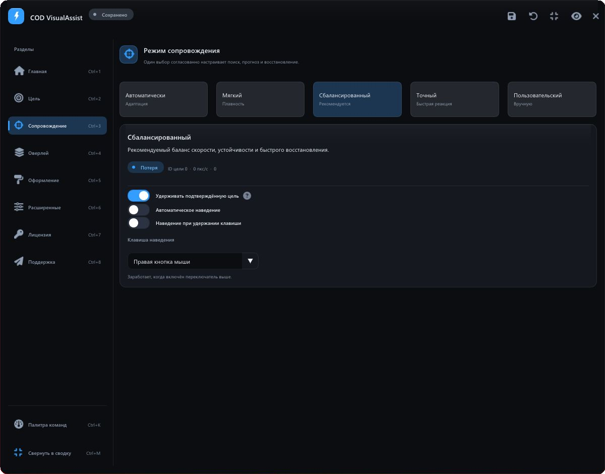
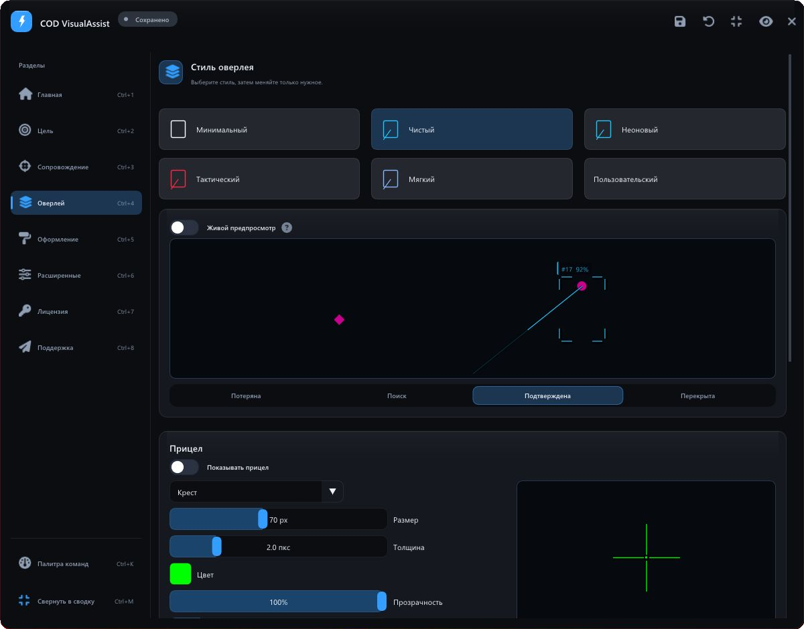
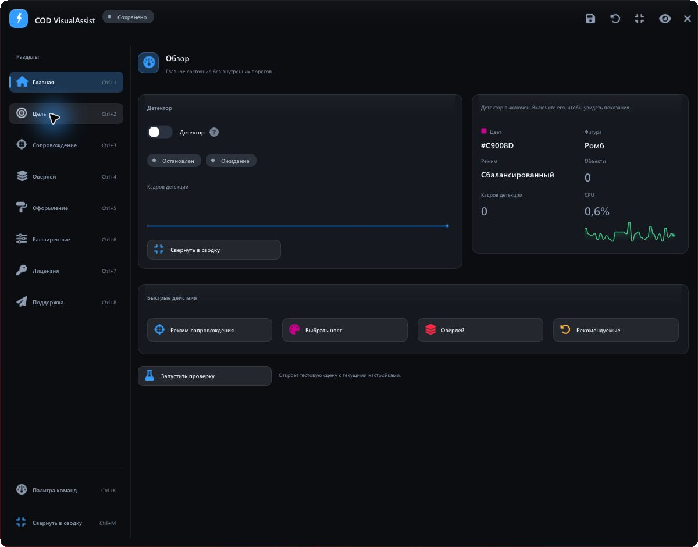

**COD VisualAssist** — desktop-приложение для современных версий Call of Duty, созданное для помощи в наведении на противника. Оно распознаёт игровые маркеры на экране, сопровождает цели и управляет визуальными подсказками через прозрачный оверлей.
<!--more-->

## От экранного маркера — к действию

COD VisualAssist объединяет компьютерное зрение, сопровождение объектов и помощь в наведении поверх современных игр серии Call of Duty. Приложение находит маркеры по цвету и форме в захваченном изображении, сохраняет идентичность цели между кадрами и передаёт результат системе наведения и прозрачному оверлею.

За лаконичной панелью находится самостоятельный конвейер захвата и обработки кадров. Пользователь начинает с цвета маркера и готового режима, а затем уточняет поведение, внешний вид и горячие клавиши.

> Изображение экрана — источник данных для детектора. Чтение памяти игрового процесса в проекте не используется.

## 01 / Распознать

Первый экран настройки отвечает на простой вопрос: что именно должно увидеть приложение. Большая палитра объединена с готовыми цветами, историей выбора и пипеткой для получения цвета с экрана. Справа — форма маркера, область поиска, приоритет объекта и наглядный предпросмотр маски.

Поддерживаются **ромб, круг и поиск обеих форм**. Детектор проверяет разные масштабы, а приоритет позволяет выбирать между сбалансированным отбором, близостью к прицелу, достоверностью и размером маркера. Точка наведения задаётся отдельно — с визуальной схемой положения на силуэте.





## 02 / Удержать

Сопровождение строится вокруг непрерывности: краткий пропуск маркера не должен превращаться в случайную смену объекта. Многоцелевой трекер присваивает объектам устойчивые идентификаторы, сопоставляет наблюдения между кадрами и прогнозирует движение при коротком перекрытии.

В интерфейсе доступны **автоматический, мягкий, сбалансированный, точный и пользовательский режимы**. Они согласованно управляют поиском, прогнозом и восстановлением. Автоматическое наведение и наведение при удержании клавиши включаются отдельно; для автовыстрела предусмотрены удержание кнопки, повторные клики и одиночное срабатывание.





### Один жизненный цикл цели

1. **Поиск — Acquiring.** Приложение накапливает подтверждение нового объекта.
2. **Захват — Locked.** Подтверждённая цель получает приоритет сопровождения.
3. **Перекрытие — Coasting.** Позиция кратковременно прогнозируется; автовыстрел не разрешается.
4. **Потеря — Lost.** После окончательной потери система возвращается к выбору цели.

Эта модель используется наведением, визуальными подсказками и телеметрией. Благодаря общей модели разные части приложения согласованно реагируют на смену состояния.

## 03 / Отобразить

Оверлей настраивается как единая визуальная система. Рамки объектов, линии к цели, подписи, область поиска и отдельный прицел имеют собственные параметры. Доступны варианты линий и рамок, толщина, цвет, прозрачность и свечение.

Готовые стили — **минимальный, чистый, неоновый, тактический и мягкий** — позволяют быстро собрать согласованное оформление. Встроенный предпросмотр показывает результат в разных состояниях цели. Его можно переключить на живые данные детектора.





Рамки показывают известные трекеру объекты: активная цель выделяется основным цветом, остальные — нейтральным, а временно перекрытые — приглушённым. Линия и индикатор захвата относятся к активной цели.

## Интерфейс, который подстраивается

Визуальный язык приложения строится на графитовых поверхностях, тонких границах, голубом акценте и типографике Segoe UI. Постоянная боковая навигация сохраняет контекст, а карточки объединяют связанные параметры. Светлая тема использует ту же сетку и иерархию.

Пользователь может менять акцентный цвет, масштаб интерфейса и шрифта, плотность, прозрачность и язык. Для увеличения текста приложение пересобирает атлас шрифтов. Палитра команд, горячие клавиши, отмена и повтор изменений сокращают путь к нужному действию; компактная сводка оставляет на экране основные показатели.





### Настройки, которые можно сохранить

Полные конфигурации сохраняются в именованные профили. Приложение поддерживает автосохранение, историю изменений и сравнение параметров профилей. Основной INI-файл записывается через временный файл и атомарную замену; резервная копия помогает восстановить повреждённую конфигурацию.

## Техническая реализация

| Слой | Реализация |
| --- | --- |
| Захват | DXGI Desktop Duplication через DirectX 11; резервный способ захвата экрана. Выбор монитора и учёт его координат. |
| Распознавание | OpenCvSharp: фильтрация по цвету, анализ формы, многомасштабный поиск и локальное восстановление. |
| Сопровождение | Многоцелевой трекер, сопоставление наблюдений, устойчивые ID, удержание и прогноз движения. |
| Отрисовка | ImGui.NET и ClickableTransparentOverlay; общий рендерер визуальных элементов для оверлея и его предпросмотра. |
| Конфигурация | INI, профили, автосохранение и резервное восстановление; снимки параметров для рабочих компонентов. |

### Обработка кадров без лишней работы

Конвейер использует поиск по кандидатным областям, проверку изменений кадра и адаптивное управление частотой детекции. Режимы производительности задают компромисс между точностью и задержкой. Данные о кадрах, времени обработки и состоянии сопровождения доступны для разбора; встроенный симулятор позволяет проверить поведение на управляемой сцене.

Качество распознавания зависит от видимости, формы и стабильности цвета игрового маркера. Поэтому настройки области поиска и детектора вынесены в интерфейс вместе с визуальной обратной связью.

## Цельный desktop-продукт

COD VisualAssist связывает настройку распознавания, поведение сопровождения и визуальный результат в последовательный рабочий процесс для современных игр Call of Duty. Готовые режимы упрощают начало работы, а детальные параметры, профили и предпросмотр дают контроль над каждым следующим шагом.



