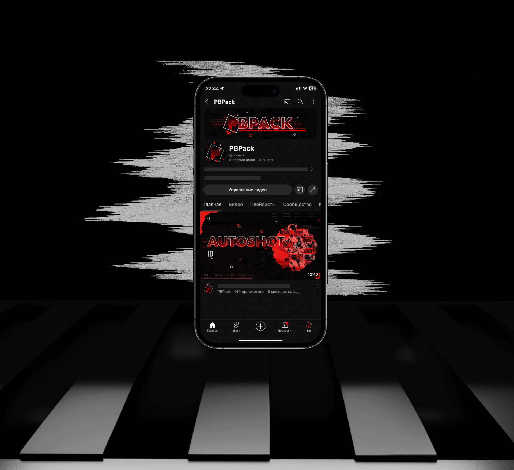
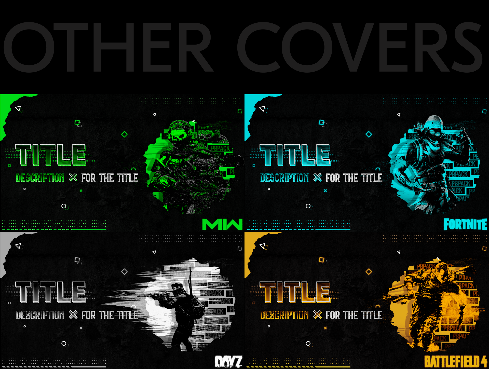

Разработка визуального стиля для бренда PBPack в социальных сетях, включая YouTube и Telegram.
<!--more-->

## 📌 О проекте PBPack  
**Задача проекта:**  
Создание единого визуального стиля для бренда PBPack, ориентированного на платформы YouTube и Telegram. Главная цель — гармоничное и яркое представление бренда в этих каналах.

**Ключевые этапы разработки:**  
- ✔️ Создание айдентики для YouTube (шапка, аватар, шаблоны обложек для видео)  
- ✔️ Разработка кастомизированного интерфейса для Telegram (оформление канала и бота)  
- ✔️ Дизайн анимированного логотипа для использования на всех платформах

---

### Результат работы

---

## 🚀 Ключевые элементы

### 🌀 Анимированный логотип  
  
> *Анимация логотипа с плавным переходом цветов и трансформацией формы, создающая динамичное восприятие бренда.*

---

## 📱 Презентация и адаптация

### YouTube

### Telegram  

**Особенности реализации:**  
- Единый стиль, применяемый на всех платформах  
- Адаптивные шаблоны для регулярных публикаций в YouTube и Telegram

---

## 🎨 Процесс создания обложки

  
> *От разработки композиции до выбора цветовой палитры и типографики.*

---

## 🔧 Базовые элементы бренда

---

## 📌 Готовые решения

---

## 🔗 Реализованные проекты

- [🎥 YouTube канал](https://www.youtube.com/@pbpack/videos)  
- [📨 Telegram канал](https://t.me/PBPackOne)