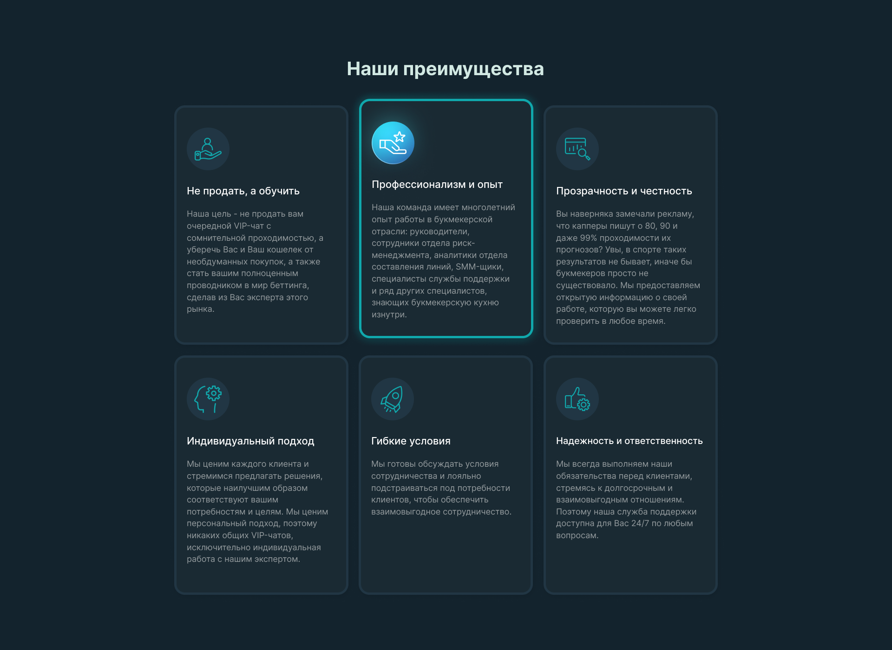
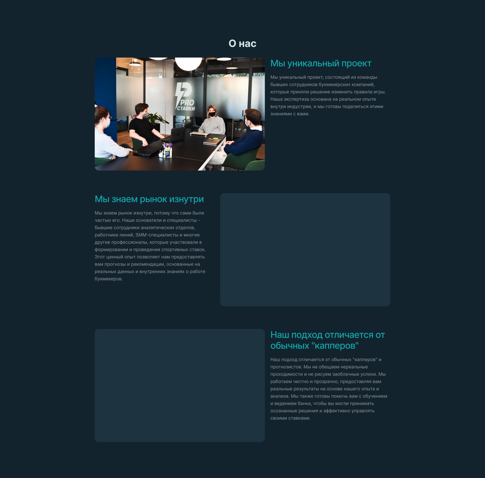
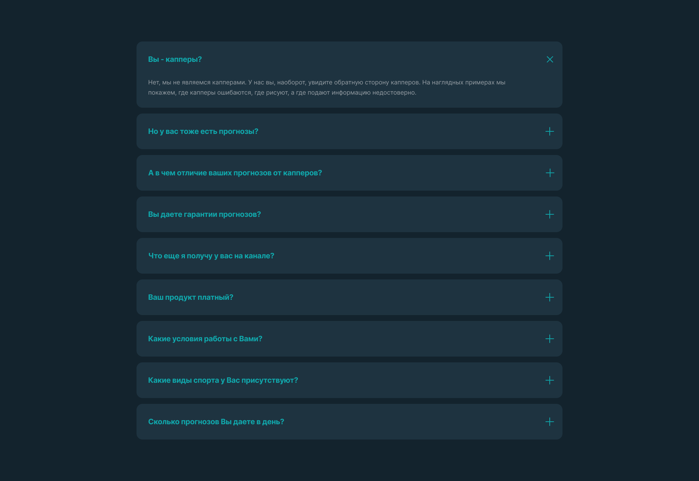
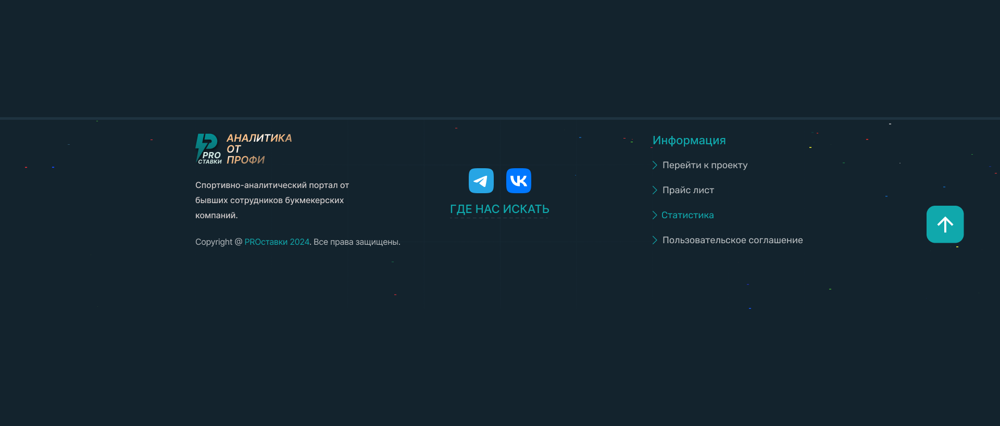
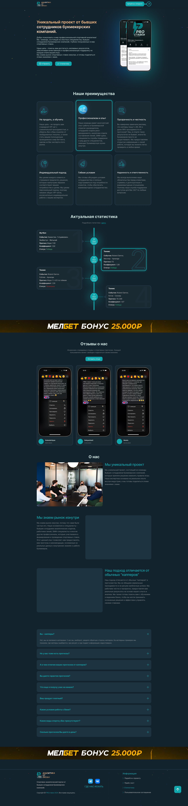
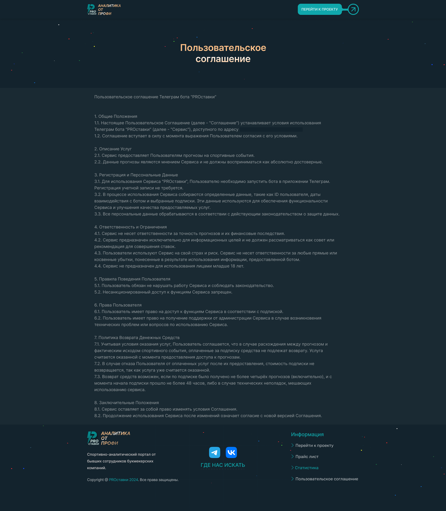
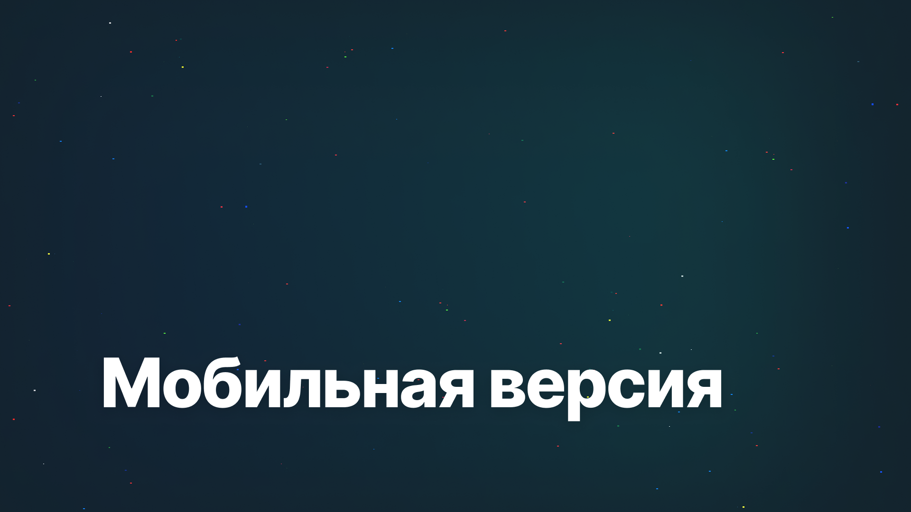
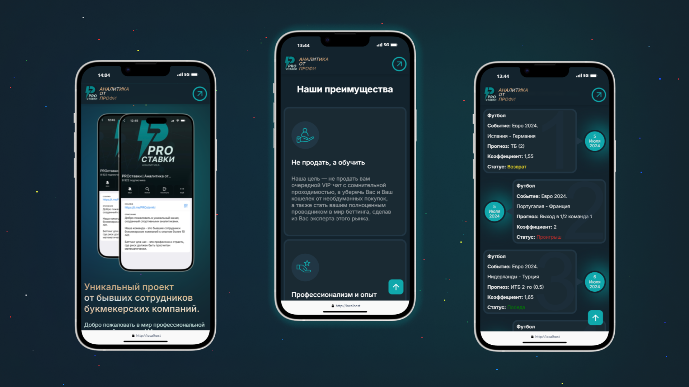
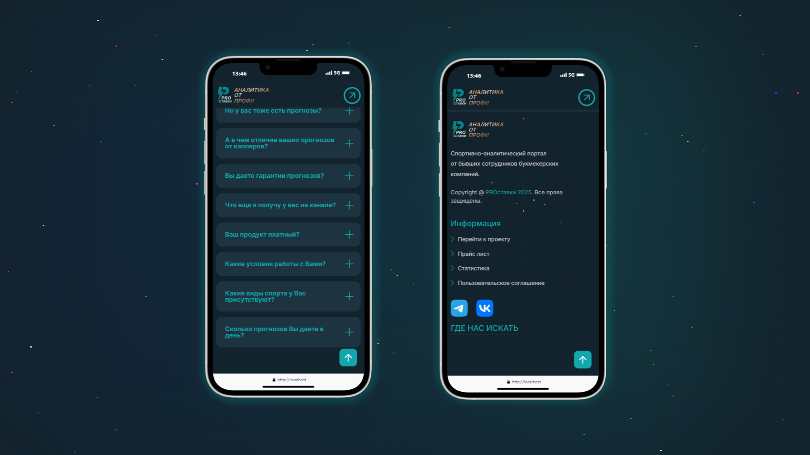
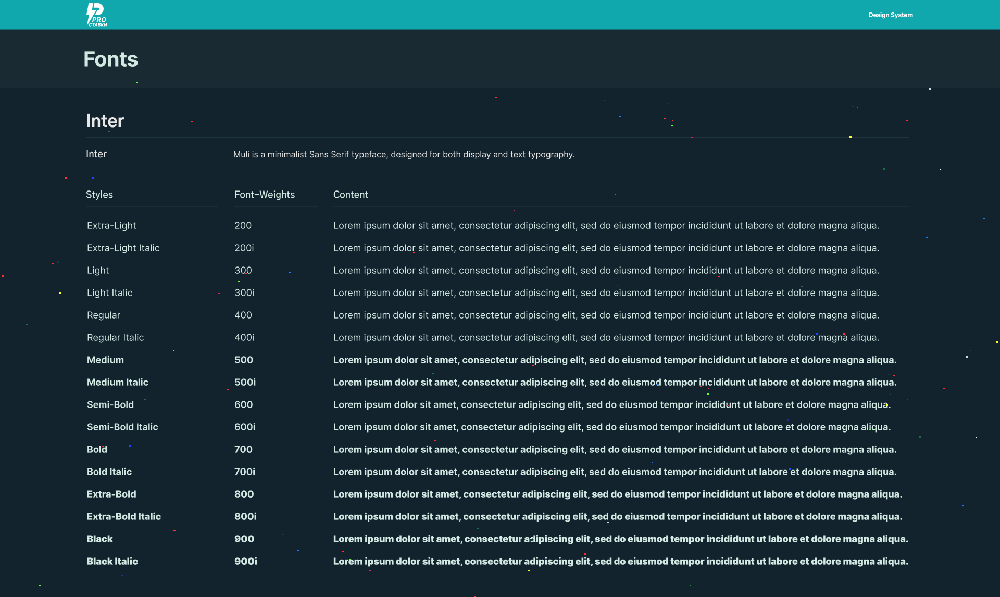

Разработка лендинга для проекта спортивной аналитики, включая интеграцию с Google Sheets и уникальный визуальный стиль.
<!--more-->
## 📌 Описание проделанной работы
В рамках реализации проекта был создан адаптивный лендинг, акцентирующий внимание на профессионализме команды, прозрачности и ориентированности на клиента. Основные этапы работы:

1. **Дизайн и структура:**
   - Разработан уникальный визуальный стиль, соответствующий логотипу проекта.
   - Подготовлены макеты в Figma, учитывающие адаптацию под десктоп и мобильные устройства.
   - Использован оранжевый цвет в качестве основного акцента, гармонирующий с фирменной палитрой.

2. **Интеграция функционала:**
   - Настроена интеграция с Google Sheets для автоматического обновления блока статистики, где отображаются последние ставки с детализацией.

3. **Контент и взаимодействие:**
   - Добавлены кнопки "Перейти к проекту" и "Статистика", обеспечивающие навигацию на Telegram-канал и страницу статистики.
   - Создан раздел FAQ с раскрывающимися ответами на популярные вопросы.
   - Создан блок "О нас" с текстом, подчеркивающим уникальность подхода и профессионализм команды.

4. **Элементы взаимодействия:**
   - В хедере добавлен логотип проекта и слоган "Аналитика от профи".
   - Подготовлен баннер для партнёрской программы с местом под промокод.

5. **Футер:**
   - Разработан футер с ссылками на основные разделы (проект, прайс-лист, статистика и пользовательское соглашение).
   - Добавлены иконки соцсетей с гиперссылками на Telegram и ВКонтакте.

**Ключевые этапы разработки:**  
- ✔️ Разработка фирменного стиля с оранжевым акцентным цветом
- ✔️ Интеграция с Google Sheets для автоматической загрузки статистики
- ✔️ Создание интерактивных блоков (FAQ, отзывы и тд)
- ✔️ Адаптация под мобильные устройства

---

### Результат работы

  
    
  
  
    
  
  
    
  
  
    
  
  
    
  
  
    
  
  
    
  
  
    
  


---

## 🚀 Демонстрация десктопной версии
  
> *Это видео демонстрирует весь функционал лендинга в реальном времени, включая обновление статистики ставок через Google Sheets и визуализацию статусов.*

---

## 📱 Адаптивный дизайн

### Десктоп версия

### Мобильная версия  

  
    
  
  
    
  
  
    
  
  
    
  


---

## 🔧 Процесс создания
1. **Исследование и планирование:** 
   - Анализ референса и определение ключевых требований.
   - Создание структуры и контента страницы.

2. **Дизайн:**
   - Разработка макетов в Figma.
   - Внесение правок и утверждение дизайна.

3. **Разработка:**
   - Верстка HTML/CSS.
   - Интеграция JavaScript для интерактивных элементов.
   - Настройка интеграции с Google Sheets.

4. **Тестирование и доработка:**
   - Проверка на кроссбраузерную совместимость.
   - Тестирование на различных устройствах.
   - Исправление ошибок и оптимизация производительности.

---

## 🎨 Цветовая палитра и шрифты

### Цветовая палитра



### Шрифты

- **Заголовки:** Inter Bold
- **Основной текст:** Inter Regular
- **Акценты:** Inter Medium

---

## 🌐 Итоговые результаты

- Полностью адаптивный и функциональный лендинг.
- Интеграция с Google Sheets для динамического отображения статистики.
- Интерактивные элементы.