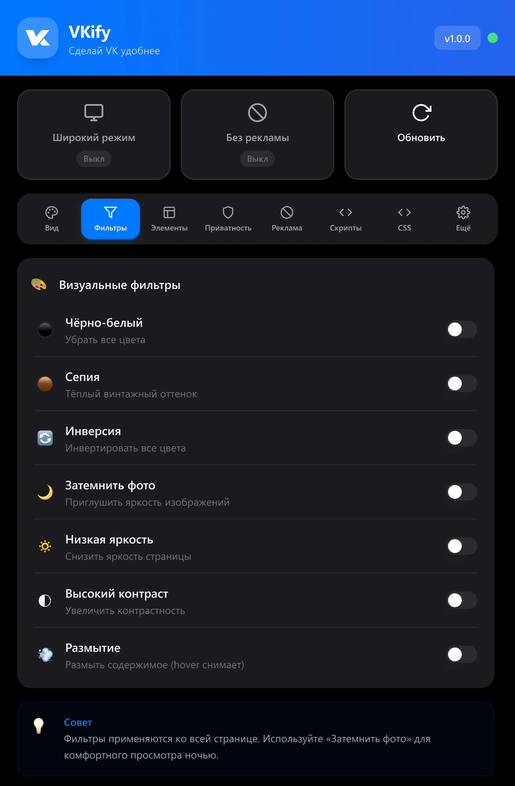

VKify — браузерное расширение, которое делает ВКонтакте удобнее: блокировка рекламы, кастомизация интерфейса, режим приватности и многое другое.
<!--more-->

## 📌 О проекте

**VKify** — полноценное расширение для браузера, разработанное для улучшения пользовательского опыта ВКонтакте. Проект включает проектирование интерфейса в **Figma**, разработку на **React** с использованием **Chrome Extension API** и продуманную систему настроек с синхронизацией.

Ключевая цель — создать **гибкий и интуитивный инструмент**, который позволяет полностью адаптировать VK под себя без необходимости технических знаний.

---

## ✨ Что было сделано

### Интерфейс и UX
- Спроектирован компактный и функциональный popup-интерфейс расширения
- Реализована система вкладок с категориями настроек
- Поддержка светлой, тёмной и автоматической темы оформления
- Плавные анимации и микровзаимодействия для улучшения UX
- Адаптивные компоненты: переключатели, слайдеры, цветовые палитры

### Функциональность

#### 🎨 Внешний вид
- Расширенный (широкий) режим отображения контента
- Компактное и фиксированное боковое меню
- Настраиваемая ширина контента и скругление углов
- 12 готовых цветовых тем + выбор произвольного цвета
- Пользовательский фон с настройками размытия, затемнения и прозрачности

#### 🎨 Визуальные фильтры
- Чёрно-белый режим, сепия, инверсия цветов
- Затемнение изображений для ночного режима
- Регулировка яркости и контрастности
- Эффект размытия с hover-снятием

#### 👁️ Скрытие элементов
- Истории, рекомендации, предложения друзей
- Эмодзи-статусы, мини-чат, кнопка «Наверх»
- Массовое включение/отключение одной кнопкой

#### 🔐 Приватность
- Режим невидимки (скрытие чатов по Ctrl+Q)
- Режим скелетона — замена контента серыми плейсхолдерами
- Блокировка индикатора «печатает»
- Отключение отметки о прочтении сообщений

#### 🛡️ Блокировка рекламы
- Реклама в боковой панели
- Рекламные посты в ленте новостей
- Рекламные истории и клипы
- Визуальный статус защиты

#### ⚡ Скрипты и автоматизация
- Авто-добавление друзей с настраиваемыми лимитами и задержками
- Обход всплывающих окон авторизации
- Статистика работы скриптов в реальном времени

#### 🎨 Пользовательский CSS
- Встроенный редактор с подсветкой синтаксиса
- Нумерация строк и автоформатирование
- История изменений (Undo/Redo)
- 14 готовых шаблонов CSS-сниппетов
- Быстрое применение и сохранение стилей

#### ⚙️ Настройки
- Экспорт/импорт настроек в JSON
- Сброс к значениям по умолчанию
- Автоматическая синхронизация между вкладками

---

## 🖼️ Интерфейс расширения

### Вид

### Фильтры

### Элементы

### Приватность

### Реклама

### Скрипты

### CSS редактор

### Еще

---

## 🎨 Дизайн-система

### Светлая тема



### Тёмная тема



### Акцентные цвета



- **Типографика:** SF Pro Display / System UI для интерфейса, SF Mono / Consolas для CSS-редактора
- **Компоненты:** Кастомные переключатели, слайдеры с градиентом, цветовые пикеры
- **Иконки:** Lucide-style SVG иконки, интегрированные как React-компоненты
- **Тени:** Многослойные тени с разной интенсивностью для светлой и тёмной темы

---

## 🛠️ Техническая реализация

### Архитектура расширения

Расширение построено по модульной архитектуре с чётким разделением ответственности. **Popup-интерфейс** реализован как отдельное React-приложение, которое общается с **content scripts** через Chrome Messaging API. Вся бизнес-логика вынесена в отдельный класс **FeatureManager**, который управляет включением и отключением функций.

Структура включает три основных слоя: popup для пользовательского интерфейса, content scripts для взаимодействия со страницами VK и background service worker для фоновых задач и координации.

### Менеджер функций

Центральный класс **FeatureManager** отвечает за управление всеми 50+ функциями расширения. При инициализации он загружает сохранённые настройки и применяет активные функции. Каждая функция представлена обработчиком с методами enable и disable, что обеспечивает чистое включение и выключение без побочных эффектов.

Менеджер поддерживает реактивное обновление: при изменении настроек в popup изменения мгновенно применяются на странице без перезагрузки. Для этого используется подписка на события Chrome Storage API.

### Система динамических стилей

Для применения визуальных изменений разработана система динамической инъекции CSS. Каждая функция может создавать собственный блок стилей с уникальным идентификатором. При отключении функции соответствующие стили удаляются из DOM.

Такой подход позволяет избежать конфликтов между функциями и обеспечивает мгновенное применение изменений. Стили хранятся в Map-структуре для быстрого доступа и управления.

### Расширенный режим отображения

Реализация широкого режима потребовала детального анализа CSS-структуры ВКонтакте. Основная сложность — сохранение пропорций двухколоночного layout профиля при изменении ширины контейнера.

Решение основано на вычислении соотношений оригинальных размеров колонок и применении этих пропорций к новой ширине. Особое внимание уделено обработке position: fixed при скролле, когда VK динамически меняет стили правой колонки.

### Кастомизация цветовой схемы

Система акцентных цветов переопределяет более 50 CSS-переменных ВКонтакте. Для корректной работы прозрачных вариантов цвета (hover-эффекты, tint-фоны) реализована конвертация HEX в RGB-компоненты.

Дополнительно реализовано динамическое обновление SVG-логотипа VK через MutationObserver, который отслеживает изменения DOM и применяет выбранный цвет к новым элементам.

### Пользовательский фон

Функция кастомного фона поддерживает как URL-изображения, так и загрузку локальных файлов с конвертацией в Base64. Фон применяется через псевдоэлемент body::before с настраиваемыми параметрами размытия, затемнения и прозрачности.

При изменении любого параметра фона (blur, dim, opacity) система переприменяет стили с новыми значениями, обеспечивая мгновенный preview без сохранения.

### Перехват сетевых запросов

Для функций приватности (блокировка «печатает» и «прочитано») используется инъекция скрипта в контекст страницы. Это необходимо, поскольку content scripts не имеют доступа к WebSocket и XHR объектам страницы.

Инжектированный скрипт перехватывает WebSocket.send, XMLHttpRequest и fetch, анализирует отправляемые данные на наличие паттернов typing/setActivity и markAsRead, и блокирует соответствующие запросы. Настройки передаются через localStorage и CustomEvent.

### Режим невидимки

Режим невидимки реализован с обработкой горячих клавиш Ctrl+Q. При активации скрываются все диалоги и счётчики непрочитанных сообщений через добавление CSS-классов.

Состояние сохраняется в Chrome Storage и восстанавливается при смене вкладок через Visibility API. Это предотвращает случайное раскрытие диалогов при возврате на страницу.

### Автоматизация добавления друзей

Скрипт авто-добавления работает только на странице поиска друзей и включает защиту от бана: рандомизация задержек между действиями, случайный выбор кнопки из списка, имитация скролла к элементу перед кликом.

Пользователь настраивает лимит добавлений в час и диапазон задержек. Статистика работы (количество добавленных, статус) синхронизируется с popup в реальном времени.

### React-архитектура popup

Popup построен на React 18 с использованием функциональных компонентов и хуков. Состояние настроек управляется через Context API с провайдером **SettingsProvider**, который инкапсулирует логику загрузки, сохранения и синхронизации.

Отдельный провайдер **ToastProvider** управляет уведомлениями. Кастомный хук **useTheme** обеспечивает мгновенное применение темы с кэшированием в localStorage для устранения мерцания при загрузке.

### Синхронизация между вкладками

При изменении настройки в popup происходит сохранение в Chrome Storage и отправка сообщения активной вкладке VK. Content script получает сообщение и вызывает соответствующий метод FeatureManager.

Обратная синхронизация работает через подписку на chrome.storage.onChanged, что позволяет нескольким открытым popup-окнам оставаться в актуальном состоянии.

### CSS-редактор

Встроенный редактор включает подсветку синтаксиса на основе регулярных выражений, нумерацию строк с синхронизацией скролла и историю изменений для undo/redo.

Техническая сложность — наложение прозрачного textarea поверх pre-элемента с подсвеченным кодом. Это обеспечивает нативное поведение ввода при визуальной подсветке.

---

## 🛠️ Стек технологий

| Категория | Технологии |
|-----------|------------|
| **Frontend** | React 18, Tailwind CSS, CSS Variables |
| **Сборка** | Vite, PostCSS |
| **API** | Chrome Extension Manifest V3 |
| **Хранение** | Chrome Storage Local API, localStorage |
| **Паттерны** | Context API, Custom Hooks, Observer Pattern, Dependency Injection |

---

## 📊 Ключевые метрики

- **50+** настраиваемых функций
- **12** готовых цветовых тем
- **14** CSS-шаблонов
- **0** серверных зависимостей — всё работает локально
- **3** уровня архитектуры: popup, content scripts, background

---

## 🔧 Технические вызовы и решения

### Проблема: Стили VK перебивают кастомные
**Решение:** Использование !important и максимально специфичных селекторов. Для динамических элементов — MutationObserver с повторным применением стилей.

### Проблема: WebSocket недоступен из content script
**Решение:** Инъекция отдельного скрипта в контекст страницы через script-тег с src на файл расширения. Коммуникация через CustomEvent и localStorage.

### Проблема: Мерцание темы при загрузке popup
**Решение:** Синхронное чтение темы из localStorage до первого рендера React. Асинхронная синхронизация с Chrome Storage происходит после.

### Проблема: Сохранение пропорций layout при расширении
**Решение:** Математический расчёт соотношений оригинальных колонок VK и применение этих пропорций через CSS calc() к новой ширине.

---

## 🌐 Итог

- Полноценное браузерное расширение с богатым функционалом
- Продуманная модульная архитектура с чётким разделением слоёв
- Реактивная система настроек с мгновенной синхронизацией
- Интуитивный интерфейс с продуманной системой навигации
- Гибкая кастомизация без технических знаний
- Безопасная работа — все данные хранятся локально
- Готовность к расширению функционала благодаря паттерну обработчиков

---