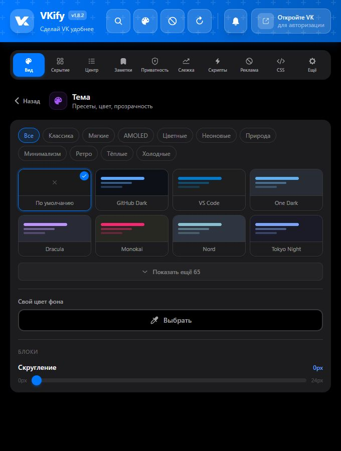
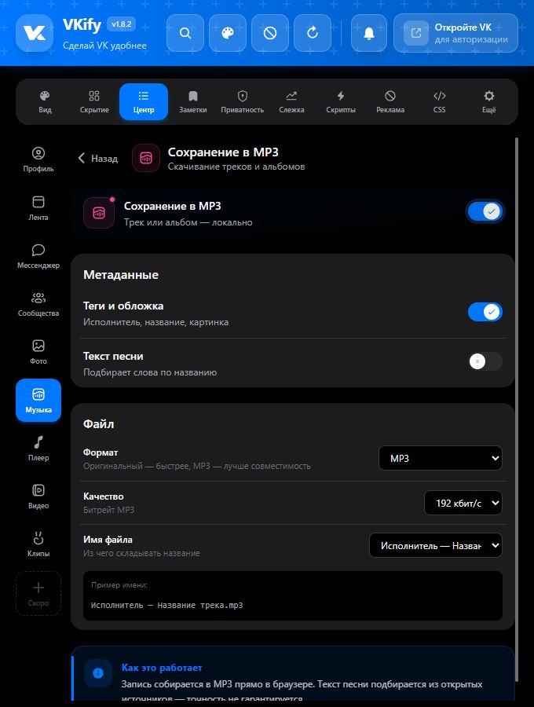
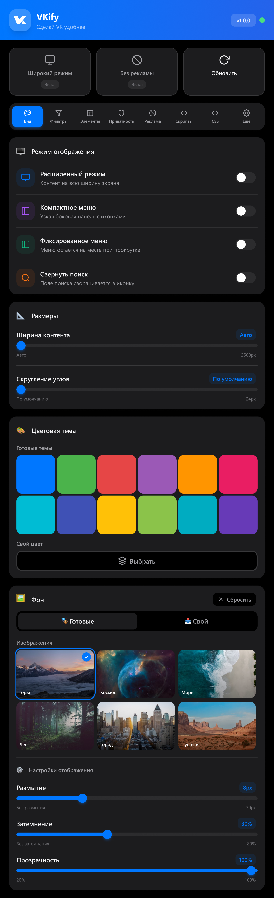
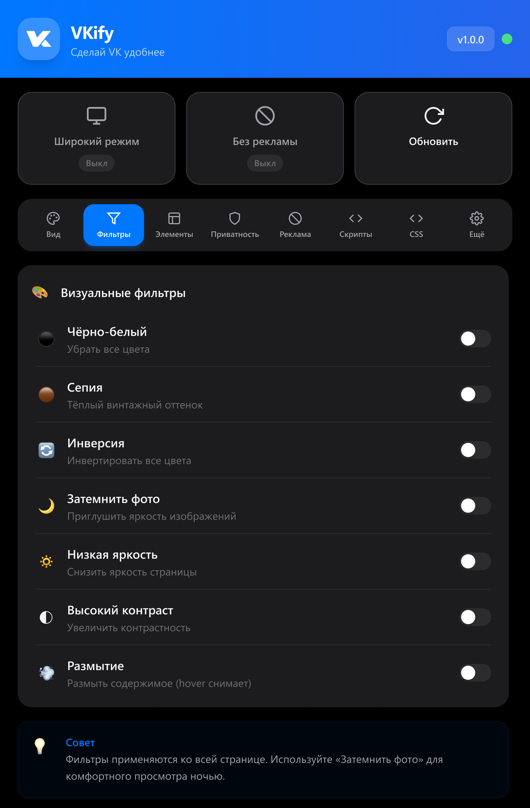
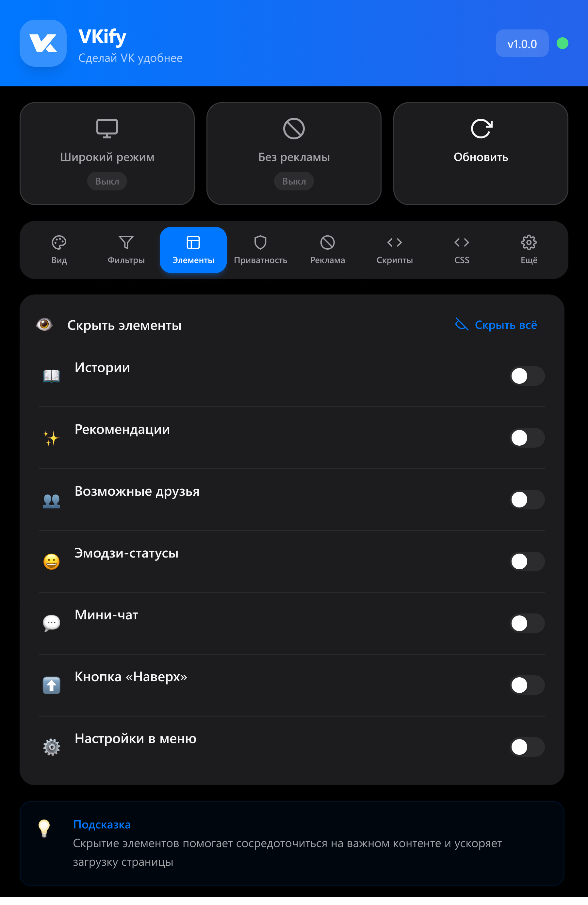
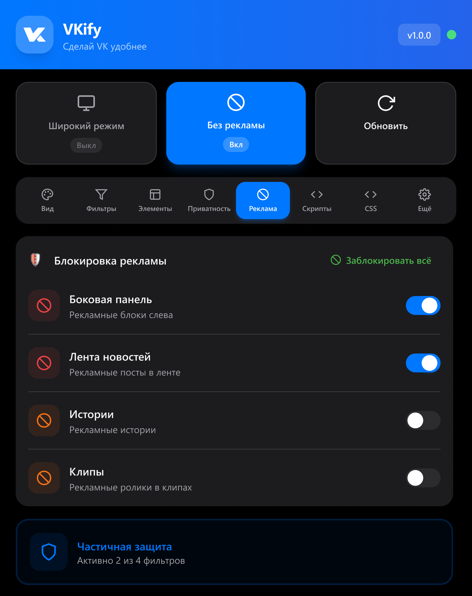
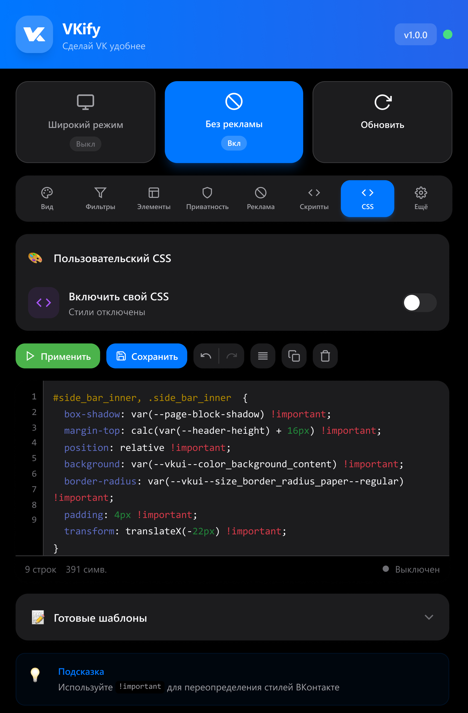

VKify объединяет настройку внешнего вида VK, чистую ленту, приватность, экспорт переписок, загрузку медиа и автоматизацию в одном расширении для Chrome, Firefox и Opera.
<!--more-->

## 📌 О проекте

**VKify** — кросс-браузерное расширение на Manifest V3, которое дополняет `vk.ru` и `vkvideo.ru` функциями, отсутствующими в стандартном интерфейсе. Настройки доступны в popup из **10 разделов** и на встроенной странице `vk.ru/vkify_settings`; поиск по функциям открывается через `Ctrl/Cmd + K`.

Изменения применяются сразу, без перезагрузки страницы, и синхронизируются между открытыми вкладками. Проект развивается из единой кодовой базы и на текущем этапе выпущен в версии **1.8.2**.

| Платформа | Поддержка |
|---|---|
| **Chrome и Chromium** | Chrome 109+, пакет из Chrome Web Store |
| **Firefox** | Firefox 115+, отдельная сборка и публикация в Firefox Add-ons |
| **Opera** | Собственная Chromium-сборка из той же кодовой базы |
| **Языки** | Полная русская и английская локализация с переключением без перезагрузки |

---

## ✨ Возможности

### 🎨 Оформление и навигация

- **72 встроенные темы** в 11 категориях, автоматическое переключение светлой и тёмной схем
- Собственный акцентный цвет и автоподбор палитры по выбранному фону
- Более **60 шрифтов** с настройкой размера, насыщенности, стиля и межстрочного интервала
- Фоны из изображения, видео или HTML-анимации с размытием, затемнением и прозрачностью
- Профили оформления и готовые пресеты «Минимализм», «Приватность» и «Производительность»
- Широкий и компактный режимы, настройка ширины и смещения страницы, перестановка колонок
- Минималистичное фиксированное меню, управление его пунктами и счётчиками
- Визуальные фильтры, форма аватарок, скругления и предупреждения о конфликтующих настройках

### 🛡️ Чистая лента и приватность

- Блокировка рекламы в интерфейсе и ленте на уровне DOM и API
- Блокировка трекеров и аналитики с журналом срабатываний
- Точное скрытие историй, рекомендаций, комментариев, промоблоков, мини-чата и других элементов VK
- Режим невидимки, блокировка статусов «печатает» и «прочитано»
- Скрытие выбранных переписок по горячей клавише и размытие страницы при потере фокуса
- Шифрование сообщений в форматах **COFFEE** и **VKify E2E v2** на AES-256-GCM с PBKDF2

### 📦 Центр: сообщения и медиа

- Экспорт диалогов в JSON, TXT, HTML и ZIP, а также всего диалога или выбранных сообщений в PDF
- Шаблоны сообщений с переменными, заметки с привязкой к диалогам и быстрое копирование
- Скачивание видео и клипов с выбором качества, историй, отдельных фотографий и альбомов в ZIP
- Загрузка треков и альбомов в исходном формате или MP3 с битрейтом, ID3-тегами, обложкой и текстом песни
- Пакетные операции и центр загрузок с прогрессом, отменой и фоновой работой
- Горячие клавиши аудиоплеера, восстановление воспроизведения и 10-полосный эквалайзер

### 📈 Слежка и автоматизация

- Отслеживание активности в сообщениях через LongPoll: печать, медиа, прочтение, редактирование и удаление
- Мониторинг онлайна с историей, недельными графиками и уведомлениями
- Наблюдение за изменением аватара, статуса и числа друзей выбранных профилей
- Авто-добавление друзей с лимитами и случайными задержками
- Переключение раскладки `ru ↔ en` по горячей клавише
- Прямое открытие внешних ссылок в обход `away.php`

### ⚙️ Инструменты и настройки

- CSS-редактор с подсветкой, форматированием, живым предпросмотром и готовыми сниппетами
- Экспорт и импорт настроек, версионированные миграции хранилища
- Профили и темы, которыми можно делиться по ссылке
- Диагностический отчёт и дашборд производительности с «Проводником фич»
- Онбординг при первом запуске и поиск по всем настройкам
- Мгновенная синхронизация popup, встроенной страницы и вкладок VK

---

## 🖼️ Интерфейс расширения

### Актуальная версия 1.8.2





### Ранние итерации

Эти экраны показывают основу, из которой выросла текущая структура интерфейса.





---

## 🧩 Архитектура

Каждая пользовательская функция описана декларативным `FeatureDefinition`: метаданные, категория, фаза запуска, зависимости, конфликты и плагины поведения. `FeatureManager` управляет жизненным циклом функций, а единый реестр позволяет добавлять новые возможности без изменения ядра.

Проект разделён на шесть взаимодействующих частей:

1. **Popup** — React-интерфейс с 10 вкладками и общим Zustand-хранилищем.
2. **Embed** — тот же интерфейс настроек, встроенный непосредственно в страницу VK.
3. **Content scripts** — применяют стили и поведение к интерфейсу VK.
4. **Injected scripts** — работают в контексте страницы для LongPoll, сетевых фильтров и функций, недоступных из изолированного content script.
5. **Background** — VK API, уведомления, задачи по расписанию и координация загрузок.
6. **Site bridge** — безопасно передаёт в расширение настройки и расшаренные темы с сайта VKify.

Состояние хранится в `chrome.storage.local`, проходит проверку по общей схеме и обновляется через версионированные миграции. Настройки реактивно синхронизируются между всеми контекстами расширения.

### Кросс-браузерная сборка

Общий `manifest/base.json` дополняется отдельными конфигурациями Chrome, Firefox и Opera. Chrome и Opera используют service worker и offscreen-документ для PDF, Firefox — модульную фоновую страницу и изолированную служебную вкладку. Тонкий слой нормализации API сохраняет promise-based интерфейс во всех браузерах.

Vite/Rollup формирует ESM-бандлы для popup и background и отдельные IIFE-бандлы для content/injected-скриптов. Тяжёлые зависимости загрузки аудио и PDF вынесены из критического пути и подгружаются только по необходимости.

### Безопасность

- CSP ограничивает выполнение кода ресурсами самого расширения
- Канал между content- и injected-слоями защищён одноразовым nonce
- Импортируемые настройки, URL, CSS и темы проходят централизованную валидацию
- Runtime-сообщения проверяют отправителя, а сетевые операции имеют лимиты и таймауты
- Production-сборка автоматически проверяется на ссылки на удалённый исполняемый код
- У проекта нет собственного backend: настройки, профили и журналы хранятся локально, а внешние запросы выполняются напрямую только для нужных функций

---

## 🛠️ Стек

| Слой | Технологии |
|---|---|
| **Интерфейс** | React 18, TypeScript 5, Tailwind CSS 3, i18next |
| **Состояние** | Zustand 5, Chrome Storage, версионированные миграции |
| **Сборка** | Vite 5, Rollup, PostCSS, собственные build/verify-скрипты |
| **Расширение** | Manifest V3, WebExtension APIs, content scripts, injected scripts |
| **Медиа** | hls.js, lamejs, html2canvas, jsPDF, Web Audio API |
| **Качество** | Vitest, happy-dom, Playwright, ESLint, TypeScript typecheck |

---

## 🔧 Ключевые инженерные задачи

### Мгновенное применение без мерцания

Критичные настройки внешнего вида зеркалируются до инициализации React и применяются на ранней фазе загрузки страницы. Остальные изменения проходят через реестр функций и обновляются без перезагрузки.

### Доступ к контексту страницы без ослабления изоляции

LongPoll и сетевые перехватчики требуют доступа к объектам страницы, поэтому вынесены в injected-слой. Обмен с content script идёт через проверяемый канал с nonce и строгими типами сообщений.

### Тяжёлый экспорт без зависания VK

PDF формируется вне активной вкладки: через offscreen-документ в Chromium или изолированную фоновую вкладку в Firefox. Данные передаются потоком, операцию можно отменить, а ресурсы освобождаются после завершения.

### Устойчивость к изменениям интерфейса VK

DOM-селекторы централизованы, функции изолированы друг от друга, а динамические области отслеживаются адресно. Это упрощает обновление расширения после изменений вёрстки `vk.ru`.

---

## 📊 Проект в цифрах

- **1.8.2** — актуальная версия в репозитории
- **3** целевых браузера из единой кодовой базы
- **10** разделов интерфейса
- **72** встроенные темы в 11 категориях
- **60+** доступных шрифтов
- **2** полностью локализованных языка
- **5** вариантов экспорта переписки: JSON, TXT, HTML, ZIP и PDF

---

## 🚀 Результат

VKify вырос из набора визуальных улучшений в самостоятельную платформу инструментов для VK: с декларативной системой функций, кросс-браузерными сборками, локализацией, медиаконвейером, экспортом сообщений и автоматизированными проверками качества.

- [Установить из Chrome Web Store](https://chromewebstore.google.com/detail/vkify/lofggenkgbpdmmplnbgfplnpfjhgljla)
- [Установить из Firefox Add-ons](https://addons.mozilla.org/ru/firefox/addon/vkify/)
- [Открыть сайт VKify](https://vkify.ru/)
- [Посмотреть исходный код](https://github.com/VKify/vkify-extension)
