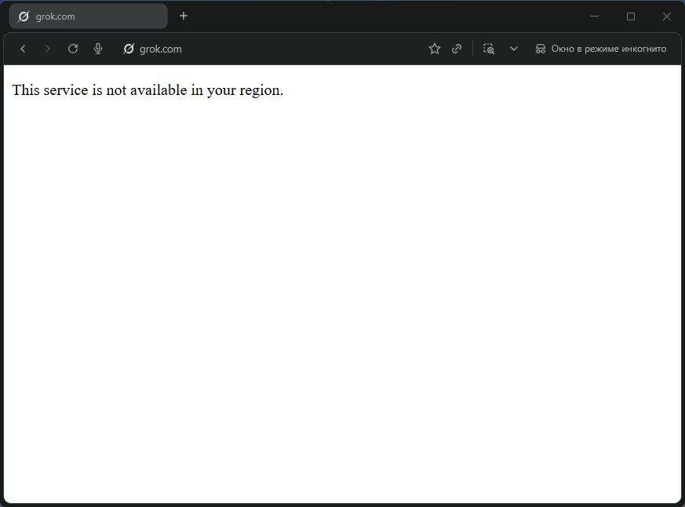
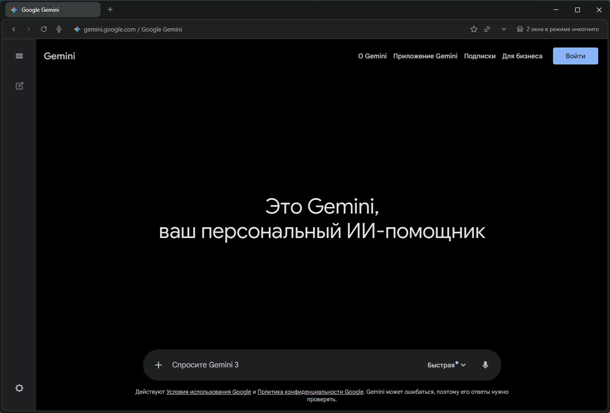
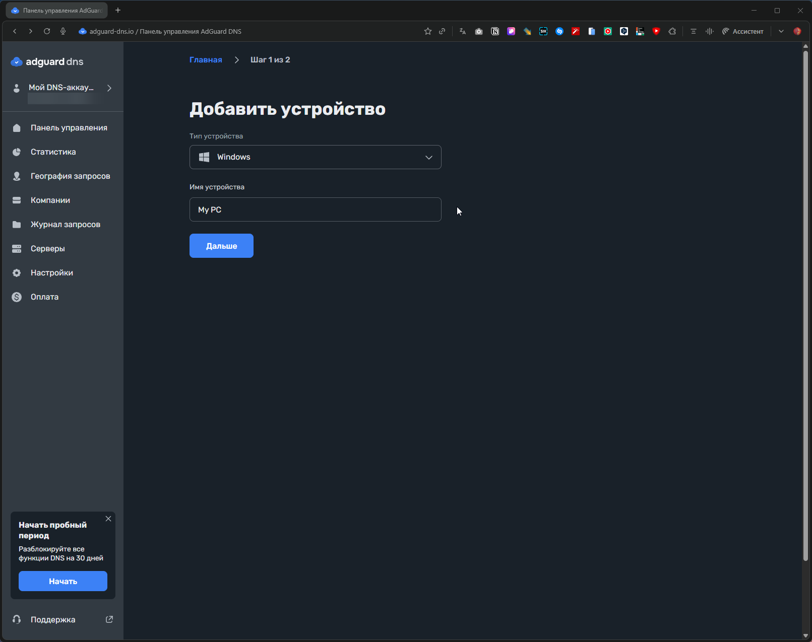
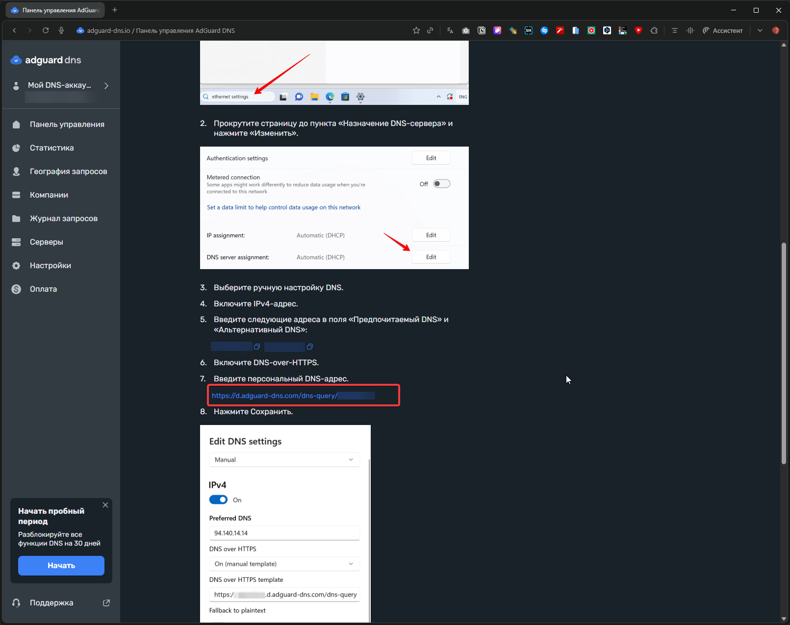

Корректная настройка DNS для стабильного доступа к AI-сервисам — через DNS, hosts или AdGuard.

<!--more-->

## Введение

> Многие AI-сервисы применяют **географические ограничения доступа**, определяя регион пользователя по IP-адресу. OpenAI, Anthropic, Google и другие компании ограничивают доступ из определённых регионов на уровне своих серверов.

Существует несколько технических подходов для корректной настройки сетевых параметров, позволяющих установить соединение с AI-сервисами. В данной статье рассматриваются методы, основанные на правильном разрешении доменных имён и выборе допустимых точек подключения.



Доступ к ChatGPT, Claude и Gemini можно настроить, используя:

1. альтернативные DNS-серверы;
2. локальный файл `hosts`;
3. DNS-фильтрацию через AdGuard DNS;
4. готовые DNS-решения с преднастроенными правилами.

Эти способы работают за счёт корректного разрешения доменных имён и выбора IP-адресов серверов, принимающих соединения. Используется только стандартная работа с DNS без применения туннелирования или обхода сетевых ограничений.

---

## ⚠️ Важно: Вопросы безопасности и доверия

Все описанные методы предполагают доверие к источникам IP-адресов:

**Сторонние DNS-серверы** видят все ваши DNS-запросы (какие сайты вы открываете)

**IP-адреса из списков hosts** перенаправляют ваш трафик через промежуточные серверы третьих лиц

**Прокси-узлы** технически могут:
- Видеть незашифрованный трафик (если сайт использует HTTP)
- Логировать ваши запросы
- Потенциально перехватывать данные

**Рекомендации:**
1. Используйте только проверенные источники (Xbox DNS, Malw.link, Comss.one)
2. Для критичных данных рассмотрите альтернативные решения
3. Никогда не вводите пароли или платёжные данные через непроверенные прокси
4. Регулярно проверяйте актуальность IP-адресов из официальных источников
5. Используйте данные методы на свой риск, понимая технические особенности работы DNS

---

## Как работают географические ограничения доступа

Чтобы понять, почему DNS-методы работают, важно понимать механизм проверки региона пользователя.

### Что происходит при подключении

Когда вы открываете сайт AI-сервиса, происходит цепочка действий:

1. **DNS-разрешение**  
   Система запрашивает IP-адрес домена (например, `chatgpt.com`).
2. **Подключение к серверу**  
   Браузер соединяется с полученным IP.
3. **Проверка со стороны сервиса**  
   Сервер анализирует IP-адрес пользователя и решает, разрешать доступ или нет.

Если IP определяется как принадлежащий к ограниченному региону — сервис может:
- не загрузиться;
- показать сообщение о недоступности;
- заблокировать регистрацию или вход.

### Роль DNS в процессе подключения

Многие AI-сервисы используют:
- разные IP-адреса для разных регионов;
- CDN и балансировщики нагрузки;
- отдельные фронтенд-узлы с разной логикой геопроверок.

Если DNS возвращает **альтернативный допустимый IP-адрес**, то:
- соединение устанавливается напрямую;
- гео-ограничение может определить другой регион;
- сервис становится доступен.

Важно понимать:  
👉 **При использовании сторонних DNS провайдер не участвует в разрешении имён**  
👉 **Трафик не шифруется и не туннелируется** (это не VPN)  
👉 Меняется только то, **на какой IP-адрес разрешается доменное имя**

Именно поэтому:
- `hosts`,
- сторонние DNS,
- AdGuard DNS с `dnsrewrite`

позволяют настроить корректное подключение.

---

## Способ 1. Альтернативный DNS-сервер

### Как это работает

Самый простой способ — заменить DNS-сервер провайдера на публичный сервер, возвращающий актуальные IP-адреса без региональной фильтрации. Подходящие варианты: **Xbox DNS** или **Malw.link DNS**. Эти серверы предоставляют стандартные DNS-ответы.

Дополнительный плюс: можно использовать защищённые протоколы DNS over HTTPS (DoH) или DNS over TLS (DoT), которые шифруют DNS-запросы. Провайдер не сможет подменить DNS-ответ или увидеть, какие домены вы запрашиваете. Однако IP-адреса серверов, к которым вы подключаетесь, и сам факт HTTPS-соединения остаются видны провайдеру.

---

### Доступные DNS-серверы

**Xbox DNS**
- IP: `176.99.11.77`, `80.78.247.254`
- DoH: `https://xbox-dns.ru/dns-query`

**Malw.link**
- IP: `84.21.189.133`, `193.23.209.189`
- DoH: `https://dns.malw.link/dns-query`

> 📎 Подробнее: [xbox-dns.ru](https://xbox-dns.ru/) и [info.dns.malw.link](https://info.dns.malw.link/)

---

### Настройка в браузере

Современные браузеры умеют использовать собственный DNS независимо от системных настроек.

#### Chrome, Edge, Brave


1. Откройте **Настройки** браузера
2. Перейдите в раздел **Конфиденциальность и безопасность** → **Безопасность**
3. Найдите пункт **Использовать безопасный DNS**
4. Выберите **Указать другой** и введите один из адресов:
   - `https://xbox-dns.ru/dns-query`
   - `https://dns.malw.link/dns-query`

#### Firefox


1. **Настройки** → **Приватность и защита**
2. Прокрутите до раздела **DNS через HTTPS**
3. Включите **DNS через HTTPS на Максимальную защиту**
4. Выбрать поставщика **Другой URL**
4. В поле **Адрес** введите один из адресов:
   - `https://xbox-dns.ru/dns-query`
   - `https://dns.malw.link/dns-query`

---

### Настройка в операционной системе

Настройка на уровне системы обеспечит работу DNS для всех приложений, а не только для браузера.

#### Windows 11

  
    
  
  
    
  


1. **Настройки** → **Сеть и интернет**
2. Выберите **Wi-Fi** или **Ethernet** (в зависимости от подключения)
3. Кликните на ваше подключение
4. Найдите **Назначение DNS-сервера** → **Изменить**
5. Выберите **Вручную** и включите **IPv4**
6. Введите адреса:

**Xbox DNS**

- Предпочитаемый DNS: `176.99.11.77`
- Альтернативный DNS: `80.78.247.254`

**Malw.link DNS**

- Предпочитаемый DNS: `84.21.189.133`
- Альтернативный DNS: `193.23.209.189`

7. Сохраните изменения

#### macOS

1. **Системные настройки** → **Сеть**
2. Выберите активное подключение → **Подробнее** (или **Дополнительно**)
3. Перейдите на вкладку **DNS**
4. Удалите существующие записи и добавьте новые:
   - `176.99.11.77` и `80.78.247.254` (Xbox DNS), или
   - `84.21.189.133` и `193.23.209.189` (Malw.link)
5. Нажмите **OK** → **Применить**

#### Linux (Ubuntu/Debian с NetworkManager)

1. **Настройки** → **Сеть**
2. Кликните на ⚙️ у вашего подключения
3. Вкладка **IPv4** → раздел **DNS**
4. Отключите **Автоматический DNS**
5. Введите адреса через запятую:
   - `176.99.11.77, 80.78.247.254` или
   - `84.21.189.133, 193.23.209.189`
6. Примените изменения и переподключитесь

---

### Плюсы и минусы

| Плюсы ✅ | Минусы ❌ |
|----------|-----------|
| Быстрая настройка — 2 минуты | DNS-трафик идёт через третью сторону |
| Работает сразу для всех сайтов | Нет точечного контроля |
| Не требует дополнительных программ | Может влиять на доступ к корпоративным ресурсам |
| DoH шифрует DNS-запросы | Зависимость от доступности DNS-сервера |

### Вердикт

Отличное решение для быстрого старта. Не требует технических знаний, настраивается за пару минут. Подходит как базовая мера или для пользователей, которым нужен простой способ без лишних сложностей.


  
    
  
  
    
  
  
    
  
  
    
  


---

## Способ 2. Файл hosts

⚠️ **Важное ограничение:** Способ с hosts не гарантирует стабильной работы крупных CDN-сервисов (Google, OpenAI, Anthropic). Он может перестать работать без предупреждения и требует регулярного обновления IP-адресов.

### Как это работает

Файл `hosts` — это текстовый файл в вашей операционной системе, который выполняет роль локальной адресной книги для доменов. В нём можно указать, например: "Когда я открываю chatgpt.com, используй IP-адрес 45.155.204.190".

Операционная система проверяет этот файл **перед любыми DNS-запросами**, что позволяет полностью контролировать, куда подключается устройство — провайдер не участвует в процессе DNS-разрешения.

Формат записи очень простой:

```
IP-адрес    домен
```

Например:

```
45.155.204.190    chatgpt.com
```

### Где найти файл hosts

Расположение файла зависит от операционной системы:

| Операционная система | Путь к файлу |
|----------------------|--------------|
| Windows | `C:\Windows\System32\drivers\etc\hosts`|
| macOS | `/etc/hosts`|
| Linux | `/etc/hosts`|

### Как редактировать hosts в Windows


**Важно:** для редактирования нужны права администратора, иначе система не даст сохранить изменения.

**Правильный способ:**

1. Нажмите Win + S, введите "Блокнот"
2. Кликните правой кнопкой → "Запустить от имени администратора"
3. В Блокноте: Файл → Открыть
4. В поле пути вставьте: `C:\Windows\System32\drivers\etc\`

  
    
  
  
    
  
  
    
  
  
    
  

5. В выпадающем списке "Тип файлов" выберите **"Все файлы"** (иначе hosts не покажется)
6. Откройте файл
7. Прокрутите в самый конец
8. Добавьте нужные записи (каждая с новой строки)

  
    
  
  
    
  

9. Сохраните (Ctrl + S)

**Критически важные моменты:**

- **Используйте только Блокнот или Notepad++**. Никаких Word, WordPad или других текстовых редакторов — они добавляют невидимые символы форматирования, которые сломают файл.
- Между IP и доменом должен быть пробел или табуляция
- Не ставьте галочку "Открывать файлы этого типа в этой программе" — hosts должен остаться без ассоциации с программами
- Если Windows ругается на сохранение, проверьте антивирус — некоторые блокируют изменения hosts как потенциально опасные

### Как редактировать hosts в macOS/Linux

```bash
sudo nano /etc/hosts
```

Вводите пароль администратора, добавляете записи, сохраняете (Ctrl + O, Enter, Ctrl + X).

### Примеры записей для AI-сервисов

> ℹ️ **О повторяющихся IP-адресах:** Вы заметите, что один IP (`45.155.204.190`) используется для множества разных сервисов (OpenAI, Google, Anthropic). Это адрес специального прокси-сервера, который:
> - Принимает соединения независимо от географии клиента
> - Перенаправляет запросы к реальным серверам сервисов
> - Позволяет установить подключение к AI-сервисам

Вот базовый набор для основных сервисов:

```
# Google AI Services
45.155.204.190 gemini.google.com
45.155.204.190 aistudio.google.com
45.155.204.190 generativelanguage.googleapis.com
45.155.204.190 aitestkitchen.withgoogle.com
45.155.204.190 aisandbox-pa.googleapis.com
45.155.204.190 webchannel-alkalimakersuite-pa.clients6.google.com
45.155.204.190 alkalimakersuite-pa.clients6.google.com
45.155.204.190 assistant-s3-pa.googleapis.com
45.155.204.190 proactivebackend-pa.googleapis.com
45.155.204.190 robinfrontend-pa.googleapis.com
45.155.204.190 o.pki.goog
45.155.204.190 labs.google
45.155.204.190 notebooklm.google.com
45.155.204.190 jules.google.com
45.155.204.190 stitch.withgoogle.com

# OpenAI
45.155.204.190 chatgpt.com
45.155.204.190 ab.chatgpt.com
45.155.204.190 auth.openai.com
45.155.204.190 auth0.openai.com
45.155.204.190 platform.openai.com
45.155.204.190 cdn.oaistatic.com
45.155.204.190 files.oaiusercontent.com
45.155.204.190 cdn.auth0.com
45.155.204.190 tcr9i.chat.openai.com
45.155.204.190 webrtc.chatgpt.com
45.155.204.190 android.chat.openai.com
45.155.204.190 api.openai.com
45.155.204.190 operator.chatgpt.com
45.155.204.190 sora.chatgpt.com
45.155.204.190 sora.com
45.155.204.190 videos.openai.com
45.155.204.190 ios.chat.openai.com

# Microsoft
45.155.204.190 copilot.microsoft.com
45.155.204.190 sydney.bing.com
45.155.204.190 edgeservices.bing.com
45.155.204.190 rewards.bing.com

# GitHub Copilot
144.31.14.104 api.github.com
144.31.14.104 api.individual.githubcopilot.com
144.31.14.104 proxy.individual.githubcopilot.com

# Grok
45.155.204.190 grok.com
45.155.204.190 accounts.x.ai
45.155.204.190 assets.grok.com

# Claude
45.155.204.190 claude.ai
45.155.204.190 console.anthropic.com
45.155.204.190 api.anthropic.com
```

Строки, начинающиеся с `#`, — это комментарии. Система их игнорирует, они нужны для удобства людей.

### Где брать актуальные IP-адреса

IP-адреса сервисов периодически меняются. Самостоятельно искать их через nslookup или dig неудобно. Проще использовать готовые актуальные списки.

**Рекомендую:** [info.dns.malw.link/hosts](https://info.dns.malw.link/hosts)

Там уже готовые конфигурации для разных сервисов. Просто копируйте нужные строки в свой hosts. Если в списке есть комментарии с `#`, можете их оставить или удалить — как вам удобнее.

### Плюсы и минусы

**Плюсы ✅** | **Минусы ❌**
--- | ---
**Максимальный контроль** — только вы решаете, что и куда разрешается | **IP-адреса могут меняться** — придётся следить и обновлять вручную
**Полная конфиденциальность** — никакие внешние DNS-серверы не участвуют | **Неудобство при большом списке сайтов** (100+ доменов) — сложно редактировать
**Высокая скорость** — система не делает сетевых DNS-запросов | **Нет синхронизации между устройствами** — на каждом нужно настраивать отдельно
**Независимость от внешних сервисов** | **Требует минимальных технических навыков** для настройки
**Подходит для параноиков :)** |

**Вердикт:** идеально для тех, кто хочет полный контроль и готов потратить 10 минут на первичную настройку. Для продвинутых пользователей и параноиков по приватности.

---

## Способ 3. AdGuard DNS

Это оптимальный баланс между удобством и контролем. Сочетает простоту стороннего DNS и гибкость hosts, при этом облегчает процесс обновления IP-адресов.

### Как это работает

AdGuard DNS — это не просто публичный DNS вроде Google или Cloudflare. Он умеет работать с правилами переписывания DNS-ответов через специальный синтаксис `dnsrewrite`. По сути, вы создаёте свои правила в облаке, а AdGuard DNS применяет их для вашего устройства.

**Важно:** IP-адреса серверов AI-сервисов могут меняться, и AdGuard DNS **не обновляет их автоматически**. Преимущество в том, что вы можете обновить все IP-адреса **в одном месте** (в веб-интерфейсе AdGuard), и изменения сразу применятся на всех ваших устройствах — не нужно редактировать файл `hosts` на каждом устройстве отдельно.

Синтаксис правила:

```
||домен^$dnsrewrite=IP-адрес
```

Разберём на примере:

```
||chatgpt.com^$dnsrewrite=45.155.204.190
```

**Что тут что:**
- `||` — означает "этот домен и все его поддомены"
- `chatgpt.com` — целевой домен
- `^` — символ конца имени хоста
- `$dnsrewrite=` — команда "переписать DNS-ответ"
- `45.155.204.190` — IP-адрес, который вернётся вместо стандартного

Когда ваше устройство спрашивает "где chatgpt.com?", запрос идёт к AdGuard DNS. Он видит правило, возвращает указанный вами IP, и стандартное DNS-разрешение заменяется на альтернативное.

### Настройка AdGuard DNS

**Шаг 1: Регистрация**

1. Зайдите на [adguard-dns.io/ru/](https://adguard-dns.io/ru/)
2. Зарегистрируйтесь (email + пароль, или через Google/Apple/GitHub)
3. Бесплатный тариф даёт 300 000 DNS-запросов в месяц — для личного использования более чем достаточно


**Шаг 2: Создание устройства**

1. В личном кабинете нажмите "Добавить устройство"
2. Выберите тип устройства (компьютер, смартфон, роутер)
3. Скопируйте адрес DNS-сервера

Вы получите персональный адрес вида:

- **DNS-over-HTTPS**: `https://d.adguard-dns.com/dns-query/ваш_id`
- **DNS-over-TLS**: `tls://ваш_id.d.adguard-dns.com`
- **Обычный DNS**: просто IP-адреса (менее безопасно, но проще)


  
    
  
  
    
  
  
    
  


**Шаг 3: Применение DNS**

Используйте инструкции из Способа 1 (альтернативный DNS), но вместо Xbox DNS или Malw.link указывайте адрес от AdGuard.

### Добавление правил переписывания

Теперь самое интересное — добавляем правила для AI-сервисов.

1. Перейдите в "Пользовательские правила"

2. Нажмите на "Редактор"

3. Вставьте правила в поле

> ℹ️ **О повторяющихся IP-адресах:** Вы заметите, что один IP (`45.155.204.190`) используется для множества разных сервисов (OpenAI, Google, Anthropic). Это адрес специального прокси-сервера, который:
> - Принимает соединения независимо от географии клиента
> - Перенаправляет запросы к реальным серверам сервисов
> - Позволяет установить подключение к AI-сервисам

**Базовый набор для ChatGPT, Claude, Grok и Gemini:**

```
||gemini.google.com^$dnsrewrite=45.155.204.190
||aistudio.google.com^$dnsrewrite=45.155.204.190
||generativelanguage.googleapis.com^$dnsrewrite=45.155.204.190
||aitestkitchen.withgoogle.com^$dnsrewrite=45.155.204.190
||aisandbox-pa.googleapis.com^$dnsrewrite=45.155.204.190
||webchannel-alkalimakersuite-pa.clients6.google.com^$dnsrewrite=45.155.204.190
||alkalimakersuite-pa.clients6.google.com^$dnsrewrite=45.155.204.190
||assistant-s3-pa.googleapis.com^$dnsrewrite=45.155.204.190
||proactivebackend-pa.googleapis.com^$dnsrewrite=45.155.204.190
||robinfrontend-pa.googleapis.com^$dnsrewrite=45.155.204.190
||o.pki.goog^$dnsrewrite=45.155.204.190
||labs.google^$dnsrewrite=45.155.204.190
||notebooklm.google.com^$dnsrewrite=45.155.204.190
||jules.google.com^$dnsrewrite=45.155.204.190
||stitch.withgoogle.com^$dnsrewrite=45.155.204.190
||chatgpt.com^$dnsrewrite=45.155.204.190
||ab.chatgpt.com^$dnsrewrite=45.155.204.190
||auth.openai.com^$dnsrewrite=45.155.204.190
||auth0.openai.com^$dnsrewrite=45.155.204.190
||platform.openai.com^$dnsrewrite=45.155.204.190
||cdn.oaistatic.com^$dnsrewrite=45.155.204.190
||files.oaiusercontent.com^$dnsrewrite=45.155.204.190
||cdn.auth0.com^$dnsrewrite=45.155.204.190
||tcr9i.chat.openai.com^$dnsrewrite=45.155.204.190
||webrtc.chatgpt.com^$dnsrewrite=45.155.204.190
||android.chat.openai.com^$dnsrewrite=45.155.204.190
||api.openai.com^$dnsrewrite=45.155.204.190
||operator.chatgpt.com^$dnsrewrite=45.155.204.190
||sora.chatgpt.com^$dnsrewrite=45.155.204.190
||sora.com^$dnsrewrite=45.155.204.190
||videos.openai.com^$dnsrewrite=45.155.204.190
||ios.chat.openai.com^$dnsrewrite=45.155.204.190
||copilot.microsoft.com^$dnsrewrite=45.155.204.190
||sydney.bing.com^$dnsrewrite=45.155.204.190
||edgeservices.bing.com^$dnsrewrite=45.155.204.190
||rewards.bing.com^$dnsrewrite=45.155.204.190
||api.github.com^$dnsrewrite=144.31.14.104
||api.individual.githubcopilot.com^$dnsrewrite=144.31.14.104
||proxy.individual.githubcopilot.com^$dnsrewrite=144.31.14.104
||grok.com^$dnsrewrite=45.155.204.190
||accounts.x.ai^$dnsrewrite=45.155.204.190
||assets.grok.com^$dnsrewrite=45.155.204.190
||claude.ai^$dnsrewrite=45.155.204.190
||console.anthropic.com^$dnsrewrite=45.155.204.190
||api.anthropic.com^$dnsrewrite=45.155.204.190
```

4. Нажмите "Сохранить"


Изменения применяются в течение 1-2 минут.

### Как сделать список правил самостоятельно и быстро:

**В VS Code или Notepad++:**
1. `Ctrl+H` (Найти и заменить)
2. Включите **Регулярные выражения** (`.*`)
3. **Найти:** `^(\d+\.\d+\.\d+\.\d+)\s+(\S+)`
4. **Заменить на:** `||$2^$dnsrewrite=$1`
5. **Заменить все**
6. Готово за 5 секунд! 🚀

> 💡 **Примечание:** Функция поиска и замены с регулярными выражениями доступна в VS Code, Notepad++, Sublime Text и других продвинутых редакторах. В стандартном Блокноте Windows эта функция недоступна.

**Список актуальных доменов AI-сервисов:** всё та же [info.dns.malw.link](https://info.dns.malw.link/).

### Важные нюансы

**Приоритет hosts vs AdGuard DNS**

Если вы раньше прописывали домены в локальный файл `hosts`, то AdGuard DNS для этих доменов не будет работать — система вообще не обратится к DNS. 

**Решение:** либо очистите hosts от записей AI-сервисов, либо используйте только один из способов.

**Лимиты бесплатной версии:**

- 300 000 DNS-запросов в месяц
- До 100 пользовательских правил фильтрации
- До 5 подключённых устройств

Для личного использования этого более чем достаточно.

### Плюсы и минусы

| Плюсы ✅ | Минусы ❌ |
|----------|-----------|
| **Централизованное управление** — все правила в одном месте | **Требует регистрации и доверия** — AdGuard видит ваши DNS-запросы |
| **Работает на всех устройствах** с указанным AdGuard DNS | **Лимиты на бесплатном тарифе** |
| **Не нужно вручную обновлять IP** — изменения в кабинете применяются автоматически | **Зависимость от сервиса** — проблемы у AdGuard могут нарушить доступ в интернет |
| **Дополнительная блокировка** рекламы и трекеров через фильтры | **Сложнее в настройке**, чем простой DNS |
| **Шифрование запросов** через DoH/DoT | |
| **Статистика запросов** — видна активность устройства | |

**Вердикт:** лучший вариант для тех, кто хочет баланс между удобством и контролем. Рекомендую для пользователей со средним уровнем технических знаний.

---

## Способ 4. Comss.one DNS — готовое решение «из коробки»

**Comss.one DNS** — это публичный DNS-сервис с преднастроенным доступом к AI-сервисам и встроенной DNS-фильтрацией. В отличие от hosts и AdGuard DNS, здесь **ничего не нужно прописывать вручную** — все правила уже добавлены на стороне сервера.

Сервис решает сразу несколько задач:

* корректное разрешение имён для AI-сервисов;
* блокировка рекламы, трекеров, фишинга и вредоносных сайтов;
* защита DNS-запросов с помощью современных протоколов шифрования.

---

### Что даёт Comss.one DNS

**Поддерживаемые AI-сервисы:**

* ChatGPT и Sora
* Claude AI
* Google Gemini
* Microsoft Copilot
* GitHub Copilot
* xAI Grok

**Дополнительно:**

* блокировка рекламы и счётчиков (фильтры AdGuard DNS + AdAway);
* защита от фишинга и вредоносных доменов;
* корректная работа обновлений Windows, антивирусов и инсайдерских сборок;
* защита серверов от DDoS;
* поддержка DNSSEC.
> 📎 Подробнее: [Comss.one DNS](https://www.comss.ru/page.php?id=7315)
---

### Адреса DNS-серверов Comss.one (актуальные)

#### 🔐 DNS-over-HTTPS (DoH)

**Для Windows и браузеров:**

```
https://dns.comss.one/dns-query
```

**Для роутеров MikroTik и Keenetic:**

```
https://router.comss.one/dns-query
```

IP сервера:

```
195.133.25.16
```

**Для iPhone, iPad и macOS:**

- профиль конфигурации: [dns.comss.one.mobileconfig](https://dl.comss.org/download/dns.comss.one.mobileconfig)

---

#### 🔐 DNS-over-TLS (DoT)

**Для Android и Linux:**

```
dns.comss.one
```

или

```
tls://dns.comss.one
```

---

#### 🔐 DNS-over-QUIC (DoQ)

```
quic://dns.comss.one
```

---

#### 🌐 Обычные DNS-серверы (IPv4)

Используйте, если устройство не поддерживает шифрование:

```
83.220.169.155
212.109.195.93
```

---

### Настройка (кратко)

Настройка полностью аналогична **Способу 1**:

* в браузере — через «Безопасный DNS»;
* в системе — через настройки сети;
* на роутере — через раздел DNS или DoH/DoT.

Разница только в адресе сервера — используется Comss.one.

---

### Важные нюансы

* Если в системе есть записи в `hosts` для ChatGPT, Gemini и т. д. — **Comss.one DNS не будет использоваться** для этих доменов.
* Не рекомендуется одновременно использовать:
  * Comss.one DNS
  * AdGuard DNS
  * Hosts
* При использовании роутера DNS нужно менять **на нём**, а не на каждом устройстве.

---

### Плюсы и минусы

| Плюсы ✅ | Минусы ❌ |
| :--- | :--- |
| **Работает сразу** — без правил и ручного ввода IP | **Полное доверие одному провайдеру** — вы полагаетесь на выбор сервиса |
| **Готовый доступ к AI-сервисам** — уже настроен и работает | **Нет точечной кастомизации** — нельзя гибко настраивать блокировку, как в AdGuard DNS |
| **Блокировка рекламы и трекеров** «из коробки» | **Зависимость от инфраструктуры Comss.one** — доступ зависит от работы и доступности этого сервиса |
| **Поддержка DoH / DoT / DoQ** — современные и безопасные протоколы | **Не максимальный уровень приватности** — DNS-запросы обрабатываются внешним сервером (в отличие от файла `hosts`) |
| **Отлично подходит для роутеров** — настройка один раз для всей сети |
| **Бесплатно** — не требует финансовых затрат |
| **Минимум технических знаний** — прост в настройке и использовании |

---

### Вердикт

**Comss.one DNS — лучший вариант «поставил и забыл».**

Если нужен **самый простой и стабильный способ** для работы с ChatGPT, Claude и Gemini — это оптимальный выбор. Особенно хорошо подходит:

* новичкам;
* для домашнего роутера;
* для семьи;
* для смартфонов и умных устройств.

Для тонкой настройки — AdGuard DNS.
Для максимальной автономности — `hosts`.
Но для большинства пользователей **Comss.one DNS — оптимальный компромисс** между удобством и функциональностью.

---

## Проверка работоспособности

После настройки любого из способов проверьте, что всё работает:

### Проверка DNS

1. Откройте [https://dnsleaktest.com/](https://dnsleaktest.com/)
2. Нажмите "Extended test"
3. Убедитесь, что используются правильные DNS-серверы:
   - Xbox DNS: `176.99.11.77` или `80.78.247.254`
   - Malw.link: `84.21.189.133` или `193.23.209.189`
   - AdGuard или Comss.one: соответствующие IP

### Проверка доступа к AI-сервисам

Попробуйте открыть:
- [chatgpt.com](https://chatgpt.com)
- [claude.ai](https://claude.ai)
- [gemini.google.com](https://gemini.google.com)
- [grok.com](https://grok.com)

Если сайт не открывается:
1. Очистите кеш DNS: `ipconfig /flushdns` (Windows) или `sudo dscacheutil -flushcache` (macOS)
2. Перезапустите браузер
3. Проверьте, что в hosts нет конфликтующих записей
4. Убедитесь, что IP-адреса актуальны

### Если ничего не помогает

- Попробуйте другой DNS-сервер из статьи
- Проверьте, не блокирует ли антивирус соединение
- Временно отключите VPN (если он был включён)
- Обновите IP-адреса из актуальных списков

---

## Частые вопросы (FAQ)

**Q: Можно ли использовать несколько способов одновременно?**

A: Не рекомендуется. Hosts имеет приоритет над DNS, поэтому AdGuard DNS или Comss.one не будут работать для доменов, прописанных в hosts.

---

**Q: Безопасно ли использовать чужие DNS-серверы?**

A: DNS-серверы из статьи (Xbox DNS, Malw.link, Comss.one) — публичные и проверенные. Но они видят ваши DNS-запросы. Для максимальной приватности используйте hosts.

---

**Q: Почему один IP для всех сервисов?**

A: `45.155.204.190` — это адрес прокси-сервера, который перенаправляет запросы к реальным серверам OpenAI, Google и других компаний.

---

**Q: IP-адреса перестали работать. Что делать?**

A: Обновите список с [info.dns.malw.link/hosts](https://info.dns.malw.link/hosts). IP-адреса CDN могут меняться.

---

**Q: Будет ли это работать на мобильных устройствах?**

A: Да. Для iOS/Android настройте DNS в системных настройках или используйте профили конфигурации (для iOS) и приложения Private DNS (для Android).

---

**Q: Может ли провайдер заблокировать эти методы?**

A: Провайдер может заблокировать конкретные DNS-серверы или IP-адреса. В этом случае придётся искать новые рабочие адреса или рассмотреть альтернативные решения.

---

## Заключение

Получить стабильный доступ к ChatGPT, Claude и Gemini через корректную настройку DNS — **вполне реально** и зачастую проще, чем кажется. В большинстве случаев географические ограничения реализованы на стороне самих сервисов через проверку IP-адреса, а DNS-подходы позволяют разрешать домены на альтернативные точки подключения.

Все четыре варианта решают одну задачу, но отличаются уровнем удобства, контроля и автономности.

**Мои рекомендации:**

* **Новичкам и тем, кто хочет «поставил и забыл»:**
  **Comss.one DNS** — самый простой и универсальный вариант. Готовый доступ к AI-сервисам, блокировка рекламы и трекеров, поддержка DoH / DoT / DoQ. Никаких IP-адресов, правил и ручных обновлений — просто меняете DNS и пользуетесь.

* **Пользователям со средним опытом, которым нужен баланс:**
  **AdGuard DNS** — оптимальный компромисс между удобством и гибкостью. Один раз настроили правила переписывания, и они работают на всех устройствах. Не нужно редактировать hosts, но при этом сохраняется контроль над тем, какие домены и куда резолвятся.

* **Продвинутым пользователям и параноикам по приватности:**
  **Файл `hosts`** — максимальная автономность. Всё локально, без сторонних DNS-сервисов и утечек запросов. Зато придётся следить за актуальностью IP-адресов и обновлять их вручную.

* **Для семейного и домашнего использования:**
  **Comss.one DNS на роутере** — одна настройка на всю сеть. Смартфоны, ноутбуки, телевизоры, игровые консоли и умные устройства получают доступ к AI-сервисам без дополнительной настройки.

В реальной жизни DNS-подходы часто оказываются **стабильнее и удобнее** альтернативных решений: они не замедляют соединение, работают прозрачно и не требуют постоянного обслуживания.

---

## Полезные ссылки

**DNS-сервисы**
* **Comss.one DNS** — доступ к AI и фильтрация [ссылка](https://www.comss.ru/page.php?id=7315)
* **AdGuard DNS** — правила фильтрации (`dnsrewrite`) [ссылка](https://adguard-dns.io/ru/)
* **Xbox DNS** — публичный DNS с DoH [ссылка](https://xbox-dns.ru/)
* **Malw.link DNS** — публичный DNS и IP-списки [ссылка](https://info.dns.malw.link/)

**Готовые IP и hosts-файлы**
* **Списки hosts и IP для AI-сервисов** [ссылка](https://info.dns.malw.link/hosts)

**Проверка подключения**
* **DNS Leak Test** [ссылка](https://dnsleaktest.com/)
* **Whoer** (IP, DNS, регион) [ссылка](https://whoer.net/)

**Документация**
* **AdGuard DNS — справка** [ссылка](https://adguard-dns.io/kb/)
* **Comss.ru — инструкции** [ссылка](https://www.comss.ru/)



### Правовое примечание

Все ссылки и технические примеры приведены **исключительно в справочных и образовательных целях**. Материал посвящён вопросам корректной настройки DNS-разрешения и сетевых параметров в рамках стандартных возможностей операционных систем и сетевого оборудования.

Описываемые подходы основаны на стандартных механизмах работы DNS и не предусматривают использование средств обхода технических ограничений или нарушение условий использования сервисов.

Пользователь самостоятельно несёт ответственность за соблюдение применимого законодательства и условий использования сервисов при применении описанных методов настройки.