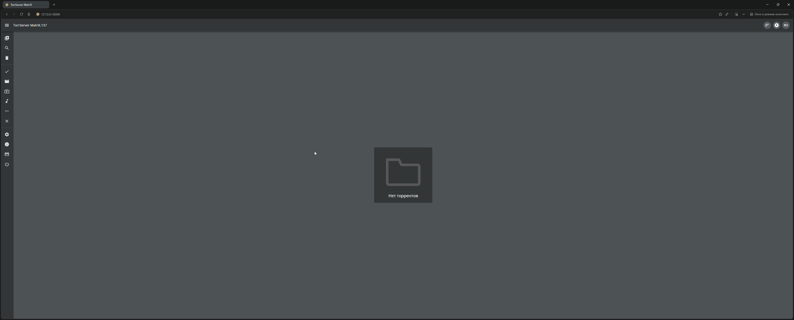
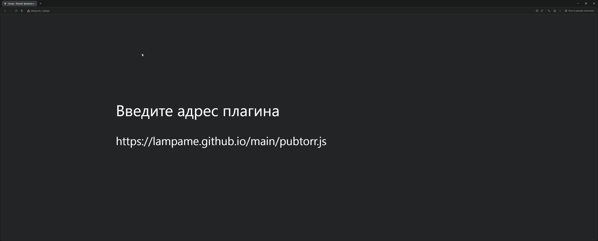
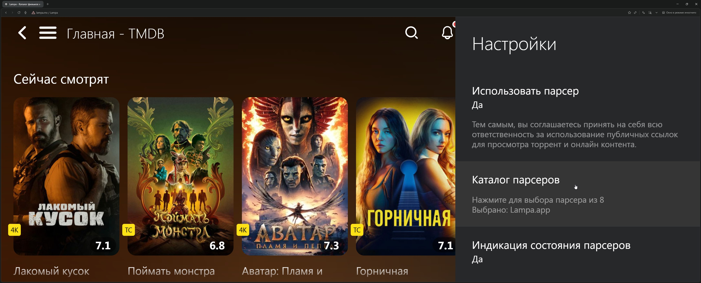

Полное руководство по стримингу торрентов для тех, кто ценит качество и своё время

<!--more-->

## Введение: торренты уже не те

Привет! Сегодня хочу поделиться с вами технологией, которая буквально изменила мой подход к домашнему кинотеатру.

Забудьте о часах ожидания, пока скачается фильм. Забудьте о забитом жёстком диске и папках с полузабытыми раздачами. Современные технологии позволяют смотреть торренты прямо сейчас — как обычный стриминговый сервис, только с библиотекой, которую не ограничивает ни одна студия.

Связка **Lampa + TorrServer** превращает хаотичный мир торрентов в удобный медиацентр с красивыми обложками, описаниями и мгновенным воспроизведением. Давайте разберёмся, как это работает и кому подойдёт!

---

## Что такое TorrServer и почему он меняет правила игры

### Суть технологии

TorrServer — это локальный сервер, который превращает torrent-файлы в видеопоток. Вместо того чтобы скачивать весь файл целиком, он загружает данные последовательно и по требованию — ровно те куски, которые нужны плееру в данный момент.

### Как это работает технически (простыми словами)

1. Вы выбираете фильм и нажимаете «Воспроизвести»
2. TorrServer получает magnet-ссылку или torrent-файл
3. Подключается к пирам (другим пользователям, у которых есть файл)
4. Начинает загружать данные с начала файла, а не случайными кусками
5. Сразу отдаёт поток вашему плееру
6. Буфер минимальный — обычно 30–60 секунд видео

По сути, TorrServer работает как переводчик между хаотичным миром торрентов и привычным видеоплеером.

### Почему это не просто «скачивание в фоне»

Классический торрент-клиент загружает части файла в случайном порядке — сначала может прийти финальная сцена, потом середина. TorrServer использует приоритизацию: он буквально «просит» у сети именно те фрагменты, которые нужны прямо сейчас. Умный алгоритм предзагрузки делает просмотр плавным.

**Кстати!** TorrServer можно запустить не только локально, но и на домашнем сервере или NAS — об этом расскажу подробнее в следующей статье.

---

## Lampa: ваш персональный каталог фильмов

### Что это такое

Lampa — это медиаприложение-оболочка, которое само по себе не хранит никакого контента. Его задача — предоставить красивый интерфейс для поиска, каталогизации и запуска воспроизведения.

Представьте Netflix, только вместо встроенной библиотеки — подключаемые источники: онлайн-кинотеатры, парсеры торрент-трекеров, ваши локальные файлы.

### Что умеет Lampa

| Функция | Описание |
|---------|----------|
| **Каталог с метаданными** | Обложки, описания, рейтинги, актёры — всё подтягивается автоматически |
| **Подборки и рекомендации** | Новинки, популярное, персональные списки |
| **Поиск по трекерам** | Через плагины ищет раздачи на различных трекерах |
| **Интеграция с TorrServer** | Одна кнопка — и фильм воспроизводится |
| **Мультиплатформенность** | Android TV, Smart TV, Apple TV, Xbox, смартфоны, ПК |

### Версии Lampa: какую выбрать

Существует несколько вариантов Lampa:

- **Lampa (официальная)** — базовая версия от разработчиков, требует ручной установки плагинов
- **Lampa UNCENSORED** — модифицированная версия с предустановленными источниками контента

Для официальной версии плагины добавляются вручную через настройки. UNCENSORED-версия работает «из коробки», но требует смены адреса сервера.

### Ключевое преимущество

Lampa абстрагирует сложность. Пользователь видит обложку фильма, нажимает «Смотреть», выбирает качество (1080p, 4K, с переводом или без) — всё. Никаких magnet-ссылок, никакого копирования между приложениями.

---

## Схема работы: от выбора фильма до воспроизведения

Разберём путь пользователя пошагово:

```
┌─────────────────────────────────────────────────────────────────┐
│  1. ПОИСК                                                       │
│     Пользователь открывает Lampa → вводит название фильма       │
│                              ↓                                  │
│  2. ВЫБОР ИСТОЧНИКА                                             │
│     Lampa показывает доступные варианты:                        │
│     • Онлайн-кинотеатры (если подключены)                       │
│     • Торрент-раздачи (через парсеры)                           │
│                              ↓                                  │
│  3. ПЕРЕДАЧА В TORRSERVER                                       │
│     Пользователь выбирает торрент →                             │
│     Lampa отправляет magnet-ссылку в TorrServer                 │
│                              ↓                                  │
│  4. СТРИМИНГ                                                    │
│     TorrServer подключается к пирам →                           │
│     формирует видеопоток →                                      │
│     передаёт в плеер Lampa                                      │
│                              ↓                                  │
│  5. ПРОСМОТР                                                    │
│     Фильм воспроизводится через 10–30 секунд буферизации        │
└─────────────────────────────────────────────────────────────────┘
```

**Важно:** TorrServer может работать на том же устройстве (например, на Android TV) или на отдельном сервере в домашней сети (NAS, Raspberry Pi, старый ПК). Второй вариант удобнее, если вы смотрите контент на нескольких устройствах.

---

## Преимущества подхода: почему это удобно

### 1. Мгновенное воспроизведение 4K-контента

Качественная раздача в 4K HDR весит 40–80 ГБ. При скорости интернета 100 Мбит/с скачивание займёт 1–2 часа. Со стримингом через TorrServer — воспроизведение начнётся через 30 секунд.

### 2. Экономия дискового пространства

TorrServer хранит только небольшой буфер (настраивается, обычно 1–4 ГБ максимум). После просмотра — данные удаляются автоматически. Никаких терабайтов «на потом».

### 3. Доступ к редкому контенту

Стриминговые сервисы ограничены лицензиями. На торрентах есть:

- Режиссёрские версии
- Фильмы без цензуры
- Редкие субтитры
- Контент, не вышедший в вашем регионе
- Remux-версии с максимальным качеством

### 4. Гибкость выбора качества

Один и тот же фильм доступен в разных вариантах:

- 720p для слабого интернета
- 1080p для баланса
- 4K HDR для максимального опыта
- Разные звуковые дорожки (оригинал, дубляж, многоголоска)

### 5. Удобный интерфейс для всей семьи

Lampa выглядит как обычный стриминговый сервис. Не нужно объяснять родителям, что такое magnet-ссылка — они просто выбирают фильм и смотрят.

---

## Требования к интернету и устройствам

### Скорость интернета

| Качество контента | Минимальная скорость | Рекомендуемая |
|-------------------|---------------------|---------------|
| 720p | 10 Мбит/с | 20 Мбит/с |
| 1080p | 20 Мбит/с | 40 Мбит/с |
| 1080p Remux | 40 Мбит/с | 60 Мбит/с |
| 4K SDR | 40 Мбит/с | 60 Мбит/с |
| 4K HDR/Remux | 80 Мбит/с | 100+ Мбит/с |

**Примечание:** реальные требования зависят от здоровья раздачи. Популярный фильм с сотнями сидов пойдёт даже на слабом интернете. Редкая раздача с 2–3 пирами может буферизироваться даже при 200 Мбит/с.

### Поддерживаемые устройства

**Android TV / Google TV**
- Лучший вариант: нативное приложение Lampa + TorrServer
- Подходят: Xiaomi Mi Box, NVIDIA Shield, телевизоры Sony, Philips, TCL с Android TV
- [Скачать Lampa для Android TV](https://github.com/lampa-app/LAMPA/releases)

**Обычные Smart TV (Samsung Tizen, LG webOS)**
- Lampa работает через браузер или специальные приложения
- TorrServer — на отдельном устройстве в сети
- Требуется дополнительная настройка

**Apple TV (tvOS)**
- Можно установить с помощью приложения **Luxo** (доступно только в App Store на Apple TV) — достаточно ввести адрес `lampa.mx` или альтернативный
- Подробнее в разделе про Apple TV ниже

**Xbox**
- Можно установить с помощью приложения **Media Station X**
- [Скачать Media Station X в Microsoft Store](https://apps.microsoft.com/detail/9P4Z98MLJPLZ)
- Отличный вариант для тех, у кого уже есть консоль

**ПК (Windows, macOS, Linux)**
- TorrServer запускается как фоновая служба (рекомендуем TorrServe MatriX)
- Lampa открывается в браузере
- Воспроизведение — через встроенный плеер или VLC/mpv

**Смартфоны и планшеты**
- Android: приложение Lampa из APK
- iOS: через web-версию (с ограничениями)

### Для запуска TorrServer понадобится

- **Минимально:** само устройство просмотра (Android TV)
- **Оптимально:** отдельный мини-ПК, NAS или Raspberry Pi 4
- **Ресурсы:** 512 МБ RAM, любой процессор, стабильный интернет

---

## Apple TV (tvOS): особый случай

### Поддерживается ли Lampa на Apple TV?

Напрямую через App Store — нет. Apple строго контролирует, что можно устанавливать на tvOS. Однако есть удобное решение!

### Способ установки через Luxo

Самый простой и рабочий способ для Apple TV:

1. Откройте **App Store** прямо на Apple TV
2. Найдите и установите приложение **Luxo**
3. Откройте Luxo и найдите поле для ввода адреса
4. Введите адрес: `lampa.mx` или альтернативный (например, `bylampa.online`)
5. Готово! Lampa загрузится внутри Luxo

**Плюсы:**
- Не требует jailbreak
- Официальное приложение из App Store
- Работает стабильно

**Минусы:**
- TorrServer всё равно нужно запускать на отдельном устройстве
- Зависимость от работоспособности Luxo

### Альтернативные способы

**Через AirPlay / Screen Mirroring:**
- Открываете Lampa на iPhone/iPad или Mac
- Транслируете экран на Apple TV
- Смотрите контент на большом экране

**Через Infuse + TorrServer:**
- TorrServer на отдельном устройстве (NAS, ПК, Raspberry Pi)
- На Apple TV — медиаплеер [Infuse](https://apps.apple.com/app/infuse-7/id1136220934)
- Плеер подключается к TorrServer по сети
- Для навигации используете Lampa на другом устройстве

### Ограничения tvOS в сравнении с другими платформами

| Аспект | Android TV | Smart TV | Apple TV |
|--------|-----------|----------|----------|
| Установка Lampa | Простая (APK) | Средняя (браузер) | Через Luxo |
| Нативное приложение | Да | Частично | Через обёртку |
| TorrServer на устройстве | Да | Нет | Нет |
| Поддержка 4K HDR | Да | Зависит от модели | Да |
| Удобство управления | Высокое | Среднее | Хорошее через Luxo |

### Кому Apple TV подойдёт, а кому — нет

**Подойдёт:**
- Тем, у кого уже есть Apple TV и экосистема Apple
- Пользователям, готовым использовать Luxo
- Любителям AirPlay-трансляций с других устройств Apple

**Не подойдёт:**
- Тем, кто хочет всё настроить за 5 минут без дополнительных устройств
- Пользователям без отдельного устройства для TorrServer

---

## Xbox: неожиданный вариант для геймеров

Если у вас есть Xbox, вы можете превратить его в полноценный медиацентр!

### Установка через Media Station X

1. Найдите и установите приложение **[Media Station X](https://apps.microsoft.com/detail/9P4Z98MLJPLZ)** из Microsoft Store
2. Откройте приложение и перейдите в настройки
3. Добавьте источник с адресом Lampa (`lampa.mx` или `bylampa.online`)
4. Наслаждайтесь просмотром!

Это отличное решение для тех, кто уже владеет консолью и не хочет покупать отдельную ТВ-приставку.

---

## Установка Lampa на разные устройства

### Android TV / Google TV — нативная установка

Это лучшая платформа для Lampa. Полноценное приложение, удобное управление пультом, возможность установить TorrServer прямо на устройство.

#### Что понадобится

- Устройство на Android TV 7.0+ (Xiaomi Mi Box, NVIDIA Shield, Ugoos, телевизоры Sony/Philips/TCL)
- Включённая установка из неизвестных источников
- APK-файл Lampa

#### Пошаговая установка

**Шаг 1.** Разрешите установку из неизвестных источников

Перейдите: **Настройки → Безопасность и ограничения → Неизвестные источники**

Включите разрешение для файлового менеджера или браузера, через который будете устанавливать.

**Шаг 2.** Скачайте APK-файл Lampa

Варианты:
- Через встроенный браузер: перейдите на [GitHub Lampa](https://github.com/lampa-app/LAMPA/releases)
- Через приложение **[Downloader](https://play.google.com/store/apps/details?id=com.esaba.downloader)** из Google Play: введите URL для скачивания
- Через приложение **[Media Station X](https://play.google.com/store/apps/details?id=de.benzac.msx&hl=ru)** из Google Play
- Перенесите APK с компьютера на флешку

**Шаг 3.** Установите приложение

Откройте скачанный файл через файловый менеджер и подтвердите установку.

**Шаг 4.** Первый запуск и настройка

При первом запуске Lampa попросит:
- Выбрать язык интерфейса
- Указать адрес сервера

**Шаг 5.** Добавьте плагины (для официальной версии)

Перейдите: **Настройки → Расширения → Добавить плагин**

Введите адрес плагина:
```
https://skaztv.online/store.js
```

Нажмите «Добавить» и **полностью перезагрузите приложение** (не просто свернуть!).

**Шаг 6.** Установите TorrServer

Для стриминга торрентов установите TorrServer как отдельное приложение. APK доступен на [GitHub проекта](https://github.com/YouROK/TorrServer/releases).

После установки укажите адрес TorrServer в настройках Lampa:
```
http://127.0.0.1:8090
```
(если TorrServer работает на том же устройстве)

#### Альтернатива: Lampa UNCENSORED

Если не хотите вручную добавлять плагины:

1. Установите стандартную Lampa
2. Перейдите в **Настройки → Основные → Адрес сервера**
3. Замените адрес на:
   - `bylampa.online` (короткий вариант)
   - `https://bylampa.online/` (для Android TV нужен полный адрес)
   - `http://bylampa.online/` (для старых устройств)
4. Перезагрузите приложение

**Примечание:** адрес `http://lampa.mx` — стандартный сервер без предустановленных плагинов.

---

### Smart TV (Samsung Tizen, LG webOS)

На телевизорах Samsung и LG нет возможности установить APK напрямую.

#### Способ 1: Встроенный браузер

**Для Samsung:**
1. Откройте приложение **Internet** (браузер)
2. Перейдите по адресу: `bylampa.online` или `lampa.mx`
3. Добавьте страницу в закладки

**Для LG:**
1. Откройте **Веб-браузер**
2. Введите адрес Lampa
3. Сохраните в избранное

**Ограничения:**
- Неудобное управление курсором
- Возможны проблемы с воспроизведением некоторых форматов
- Нет фонового режима

#### Способ 2: Приложения из официальных магазинов

Для Samsung (Tizen App Store) и LG (LG Content Store) существуют версии Lampa. В них уже есть пункт «Парсер» — дополнительные плагины устанавливать не нужно.

#### Важно: TorrServer на отдельном устройстве

Smart TV не могут запускать TorrServer локально. Вам понадобится:
- Компьютер в той же сети
- NAS (Synology, QNAP)
- Raspberry Pi
- Роутер с поддержкой Entware

В настройках Lampa укажите IP-адрес устройства с TorrServer:
```
http://192.168.1.100:8090
```
(замените на ваш IP)

---

### ПК (Windows / macOS / Linux) — подробная инструкция

На компьютере Lampa работает через браузер, а TorrServer запускается как локальный сервер. Для Windows рекомендую использовать **TorrServe MatriX** — удобную версию с графическим интерфейсом.

#### Установка TorrServe MatriX (Windows)

**Шаг 1.** Скачайте TorrServe MatriX

Перейдите на [GitHub TorrServe MatriX](https://github.com/YouROK/TorrServer/releases) и скачайте файл `TorrServer-windows-amd64.exe` для Windows.


**Шаг 2.** Запустите TorrServer

Запустите скачанный файл. Windows может показать предупреждение SmartScreen — нажмите «Подробнее» → «Выполнить в любом случае».


**Шаг 3.** Проверьте работу сервера

Откройте браузер и перейдите по адресу:
```
http://127.0.0.1:8090
```



**Шаг 4.** Откройте Lampa в браузере

В новой вкладке перейдите на:
- [bylampa.online](https://bylampa.online/) — версия с предустановленными плагинами
- [lampa.mx](http://lampa.mx) — чистая версия


**Шаг 5.** Настройте подключение к TorrServer

Перейдите в **Настройки** (иконка шестерёнки) → **Основные** → **TorrServer**

Введите адрес:
```
127.0.0.1:8090
```

> **💡 Важно:** Адрес `127.0.0.1` работает только если Lampa открыта на том же компьютере, где запущен TorrServer. 
>
> Если вы хотите подключиться с другого устройства в локальной сети (например, с телевизора или телефона), вам нужно узнать **локальный IPv4-адрес** компьютера с TorrServer:
>
> **Windows:** откройте командную строку (Win+R → `cmd`) и введите:
> ```
> ipconfig
> ```
> Найдите строку **IPv4-адрес** (обычно выглядит как `192.168.X.X`) и используйте его вместо `127.0.0.1`:
> ```
> 192.168.1.100:8090
> ```


**Шаг 6.** Установите парсер (источник торрентов)

Парсер — это плагин, который ищет торренты для фильмов и сериалов. **Без установленного парсера Lampa не сможет находить раздачи** — при попытке открыть торренты вы увидите пустой список.

**6.1.** Сначала добавьте плагин парсера:

Перейдите: **Настройки → Расширения → Добавить плагин**

Введите один из адресов:

| Парсер | Адрес плагина |
|--------|---------------|
| Jackett (публичный) | `https://bylampa.github.io/jackett.js` |
| PubTorr | `https://lampame.github.io/main/pubtorr.js` |



Нажмите **«Добавить»** и перезагрузите страницу.

**6.2.** Затем активируйте парсер в настройках:

Перейдите: **Настройки → Парсер**

Выберите установленный парсер из списка.




**6.3.** Проверьте работу парсера:

Откройте любой фильм и перейдите в раздел **«Торренты»**. Если всё настроено правильно, вы увидите список раздач с указанием качества, размера и количества сидов.


> **💡 Совет:** Если один парсер не работает или показывает мало результатов — попробуйте установить другой.

**Шаг 7.** Добавьте каталог плагинов (опционально)

Если вы используете чистую версию lampa.mx и хотите получить доступ к дополнительным плагинам, можете добавить сторонний каталог.

Перейдите: **Настройки → Расширения → Добавить плагин**

Введите:
```
https://skaztv.online/store.js
```


> **⚠️ Примечание:** Это неофициальный каталог сторонних плагинов, включающий пиратские источники контента. Используйте на своё усмотрение и помните о правовых аспектах в вашей стране.

**Шаг 8.** Готово! Выберите фильм и смотрите

Найдите фильм через поиск или каталог, нажмите на него, выберите источник «Торренты», выберите качество — воспроизведение начнётся через несколько секунд.


#### Установка на macOS

1. Скачайте `TorrServer-darwin-amd64` с [GitHub](https://github.com/YouROK/TorrServer/releases)
2. Откройте **Системные настройки → Конфиденциальность и безопасность**
3. Разрешите запуск скачанного файла
4. Запустите через терминал или двойным кликом
5. Откройте Lampa в браузере и настройте как описано выше

#### Установка на Linux

```bash
wget https://github.com/YouROK/TorrServer/releases/latest/download/TorrServer-linux-amd64
chmod +x TorrServer-linux-amd64
./TorrServer-linux-amd64
```

Затем откройте Lampa в браузере и настройте подключение к `http://127.0.0.1:8090`.

---

### Смартфоны и планшеты

#### Android

1. Скачайте APK с [GitHub Lampa](https://github.com/lampa-app/LAMPA/releases)
2. Разрешите установку из неизвестных источников
3. Установите и настройте как на Android TV

TorrServer можно запустить прямо на телефоне (есть мобильная версия), но это сильно расходует батарею. Лучше использовать сервер на другом устройстве.

#### iOS / iPadOS

Нативного приложения нет. Варианты:
- **Web-версия в Safari:** откройте [bylampa.online](https://bylampa.online), добавьте на домашний экран
- **AirPlay** на Apple TV или телевизор

---

## Полезные плагины для Lampa

Вот список проверенных плагинов, которые расширят возможности Lampa. Добавляются через **Настройки → Расширения → Добавить плагин**.

### Торрент-плагины

| Плагин | Описание | Адрес |
|--------|----------|-------|
| **Добавляет пункт «Парсер»** | Для смарт-телевизоров из официальных магазинов | `http://cub.rip/plugin/etor` |
| **Переключение парсеров** | Выбор серверов для поиска торрентов с отображением работоспособности | `https://bylampa.github.io/jackett.js` или `https://lampame.github.io/main/pubtorr.js` |
| **Tracks** | Выбор аудиодорожки и субтитров в торрентах | `http://cub.rip/plugin/tracks` |
| **Поиск локального TorrServer** | Автоматический поиск TorrServer в локальной сети | `http://193.233.134.21/plugins/checker.js` |
| **Закачка торрентов** | Подключение qBittorrent и Transmission | `https://lampame.github.io/main/torrentmanager/torrentmanager.js` |
| **Вторая кнопка Торренты** | Дополнительная кнопка с выбором парсера | `https://github.freebie.tom.ru/torrents.js` |
| **Free Torrserver** | Бесплатные TorrServer в интернете (если нет своего) | `https://bylampa.github.io/freetorr.js` |
| **Визуализация загрузки** | Красивый прелоадер перед запуском видео | `https://plugin.rootu.top/ts-preload.js` |

### ТВ-плагины

| Плагин | Описание | Адрес |
|--------|----------|-------|
| **Дизель ТВ** | Бесплатные телеканалы с программой и архивом | `https://andreyurl54.github.io/diesel5/diesel.js` |
| **Кулик TV** | IPTV-каналы (требует активацию через Telegram-бота @kuliktv_bot) | `http://cdn.kulik.uz/cors` |
| **IPTV** | Просмотр IPTV с собственными плейлистами | `http://cub.rip/plugin/iptv` |
| **Hack TV** | Бесплатные каналы (качество может варьироваться) | `https://bylampa.github.io/tv.js` |

### Плагины 18+

| Плагин | Описание | Адрес |
|--------|----------|-------|
| **Клубничка** | Контент с Pornhub, Xvideos и других | `https://bwa.to/s` |
| **Клубничка (Bwa Cloud)** | Альтернативная версия для старых устройств | `http://bwa-cloud.cfhttp.top/sisi.js` |

---

## Ограничения и риски: о чём важно знать

### Технические ограничения

**Зависимость от сидов**
Если раздача «мёртвая» (нет пользователей, отдающих файл) — смотреть не получится. Это касается редкого и старого контента.

**Буферизация при перемотке**
Прыжок на 30 минут вперёд = новый запрос данных. Придётся подождать несколько секунд.

**Совместимость форматов**
Не все плееры корректно воспроизводят HDR, Dolby Vision, многоканальный звук. На дешёвых приставках 4K может тормозить.

**Нестабильность плагинов**
Источники контента могут переставать работать, адреса меняются. Нужно периодически обновлять плагины.

---

## Для кого подходит такой способ просмотра

### Идеально подойдёт:

**Энтузиастам качества**
Тем, кто не готов мириться со сжатием Netflix и хочет Remux-версии.

**Пользователям с ограниченным хранилищем**
Если ваш ТВ-бокс имеет 8 ГБ памяти — традиционное скачивание не вариант.

**Владельцам домашних медиасерверов**
TorrServer отлично вписывается в экосистему с Plex, Jellyfin, NAS.

**Зрителям редкого контента**
Авторское кино, старые сериалы, зарубежные шоу без локализации.

**Пользователям Android TV**
Максимально простая настройка, всё работает нативно.

### Может не подойти:

**При нестабильном интернете**
Частые обрывы = постоянная буферизация.

**Для фонового просмотра**
Если контент — фон, проще включить YouTube.

**Тем, кто не готов к минимальной настройке**
Начальная конфигурация потребует 20–30 минут.

---

## Краткая памятка по установке

| Платформа | Сложность | Рекомендация |
|-----------|-----------|--------------|
| Android TV | ★☆☆☆☆ | Лучший выбор — APK + TorrServer на устройстве |
| Smart TV (Samsung/LG) | ★★★☆☆ | Браузер или приложение из магазина + TorrServer отдельно |
| Apple TV | ★★☆☆☆ | Luxo (из App Store на Apple TV) + TorrServer на отдельном устройстве |
| Xbox | ★★☆☆☆ | Media Station X + TorrServer отдельно |
| Windows/macOS/Linux | ★★☆☆☆ | Браузер + TorrServe MatriX |
| Android-смартфон | ★★☆☆☆ | APK, TorrServer лучше на сервере |
| iPhone/iPad | ★★★☆☆ | Только web-версия |

---

## Заключение

Связка Lampa + TorrServer — это действительно удобный инструмент для организации домашнего кинотеатра. Технология стала доступнее: упростилась установка, появились новые плагины, улучшилась буферизация.

Для тех, кто ценит свободу выбора и качество картинки, — это один из лучших вариантов. А возможность установки на Xbox и Apple TV делает систему ещё универсальнее!

В следующей статье расскажу подробнее о запуске TorrServer на удаленном сервере — это откроет ещё больше возможностей для мультирум-просмотра.

---

## Полезные ссылки

### Официальные ресурсы

| Ресурс | Ссылка |
|--------|--------|
| **Lampa (официальный сайт)** | [lampa.mx](https://lampa.mx) |
| **Lampa (GitHub, APK)** | [github.com/lampa-app/LAMPA/releases](https://github.com/lampa-app/LAMPA/releases) |
| **Lampa UNCENSORED** | [bylampa.online](https://bylampa.online) |
| **TorrServer (GitHub)** | [github.com/YouROK/TorrServer](https://github.com/YouROK/TorrServer) |
| **TorrServer (релизы)** | [GitHub Releases](https://github.com/YouROK/TorrServer/releases) |

### Приложения для устройств

| Платформа | Приложение | Ссылка |
|-----------|-----------|--------|
| **Apple TV** | Infuse | [App Store](https://apps.apple.com/app/infuse-7/id1136220934) |
| **Xbox** | Media Station X | [Microsoft Store](https://apps.microsoft.com/detail/9P4Z98MLJPLZ) |
| **Android TV** | Media Station X | [Google Play](https://play.google.com/store/apps/details?id=de.benzac.msx&hl=ru) |
| **Android TV** | Downloader | [Google Play](https://play.google.com/store/apps/details?id=com.esaba.downloader) |

### Магазин плагинов

| Название | Адрес |
|----------|-------|
| **Основной магазин плагинов** | `https://skaztv.online/store.js` |
| **cub.rip (авторизация)** | [cub.rip](https://cub.rip) |
| **cub.rip IPTV** | [cub.rip/iptv](https://cub.rip/iptv/) |



*Актуальность информации: январь 2026. Адреса плагинов и серверов могут меняться — проверяйте актуальные данные в тематических сообществах.*