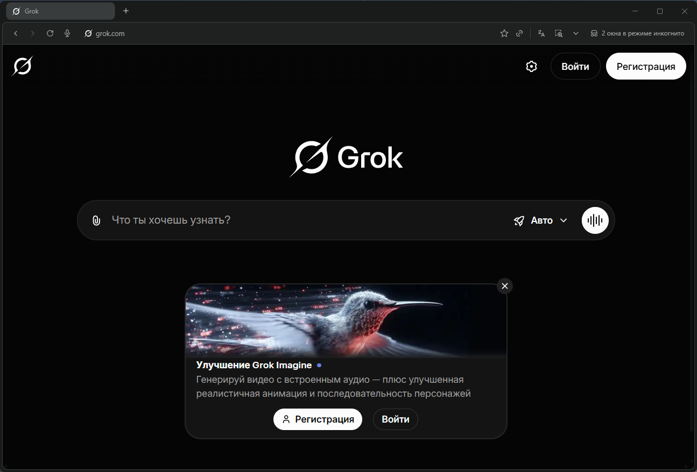
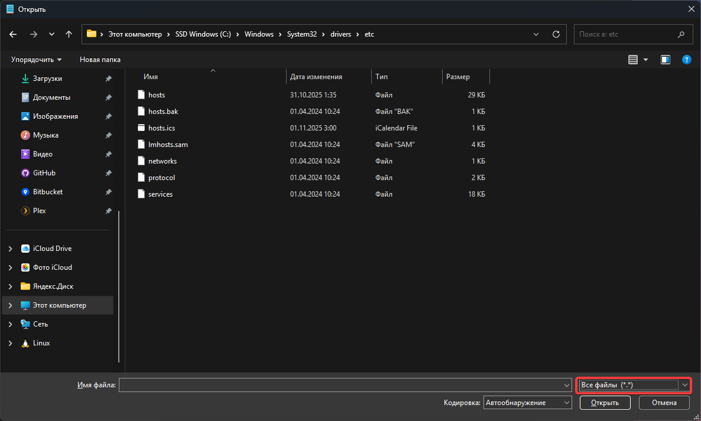
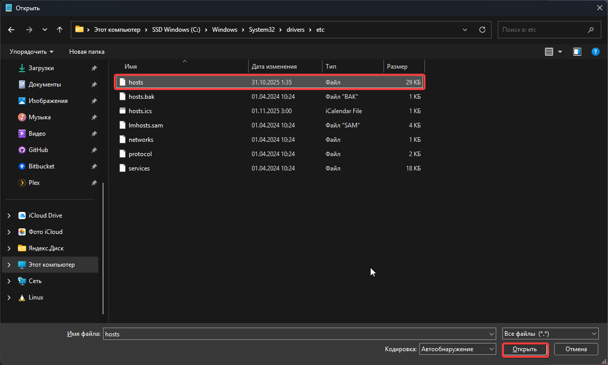
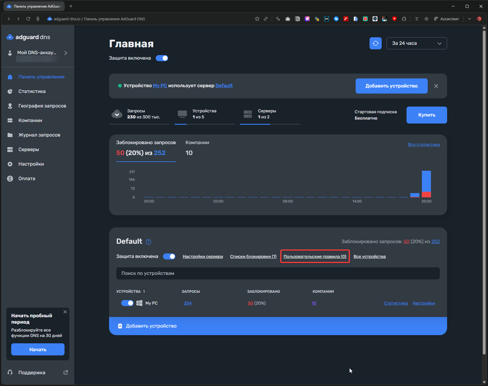

Разблокируй нейросети без VPN — через DNS, hosts или AdGuard.

<!--more-->

## Введение

> Многие сервисы с нейросетями недоступны из-за региональных ограничений. VPN помогает, но это не единственный и далеко не самый удобный способ обхода блокировок. Постоянно включенный VPN замедляет соединение, жрёт батарею на мобильных устройствах и иногда конфликтует с банковскими приложениями или корпоративными сервисами.


Есть альтернатива: работа с DNS. В этой статье разберём **четыре рабочих способа** получить доступ к ChatGPT, Claude и Gemini без VPN:

1. Сторонний DNS-сервер
2. Файл `hosts`
3. DNS-фильтрация через AdGuard DNS
4. Comss.one DNS — готовое решение

Это не магия и не сложные хакерские техники — просто грамотная настройка того, как ваш компьютер узнаёт, где находятся нужные сайты. Разберём, как это работает и как настроить каждый способ.

---

## Как вообще работают блокировки

Чтобы понять, как обходить блокировки, нужно понять, как они устроены. Когда вы вводите в браузере адрес сайта, происходит несколько шагов:

1. **DNS-запрос**: ваша система спрашивает у DNS-сервера: "Какой IP-адрес у chatgpt.com?"
2. **Получение ответа**: DNS-сервер возвращает IP-адрес, например `95.182.120.241`
3. **Подключение**: браузер подключается к этому IP-адресу и загружает сайт

Большинство блокировок нейросетей в России происходят именно **на первом этапе** — на уровне DNS. Провайдер использует свой DNS-сервер, который либо подменяет правильный IP-адрес на заглушку, либо вообще не возвращает ответ. Результат один: сайт не открывается.

Хорошая новость: если получить правильный IP-адрес в обход провайдерского DNS, сервис будет работать без всяких VPN. Сам трафик к нейросети обычно не блокируется — блокируется только информация о том, куда подключаться.

### Приоритет разрешения имён

Когда система пытается узнать IP-адрес сайта, она проверяет источники в строгой последовательности:

1. **Файл `hosts`** — локальный файл на вашем компьютере (высший приоритет)
2. **Пользовательский DNS** — сервер, который вы указали в настройках
3. **DNS провайдера** — сервер по умолчанию от вашего интернет-провайдера

Это важно понимать, потому что если вы прописали адрес в `hosts`, то никакие DNS-серверы уже не будут использоваться для этого домена.

---

## Способ 1. Сторонний DNS-сервер

### Как это работает

Самый простой способ — заменить DNS-сервер провайдера на публичный сервер, который не применяет региональные блокировки. Подходящие варианты: **Xbox DNS** или **Malw.link DNS**. Эти серверы честно возвращают настоящие IP-адреса без подмен.

Дополнительный плюс: можно использовать защищённые протоколы DNS over HTTPS (DoH) или DNS over TLS (DoT), которые шифруют DNS-запросы. Провайдер не сможет не только подменить ответ, но даже увидеть, какие сайты вы запрашиваете.

---

### Доступные DNS-серверы

**Xbox DNS**
- IP: `176.99.11.77`, `80.78.247.254`
- DoH: `https://xbox-dns.ru/dns-query`

**Malw.link**
- IP: `84.21.189.133`, `193.23.209.189`
- DoH: `https://dns.malw.link/dns-query`

> 📎 Подробнее: [xbox-dns.ru](https://xbox-dns.ru/) и [info.dns.malw.link](https://info.dns.malw.link/)

---

### Настройка в браузере

Современные браузеры умеют использовать собственный DNS независимо от системных настроек.

#### Chrome, Edge, Brave


1. Откройте **Настройки** браузера
2. Перейдите в раздел **Конфиденциальность и безопасность** → **Безопасность**
3. Найдите пункт **Использовать безопасный DNS**
4. Выберите **Указать другой** и введите один из адресов:
   - `https://xbox-dns.ru/dns-query`
   - `https://dns.malw.link/dns-query`

#### Firefox


1. **Настройки** → **Приватность и защита**
2. Прокрутите до раздела **DNS через HTTPS**
3. Включите **DNS через HTTPS на Максимальную защиту**
4. Выбрать поставщика **Другой URL**
4. В поле **Адрес** введите один из адресов:
   - `https://xbox-dns.ru/dns-query`
   - `https://dns.malw.link/dns-query`

---

### Настройка в операционной системе

Настройка на уровне системы обеспечит работу DNS для всех приложений, а не только для браузера.

#### Windows 11

  
    
  
  
    
  


1. **Настройки** → **Сеть и интернет**
2. Выберите **Wi-Fi** или **Ethernet** (в зависимости от подключения)
3. Кликните на ваше подключение
4. Найдите **Назначение DNS-сервера** → **Изменить**
5. Выберите **Вручную** и включите **IPv4**
6. Введите адреса:

| Параметр | Xbox DNS | Malw.link |
|----------|----------|-----------|
| Предпочитаемый | `176.99.11.77` | `84.21.189.133` |
| Альтернативный | `80.78.247.254` | `193.23.209.189` |

7. Сохраните изменения

#### macOS

1. **Системные настройки** → **Сеть**
2. Выберите активное подключение → **Подробнее** (или **Дополнительно**)
3. Перейдите на вкладку **DNS**
4. Удалите существующие записи и добавьте новые:
   - `176.99.11.77` и `80.78.247.254` (Xbox DNS), или
   - `84.21.189.133` и `193.23.209.189` (Malw.link)
5. Нажмите **OK** → **Применить**

#### Linux (Ubuntu/Debian с NetworkManager)

1. **Настройки** → **Сеть**
2. Кликните на ⚙️ у вашего подключения
3. Вкладка **IPv4** → раздел **DNS**
4. Отключите **Автоматический DNS**
5. Введите адреса через запятую:
   - `176.99.11.77, 80.78.247.254` или
   - `84.21.189.133, 193.23.209.189`
6. Примените изменения и переподключитесь

---

### Плюсы и минусы

| Плюсы ✅ | Минусы ❌ |
|----------|-----------|
| Быстрая настройка — 2 минуты | DNS-трафик идёт через третью сторону |
| Работает сразу для всех сайтов | Нет точечного контроля |
| Не требует дополнительных программ | Может ломать доступ к корпоративным ресурсам |
| DoH шифрует DNS-запросы | При блокировке DNS способ перестанет работать |

### Вердикт

Отличное решение для быстрого старта. Не требует технических знаний, настраивается за пару минут. Подходит как временная мера или для пользователей, которым нужен простой способ без лишних сложностей.


  
    
  
  
    
  
  
    
  
  
    
  


---

## Способ 2. Файл hosts

### Как это работает

Файл `hosts` — это простой текстовый файл в вашей операционной системе, который работает как локальная адресная книга. В нём можно вручную указать: "Когда я прошу открыть chatgpt.com, подключайся к IP-адресу 45.155.204.190".

Система проверяет этот файл **раньше**, чем обращается к любым DNS-серверам. Это означает полный контроль: провайдер вообще не участвует в процессе разрешения имён для указанных доменов.

Формат записи очень простой:

```
IP-адрес    домен
```

Например:

```
45.155.204.190    chatgpt.com
```

### Где найти файл hosts

Расположение файла зависит от операционной системы:

| Операционная система | Путь к файлу |
|----------------------|--------------|
| Windows | `System32\drivers\etc\hosts`|
| macOS | `/etc/hosts`|
| Linux | `/etc/hosts`|

### Как редактировать hosts в Windows


**Важно:** для редактирования нужны права администратора, иначе система не даст сохранить изменения.

**Правильный способ:**

1. Нажмите Win + S, введите "Блокнот"
2. Кликните правой кнопкой → "Запустить от имени администратора"
3. В Блокноте: Файл → Открыть
4. В поле пути вставьте: `C:\Windows\System32\drivers\etc\`

  
    
  
  
    
  
  
    
  
  
    
  

5. В выпадающем списке "Тип файлов" выберите **"Все файлы"** (иначе hosts не покажется)
6. Откройте файл
7. Прокрутите в самый конец
8. Добавьте нужные записи (каждая с новой строки)

  
    
  
  
    
  

9. Сохраните (Ctrl + S)

**Критически важные моменты:**

- **Используйте только Блокнот или Notepad++**. Никаких Word, WordPad или других текстовых редакторов — они добавляют невидимые символы форматирования, которые сломают файл.
- Между IP и доменом должен быть пробел или табуляция
- Не ставьте галочку "Открывать файлы этого типа в этой программе" — hosts должен остаться без ассоциации с программами
- Если Windows ругается на сохранение, проверьте антивирус — некоторые блокируют изменения hosts как потенциально опасные

### Как редактировать hosts в macOS/Linux

```bash
sudo nano /etc/hosts
```

Вводите пароль администратора, добавляете записи, сохраняете (Ctrl + O, Enter, Ctrl + X).

### Примеры записей для нейросетей

Вот базовый набор для основных сервисов:

```
52.223.13.41 tracker.openbittorrent.com
185.31.40.18 test.dns.malw.link
130.255.77.28 ntc.party
45.155.204.190 controlplane.tailscale.com
45.95.233.23 game.clashroyaleapp.com
193.23.209.189 gamea.clashofclans.com
185.246.223.127 game.brawlstarsgame.com
108.61.167.26 game.squadbustersgame.com
45.95.233.23 game.mocogame.com
172.64.33.155 d.rutor.info
157.240.245.174 instagram.com
157.240.245.174 www.instagram.com
157.240.245.174 b.i.instagram.com
157.240.245.174 z-p42-chat-e2ee-ig.facebook.com
157.240.245.174 help.instagram.com
45.155.204.190 gemini.google.com
45.155.204.190 aistudio.google.com
45.155.204.190 generativelanguage.googleapis.com
45.155.204.190 aitestkitchen.withgoogle.com
45.155.204.190 aisandbox-pa.googleapis.com
45.155.204.190 webchannel-alkalimakersuite-pa.clients6.google.com
45.155.204.190 alkalimakersuite-pa.clients6.google.com
45.155.204.190 assistant-s3-pa.googleapis.com
45.155.204.190 proactivebackend-pa.googleapis.com
45.155.204.190 robinfrontend-pa.googleapis.com
45.155.204.190 o.pki.goog
45.155.204.190 labs.google
45.155.204.190 notebooklm.google.com
45.155.204.190 jules.google.com
45.155.204.190 stitch.withgoogle.com

# OpenAI
45.155.204.190 chatgpt.com
45.155.204.190 ab.chatgpt.com
45.155.204.190 auth.openai.com
45.155.204.190 auth0.openai.com
45.155.204.190 platform.openai.com
45.155.204.190 cdn.oaistatic.com
45.155.204.190 files.oaiusercontent.com
45.155.204.190 cdn.auth0.com
45.155.204.190 tcr9i.chat.openai.com
45.155.204.190 webrtc.chatgpt.com
45.155.204.190 android.chat.openai.com
45.155.204.190 api.openai.com
45.155.204.190 operator.chatgpt.com
45.155.204.190 sora.chatgpt.com
45.155.204.190 sora.com
45.155.204.190 videos.openai.com
45.155.204.190 ios.chat.openai.com

# Microsoft
45.155.204.190 copilot.microsoft.com
45.155.204.190 sydney.bing.com
45.155.204.190 edgeservices.bing.com
45.155.204.190 rewards.bing.com
45.155.204.190 xsts.auth.xboxlive.com
45.155.204.190 xgpuwebf2p.gssv-play-prod.xboxlive.com
45.155.204.190 xgpuweb.gssv-play-prod.xboxlive.com

# GitHub Copilot
144.31.14.104 api.github.com
144.31.14.104 api.individual.githubcopilot.com
144.31.14.104 proxy.individual.githubcopilot.com

# Grok
45.155.204.190 grok.com
45.155.204.190 accounts.x.ai
45.155.204.190 assets.grok.com

# Deezer
45.155.204.190 deezer.com
45.155.204.190 www.deezer.com
45.155.204.190 payment.deezer.com

# Claude
45.155.204.190 claude.ai
45.155.204.190 console.anthropic.com
45.155.204.190 api.anthropic.com
```

Строки, начинающиеся с `#`, — это комментарии. Система их игнорирует, они нужны для удобства людей.

### Где брать актуальные IP-адреса

IP-адреса сервисов периодически меняются. Самостоятельно искать их через nslookup или dig неудобно. Проще использовать готовые актуальные списки.

**Рекомендую:** [info.dns.malw.link/hosts](https://info.dns.malw.link/hosts)

Там уже готовые конфиги для разных сервисов. Просто копируйте нужные строки в свой hosts. Если в списке есть комментарии с `#`, можете их оставить или удалить — как вам удобнее.

### Плюсы и минусы

**Плюсы ✅**
- Максимальный контроль — только вы решаете, что и куда разрешается
- Полная конфиденциальность — никакие внешние DNS-серверы не участвуют
- Работает быстрее любого DNS, потому что система вообще не делает сетевых запросов
- Не зависит от внешних сервисов
- Подходит для параноиков :)

**Минусы ❌**
- IP-адреса могут меняться, придётся следить и обновлять вручную
- При большом списке сайтов (100+ доменов) становится неудобно редактировать
- Настройки не синхронизируются между устройствами — на каждом компьютере/смартфоне надо настраивать отдельно
- Требует минимальных технических навыков

**Вердикт:** идеально для тех, кто хочет полный контроль и готов потратить 10 минут на первичную настройку. Для продвинутых пользователей и параноиков по приватности.

---

## Способ 3. AdGuard DNS

Это оптимальный баланс между удобством и контролем. Сочетает простоту стороннего DNS и гибкость hosts, при этом не требует постоянного обновления.

### Как это работает

AdGuard DNS — это не просто публичный DNS вроде Google или Cloudflare. Он умеет работать с правилами переписывания DNS-ответов через специальный синтаксис `dnsrewrite`. По сути, вы создаёте свои правила в облаке, а AdGuard DNS применяет их для вашего устройства.

Синтаксис правила:

```
||домен^$dnsrewrite=IP-адрес
```

Разберём на примере:

```
||chatgpt.com^$dnsrewrite=45.155.204.190
```

**Что тут что:**
- `||` — означает "этот домен и все его поддомены"
- `chatgpt.com` — целевой домен
- `^` — символ конца имени хоста
- `$dnsrewrite=` — команда "переписать DNS-ответ"
- `45.155.204.190` — IP-адрес, который вернётся вместо того, что сказал бы провайдер

Когда ваше устройство спрашивает "где chatgpt.com?", запрос идёт к AdGuard DNS. Он видит правило, возвращает указанный вами IP, и провайдерская блокировка вообще не срабатывает — запрос до провайдерского DNS просто не доходит.

### Настройка AdGuard DNS

**Шаг 1: Регистрация**

1. Зайдите на [adguard-dns.io/ru/](https://adguard-dns.io/ru/)
2. Зарегистрируйтесь (email + пароль, или через Google/Apple/GitHub)
3. Бесплатный тариф даёт 300 000 DNS-запросов в месяц — для личного использования более чем достаточно


**Шаг 2: Создание устройства**

1. В личном кабинете нажмите "Добавить устройство"
2. Выберите тип устройства (компьютер, смартфон, роутер)
3. Скопируйте адрес DNS-сервера

Вы получите персональный адрес вида:

- **DNS-over-HTTPS**: `https://d.adguard-dns.com/dns-query/ваш_id`
- **DNS-over-TLS**: `tls://ваш_id.d.adguard-dns.com`
- **Обычный DNS**: просто IP-адреса (менее безопасно, но проще)


  
    
  
  
    
  
  
    
  


**Шаг 3: Применение DNS**

Используйте инструкции из Способа 1 (сторонний DNS), но вместо Xbox DNS или Malw.link указывайте адрес от AdGuard.

### Добавление правил переписывания

Теперь самое интересное — добавляем правила для нейросетей.

1. Перейдите в "Пользовательские правила"

2. Нажмите на "Редактор"

3. Вставьте правила в поле

**Базовый набор для ChatGPT, Claude, Grok и Gemini:**

```
||tracker.openbittorrent.com^$dnsrewrite=52.223.13.41
||test.dns.malw.link^$dnsrewrite=185.31.40.18
||ntc.party^$dnsrewrite=130.255.77.28
||controlplane.tailscale.com^$dnsrewrite=45.155.204.190
||game.clashroyaleapp.com^$dnsrewrite=45.95.233.23
||gamea.clashofclans.com^$dnsrewrite=193.23.209.189
||game.brawlstarsgame.com^$dnsrewrite=185.246.223.127
||game.squadbustersgame.com^$dnsrewrite=108.61.167.26
||game.mocogame.com^$dnsrewrite=45.95.233.23
||d.rutor.info^$dnsrewrite=172.64.33.155
||instagram.com^$dnsrewrite=157.240.245.174
||www.instagram.com^$dnsrewrite=157.240.245.174
||b.i.instagram.com^$dnsrewrite=157.240.245.174
||z-p42-chat-e2ee-ig.facebook.com^$dnsrewrite=157.240.245.174
||help.instagram.com^$dnsrewrite=157.240.245.174
||gemini.google.com^$dnsrewrite=45.155.204.190
||aistudio.google.com^$dnsrewrite=45.155.204.190
||generativelanguage.googleapis.com^$dnsrewrite=45.155.204.190
||aitestkitchen.withgoogle.com^$dnsrewrite=45.155.204.190
||aisandbox-pa.googleapis.com^$dnsrewrite=45.155.204.190
||webchannel-alkalimakersuite-pa.clients6.google.com^$dnsrewrite=45.155.204.190
||alkalimakersuite-pa.clients6.google.com^$dnsrewrite=45.155.204.190
||assistant-s3-pa.googleapis.com^$dnsrewrite=45.155.204.190
||proactivebackend-pa.googleapis.com^$dnsrewrite=45.155.204.190
||robinfrontend-pa.googleapis.com^$dnsrewrite=45.155.204.190
||o.pki.goog^$dnsrewrite=45.155.204.190
||labs.google^$dnsrewrite=45.155.204.190
||notebooklm.google.com^$dnsrewrite=45.155.204.190
||jules.google.com^$dnsrewrite=45.155.204.190
||stitch.withgoogle.com^$dnsrewrite=45.155.204.190
||chatgpt.com^$dnsrewrite=45.155.204.190
||ab.chatgpt.com^$dnsrewrite=45.155.204.190
||auth.openai.com^$dnsrewrite=45.155.204.190
||auth0.openai.com^$dnsrewrite=45.155.204.190
||platform.openai.com^$dnsrewrite=45.155.204.190
||cdn.oaistatic.com^$dnsrewrite=45.155.204.190
||files.oaiusercontent.com^$dnsrewrite=45.155.204.190
||cdn.auth0.com^$dnsrewrite=45.155.204.190
||tcr9i.chat.openai.com^$dnsrewrite=45.155.204.190
||webrtc.chatgpt.com^$dnsrewrite=45.155.204.190
||android.chat.openai.com^$dnsrewrite=45.155.204.190
||api.openai.com^$dnsrewrite=45.155.204.190
||operator.chatgpt.com^$dnsrewrite=45.155.204.190
||sora.chatgpt.com^$dnsrewrite=45.155.204.190
||sora.com^$dnsrewrite=45.155.204.190
||videos.openai.com^$dnsrewrite=45.155.204.190
||ios.chat.openai.com^$dnsrewrite=45.155.204.190
||copilot.microsoft.com^$dnsrewrite=45.155.204.190
||sydney.bing.com^$dnsrewrite=45.155.204.190
||edgeservices.bing.com^$dnsrewrite=45.155.204.190
||rewards.bing.com^$dnsrewrite=45.155.204.190
||xsts.auth.xboxlive.com^$dnsrewrite=45.155.204.190
||xgpuwebf2p.gssv-play-prod.xboxlive.com^$dnsrewrite=45.155.204.190
||xgpuweb.gssv-play-prod.xboxlive.com^$dnsrewrite=45.155.204.190
||api.github.com^$dnsrewrite=144.31.14.104
||api.individual.githubcopilot.com^$dnsrewrite=144.31.14.104
||proxy.individual.githubcopilot.com^$dnsrewrite=144.31.14.104
||grok.com^$dnsrewrite=45.155.204.190
||accounts.x.ai^$dnsrewrite=45.155.204.190
||assets.grok.com^$dnsrewrite=45.155.204.190
||deezer.com^$dnsrewrite=45.155.204.190
||www.deezer.com^$dnsrewrite=45.155.204.190
||payment.deezer.com^$dnsrewrite=45.155.204.190
||claude.ai^$dnsrewrite=45.155.204.190
||console.anthropic.com^$dnsrewrite=45.155.204.190
||api.anthropic.com^$dnsrewrite=45.155.204.190
```

4. Нажмите "Сохранить"


Изменения применяются в течение 1-2 минут.

### Как сделать список правил самостоятельно и быстро:

**В VS Code или Notepad++:**
1. `Ctrl+H` (Найти и заменить)
2. Включите **Регулярные выражения** (`.*`)
3. **Найти:** `^(\d+\.\d+\.\d+\.\d+)\s+(\S+)`
4. **Заменить на:** `||$2^$dnsrewrite=$1`
5. **Заменить все**
6. Готово за 5 секунд! 🚀

**Список актуальных доменов нейросетей:** всё та же [info.dns.malw.link](https://info.dns.malw.link/).

### Важные нюансы

**Приоритет hosts vs AdGuard DNS**

Если вы раньше прописывали домены в локальный файл `hosts`, то AdGuard DNS для этих доменов не будет работать — система вообще не обратится к DNS. 

**Решение:** либо очистите hosts от записей нейросетей, либо используйте только один из способов.

**Лимиты бесплатной версии:**

- 300 000 DNS-запросов в месяц
- До 100 пользовательских правил фильтрации
- До 5 подключённых устройств

Для личного использования этого более чем достаточно.

### Плюсы и минусы

**Плюсы ✅**
- Централизованное управление — все правила в одном месте
- Работает на всех устройствах, где указан AdGuard DNS
- Не нужно вручную обновлять IP — просто измените правило в кабинете
- Дополнительная блокировка рекламы и трекеров (если включить фильтры)
- Шифрование DNS-запросов через DoH/DoT
- Статистика запросов — видно, куда ходит ваше устройство

**Минусы ❌**
- Требует регистрации и доверия внешнему сервису (AdGuard видит ваши DNS-запросы)
- Лимиты на бесплатном тарифе
- Зависимость от работы сервиса AdGuard — если у них проблемы, может пропасть интернет
- Чуть сложнее в настройке, чем просто сменить DNS из первого варианта

**Вердикт:** лучший вариант для тех, кто хочет баланс между удобством и контролем. Рекомендую для пользователей со средним уровнем технических знаний.

---

## Способ 4. Comss.one DNS — готовое решение «из коробки»

**Comss.one DNS** — это публичный DNS-сервис с уже настроенным доступом к ИИ-сервисам и встроенной DNS-фильтрацией. В отличие от hosts и AdGuard DNS, здесь **ничего не нужно прописывать вручную** — все правила уже добавлены на стороне сервера.

Сервис ориентирован на пользователей из России и решает сразу несколько задач:

* обход DNS-блокировок ИИ-сервисов;
* блокировка рекламы, трекеров, фишинга и вредоносных сайтов;
* защита DNS-запросов с помощью современных протоколов шифрования.

---

### Что даёт Comss.one DNS

**Поддерживаемые ИИ-сервисы:**

* ChatGPT и Sora
* Claude AI
* Google Gemini
* Microsoft Copilot
* GitHub Copilot
* xAI Grok

**Дополнительно:**

* блокировка рекламы и счётчиков (фильтры AdGuard DNS + AdAway);
* защита от фишинга и вредоносных доменов;
* корректная работа обновлений Windows, антивирусов и инсайдерских сборок;
* защита серверов от DDoS;
* поддержка DNSSEC.
> 📎 Подробнее: [Comss.one DNS](https://www.comss.ru/page.php?id=7315)
---

### Адреса DNS-серверов Comss.one (актуальные)

#### 🔐 DNS-over-HTTPS (DoH)

**Для Windows и браузеров:**

```
https://dns.comss.one/dns-query
```

**Для роутеров MikroTik и Keenetic:**

```
https://router.comss.one/dns-query
```

IP сервера:

```
195.133.25.16
```

**Для iPhone, iPad и macOS:**

- профиль конфигурации: [dns.comss.one.mobileconfig](https://dl.comss.org/download/dns.comss.one.mobileconfig)

---

#### 🔐 DNS-over-TLS (DoT)

**Для Android и Linux:**

```
dns.comss.one
```

или

```
tls://dns.comss.one
```

---

#### 🔐 DNS-over-QUIC (DoQ)

```
quic://dns.comss.one
```

---

#### 🌐 Обычные DNS-серверы (IPv4)

Используйте, если устройство не поддерживает шифрование:

```
83.220.169.155
212.109.195.93
```

⚠️ Без шифрования провайдер **теоретически может** вмешиваться в DNS-запросы, поэтому при возможности лучше использовать DoH / DoT / DoQ.

---

### Настройка (кратко)

Настройка полностью аналогична **Способу 1**:

* в браузере — через «Безопасный DNS»;
* в системе — через настройки сети;
* на роутере — через раздел DNS или DoH/DoT.

Разница только в адресе сервера — используется Comss.one.

---

### Важные нюансы

* Если в системе есть записи в `hosts` для ChatGPT, Gemini и т. д. — **Comss.one DNS не будет использоваться** для этих доменов.
* Не рекомендуется одновременно использовать:

  * Comss.one DNS
  * AdGuard DNS
  * NextDNS
    для одних и тех же устройств.
* При использовании роутера DNS нужно менять **на нём**, а не на каждом устройстве.

---

### Плюсы и минусы

**Плюсы ✅**

* Работает сразу — без правил и IP
* Готовый доступ к ИИ-сервисам
* Блокировка рекламы и трекеров
* Поддержка DoH / DoT / DoQ
* Отлично подходит для роутеров
* Бесплатно
* Минимум технических знаний

**Минусы ❌**

* Полное доверие одному DNS-провайдеру
* Нет точечной кастомизации, как в AdGuard DNS
* Зависимость от инфраструктуры Comss.one
* Не максимальный уровень приватности (в отличие от hosts)

---

### Вердикт

**Comss.one DNS — лучший вариант «поставил и забыл».**

Если нужен **самый простой и стабильный способ** пользоваться ChatGPT, Claude и Gemini без VPN — это оптимальный выбор. Особенно хорошо подходит:

* новичкам;
* для домашнего роутера;
* для семьи;
* для смартфонов и умных устройств.

Для тонкой настройки — AdGuard DNS.
Для максимальной автономности — `hosts`.
Но для большинства пользователей **Comss.one DNS — оптимальный компромисс** между удобством и функциональностью.

---

## Заключение

Получить доступ к ChatGPT, Claude и Gemini без VPN — **вполне реально** и зачастую проще, чем кажется. В большинстве случаев блокировки реализованы на уровне DNS, и именно поэтому описанные в статье способы работают стабильно и без лишних побочных эффектов.

Все четыре варианта решают одну задачу, но отличаются уровнем удобства, контроля и автономности.

**Мои рекомендации:**

* **Новичкам и тем, кто хочет «поставил и забыл»:**
  **Comss.one DNS** — самый простой и универсальный вариант. Готовый доступ к ИИ-сервисам, блокировка рекламы и трекеров, поддержка DoH / DoT / DoQ. Никаких IP-адресов, правил и ручных обновлений — просто меняете DNS и пользуетесь.

* **Пользователям со средним опытом, которым нужен баланс:**
  **AdGuard DNS** — оптимальный компромисс между удобством и гибкостью. Один раз настроили правила переписывания, и они работают на всех устройствах. Не нужно редактировать hosts, но при этом сохраняется контроль над тем, какие домены и куда резолвятся.

* **Продвинутым пользователям и параноикам по приватности:**
  **Файл `hosts`** — максимальная автономность. Всё локально, без сторонних DNS-сервисов и утечек запросов. Зато придётся следить за актуальностью IP-адресов и обновлять их вручную.

* **Для семейного и домашнего использования:**
  **Comss.one DNS на роутере** — одна настройка на всю сеть. Смартфоны, ноутбуки, телевизоры, игровые консоли и умные устройства получают доступ к ИИ-сервисам без VPN и без индивидуальной настройки.

В реальной жизни DNS-подходы часто оказываются **стабильнее и удобнее VPN**: они не замедляют соединение.

Единственный серьёзный минус — если провайдер начнёт массово применять блокировки по IP или DPI, DNS может перестать помогать. В этом случае VPN действительно останется единственным вариантом. Но пока основная масса ограничений реализована через DNS, все описанные способы остаются рабочими.

**Полезные ссылки:**

* [comss.ru](https://www.comss.ru/page.php?id=7315) — Comss.ru DNS и инструкции
* [info.dns.malw.link](https://info.dns.malw.link/) — актуальные IP и готовые конфиги для hosts
* [adguard-dns.io](https://adguard-dns.io/ru/) — облачный AdGuard DNS
* [dnsleaktest.com](https://dnsleaktest.com/) — проверка DNS
* [whoer.net](https://whoer.net/) — комплексная проверка подключения